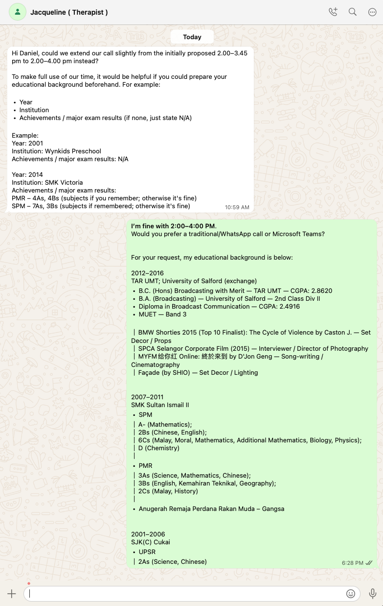

- 00:02 走動，查實所聽所見，晚餐，清洗廚具，覺察鏡像潛意識的歌詞，處理垃圾，刻意放慢動作
- 02:11 蹲廁所，看視頻
- 00:35 熱水澡，盥洗，戴上牙套
- 02:58 睡覺
- 05:21 夢醒，賴床，覺察頭部發麻
- 05:33 記錄[[夢境]]，覺察無助、害怕、迷茫、羞愧
  collapsed:: true
	- 夢見自己和另一群人出現在一家富有人家的走廊走，遇到許多匪夷所思的對白和現象
	- 來到大廳，中間有一個圓形的舞臺，從第一組信仰的代表團開始從其中一個走廊跑出來，然後圍着圓舞臺飛馳的奔跑，而我當時則向我退到最靠近舞臺的邊緣，擔心一個不小心自己的臉都會被其中一個人撞歪，不久後，他們以舞臺爲中心點，像是陽光發散的光線般由內之外排列成一行，最後高喊自己的領導，以此類推
	- 直到第二組，穿着貌似穆斯林的另一群人開始重複上一組同樣的 [[SOP]]，奇怪的是大學朋友[[陳培永]]忽然現身，好像認識當下帶領團隊在狂奔的領袖般，也一同在跟着圍觀
	- 覺察好奇，有沒有可能每一次作夢都是徘徊在[[平行時空]]最靠近且[[瀕臨死亡]]的世界
	- 停筆於 05:49
- 05:49 喝水，半躺半坐，哼唱，覺察抑鬱
  collapsed:: true
	- [[KTV 想點唱的歌單]]
	- 覺察鏡像潛意識的歌詞 ── [[走出黑暗面對着變化]] ( ((6976eb5c-a59e-4a18-8222-8342bfa40206)) )
- 06:13 藉助 AI 工具 ── 討論 [[[[valid]] 的 [[感受]]如何跟[[非合理信念]]及[[不符合事實的想法]]共存]]
  collapsed:: true
	- **09:22** [[quick capture]]:  https://chatgpt.com/share/698bd85f-eedc-8006-8703-d6988b17db44
- 09:22 因眼前事物分心，半躺半坐，刷社媒
- 11:[[10]] 查看信息，爲回信預備個人學曆資料，因眼前事物分心
- 13:01 藉助 [[AI]] 工具 ── 回信 [[Jacqueline Kon Jia Min]]，修正信息，強迫性做事，強忍黏膩的皮膚，強忍睡意，忽略式哼唱，坐著，流汗
  collapsed:: true
	- 
	-
- 18:41 走動，沖涼，摘下牙套
- 19:30 檢查現金流，覺察猶豫而決，焦慮，咬嘴皮，轉賬
- 19:40 換衣
- 19:59 到油站打風 + 檢查引擎油
- 20:28 前往 [[Mr DIY]] 替換 [[Thu, 05-02-2026]] 新買的 [[USB-C to Lightning]] 數據線
- 20:35 抵達目的地，發現 [[MacBook Pro (MBP)]] 忽然沒電
- 20:48 到家，測試電源發現還有電，懷疑可能 callibration 問題
- 20:55 離開
- 22:30 到家
- 22:40 換衣，重啟 [[MacBook Pro (MBP)]] 進行 [[Apple Diagnostics]]
	-
- 22:55 藉助 AI 工具 ── 分析報告，文字提問，強忍睡意
- 23:19 緩衝，確認自己的手尾，整理雜物
- 23:29