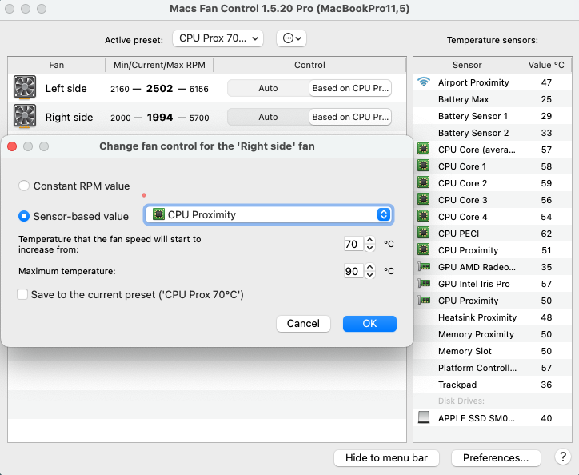

- 01:01 記錄閃念
- 01:04 [[quick capture]]: #voice-memo
  collapsed:: true
	- **這張臉 DEMO**
		- 
	- 想象的畫面有老師當主唱；一大半孩子或和聲團在跟唱的和諧感
	- 結束於 01:08
- 01:08 盥洗，戴上牙套
- 01:35 忍糞，預設鬧鐘，下載軟件，強忍睡意
- 01:48 睡覺
- 08:50 夢醒，因身體不適醒來，因外部聲音醒來，確認貌似鼠類的叫聲源頭，賴床，深呼吸
- 09:00 解除鬧鐘，時間帳，賴床
- 09:06 喝水，輕撫自己的頭
- 09:57 查看信息，確認 [[OCD Assessment Follow-Up]] [[14]]:00 - [[16]]:00 會議方式
  collapsed:: true
	- https://teams.live.com/meet/9357210933626?p=564WtE2V32MmpK4y3q
- 10:00 測試軟件 ── [[Microsoft Teams]]、 [[CleanShot X]] [[Screen Recording]] + [[Audio Recording]] 、[[豆包 AI]] [[會議記錄]]
  id:: 698d33af-0a2d-4b7d-abe9-b93ab27e223b
  collapsed:: true
	- 結束於 10:30
- 10:30 時間賬
- 10:35 回信
- [[10]]:37 重啟 [[MacBook Pro (MBP)]]，藉助 [[AI]] 工具 ── 為減少噪音，透過 [[Macs Fan Control]] 微調參數，聽見非同居者造訪和嫲嫲的對話，覺察排斥，焦慮，難過
  collapsed:: true
	- 
- 11:05 忽略式哼唱，強迫性做事 ── 行事曆 [[OCPD Assessment Follow-Up]] 添加已填的 [[Liebowitz Social Anxiety Scale]] 表格
  collapsed:: true
	- 
	- https://www.notion.so/geng-is-here/LSAS_Completed_NG-KAH-KING-305459c690fa8083a975ff27ce6dd9b6?source=copy_link
- 12:00 整理雜物，覺察焦慮，強迫性做事
- 12:07  強迫性做事，重啟 [[MacBook Pro (MBP)]]，確認自己的手尾，檢查系統流暢度
- 12:48 主動打開冷氣，走動，輕撫自己的頭，深呼吸，覺察焦慮比
- 12:55 走動，排尿，摘下牙套，喝水，沖涼，刻意放慢動作，覺察焦慮，輕撫自己的頭
- 13:29 覺察焦慮，優化 [[MacBook Pro (MBP)]] 後臺，哼唱，裸上半身
- 13:38
-
-