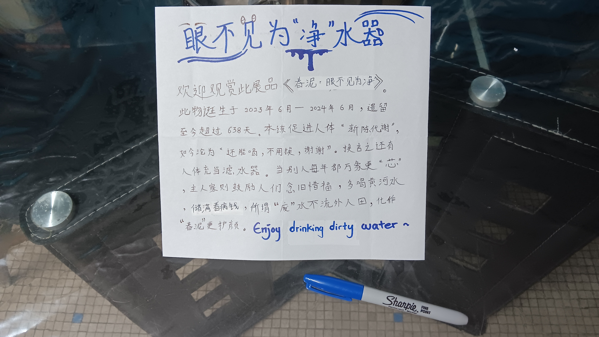
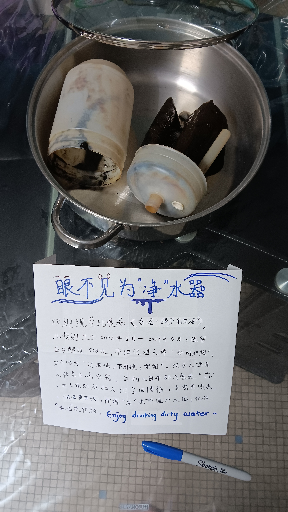
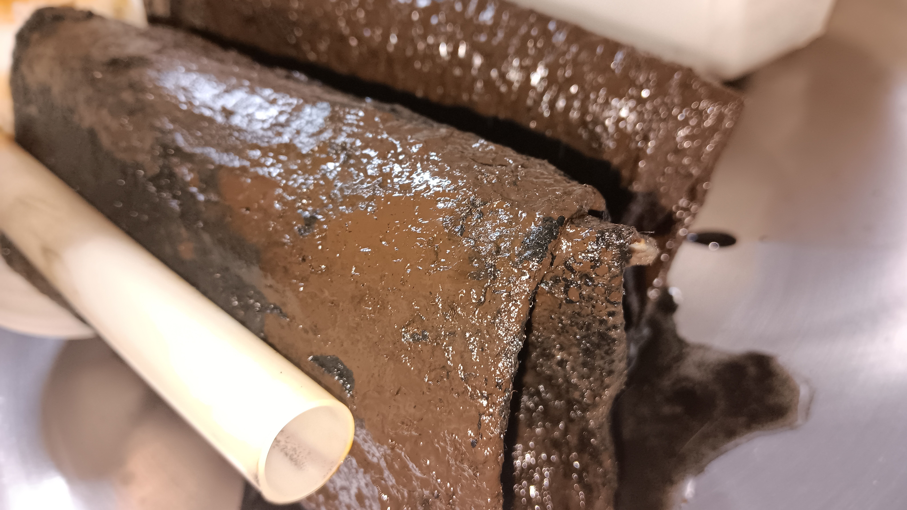
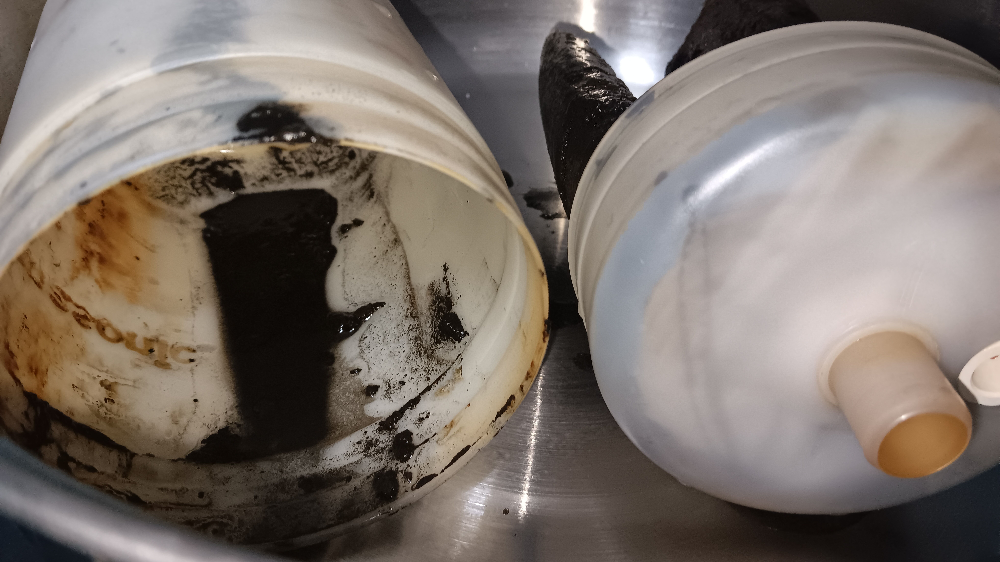

- 00:38 為提醒家人更換家裡[[濾水器]]的[[濾芯]]，選擇諷刺的手法撰寫一篇展品介紹
	- [[眼不见为净]]
		- 此物[[誕生]]於 2023 年 6 月 ─ [[2024]] 年 6 月，遺留至今超過 [[638]] 天。本該促進人體 「[[新陳代謝]]」，如今淪為 「還能喝，不用換，謝謝」，換言之還有人體充當濾水器
		- 當別人每年都 [[萬象更「芯」]] ，主人家則鼓勵人們[[念舊]]惜福，多喝[[黃河水]]，儲滿看病錢，畢竟[[「廢」水不流外人田]]，化作[[春泥]]更護顏。enjoy drinking dirty water
		- 
		- 
		- 
		- 
- 04:01 冲凉，排尿
- 04:48 编辑信息，藉助 AI 工具
- 06:27 成功回信實習諮商師 [[Valerie Tan Jin Wen]]，
- 06:30 睡覺，睡睡醒醒，因外部聲音醒來，覺察焦慮，回籠覺，因疲倦起不了身
- 12:55 因身體不適醒來，時間帳，走動
- 13:00 簽署 [[Trainee Consent Form.pdf]]，回信實習諮商師 [[Valerie Tan Jin Wen]]
- 13:35 繳保費 ── [[AIA]] [[A-LifeLink]] [[FEB]] [[2026]]，覺察焦慮，暗室直視 3C 藍光
- 13:50 走動，喝水，午餐，排便，沖涼，猶豫而決，離子化飲用水
- 15:03 OGC
- 15:20 走動
- 15:24 為騰出空間，清理過去跟[[陳莉晶]]在一起的信物，清理舊物，覺察懷念，難過，喜悅，聽音樂
- 19:50 走動，安裝硬件
- 21:15 中途遇到家人干預，泄憤，對他人說教，強忍黏膩的皮膚，爆粗，咄咄逼人，覺察忌妒，難過，憤怒，失望，羞愧
- 22:16 強忍黏膩的皮膚，晚餐，清洗廚具，喝冷飲，吃甜食，覺察
- 23:37 走動，離子化飲用水
	- 結束於 [[Mon, 02-03-2026]] 00:38