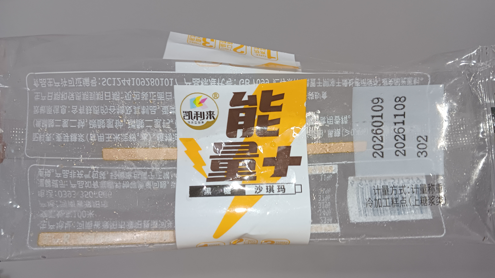
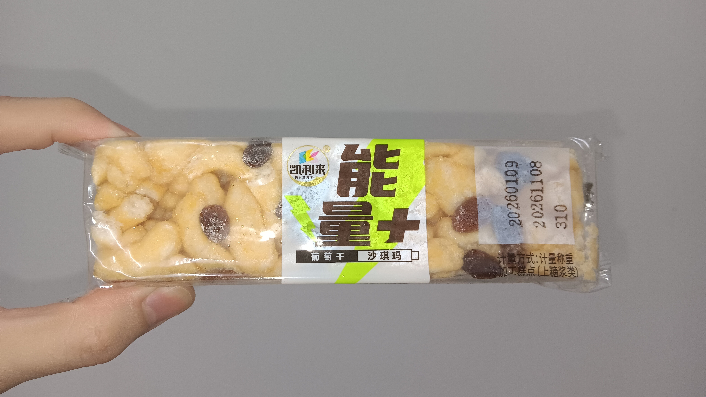
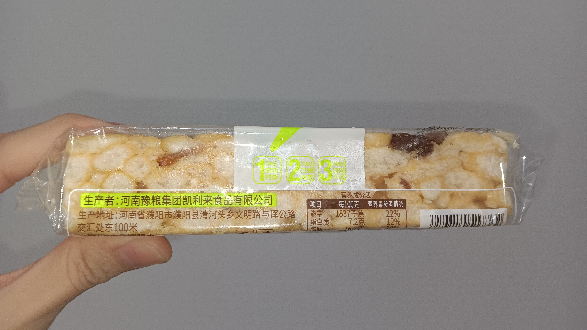
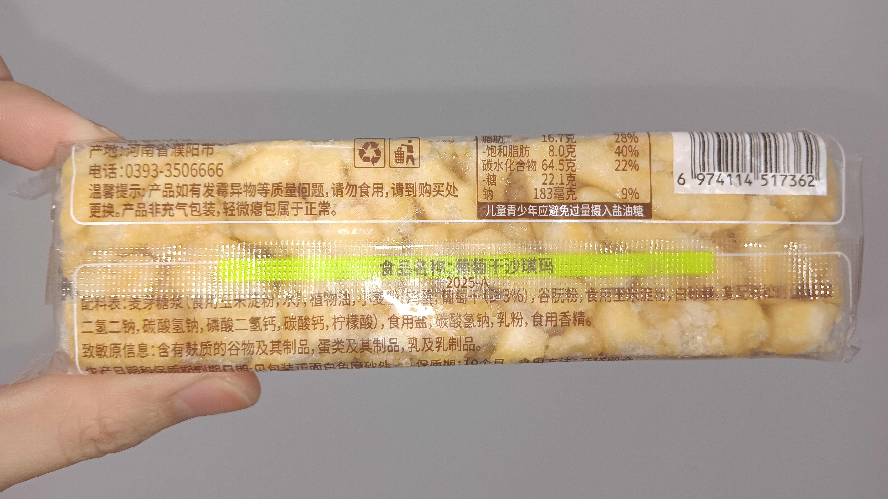
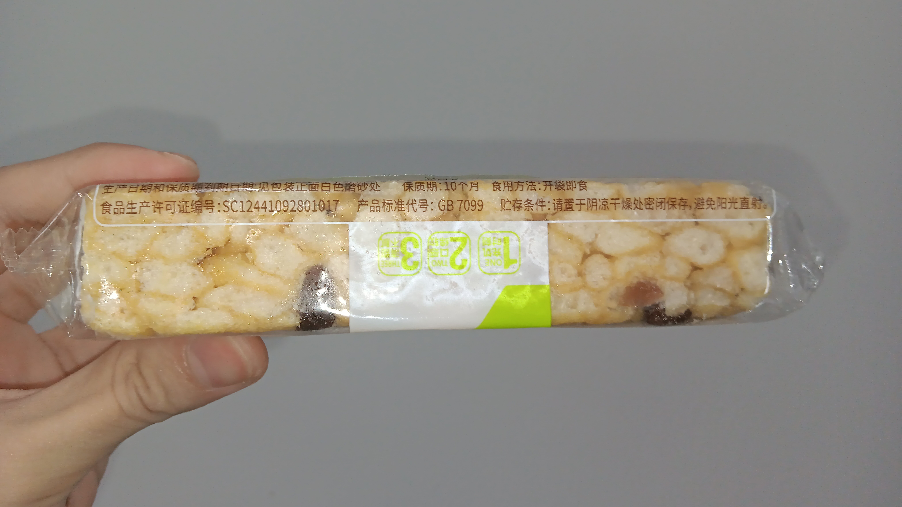

- 01:33 走動，盥洗，摘下牙套，喝水，晚餐，吃甜食，喝牛奶，嚐到看似酥脆卻實質鬆軟的[[大陸零食]]──[[凯利来能量+沙琪玛]]，由[[河南豫粮集团凯利来食品有限公司]]生產
  collapsed:: true
	- 
	- 
	- 
	- 
	- 
- 03:25 清洗廚具，走動，處理垃圾，拆解可回收盒子
- 04:41 沖涼，盥洗
- 05:09 喝蕃薯糖水，覺察滿足
- 05:13 文字提問，藉助 AI 工具 ── 忽然想起一個非常好奇想了解很久的科學原理 + 思維邏輯
  collapsed:: true
	- [[quick capture]]:  https://chatgpt.com/share/69aa0570-daec-8006-b0f2-fd865a8af44c
- 06:39 盥洗，戴上牙套，清洗廚具，走動，覺察疲勞
- 07:02 睡覺，聽音樂
- 08:10 聽見爺爺手機聲量過大且高頻重複，從戶外傳到房內，覺察煩躁，輕撫自己的頭，安撫自己，賴床，了解自己的需要 ── 陪伴自己走到戶外主動暫停視頻播放
- 08:17 走動，到了附近時確認視頻自動停播
- 08:19 躺着，時間帳，聽音樂，覺察平靜，疲勞
- 08:25 回籠覺，聽音樂，睡睡醒醒，夢醒，因疲倦起不了身
- 18:39 因身體不適醒來，頭部覺得腫脹，想象許多自己[[吊頸]][[死亡]]的畫面
- 18:59 時間帳，半躺半坐
- 19:04 走動，盥洗，摘下牙套
- 19:32 查看信箱
- 19:34 藉助 [[AI]] 工具 ── 遷移 [[Rovo Dev CLI]] 的對話記錄至 [[[[Antigravity]] [[IDE]]]]，躲避與家人接觸
- 19:57 時間賬，文字提問，網搜資訊
- 20:07 吃蔬果，喝水，晚餐，清洗廚具，發呆，覺察疲勞，沖涼，盥洗，戴上牙套，刻意放慢動作，覺察鏡像潛意識的歌詞，覺察亢奮，排尿，
- 22:57 OGC，入耳式耳機
- 23:15 走動，緩衝
- 23:20 藉助 [[AI]] 工具 ([[Chrome AI mode]]) ── 透過 [[MCP (Model Context Protocal)]] 鏈接 [[[[Notion]] Custom Agent]] 和 [[MacBook Pro (MBP)]] [[filesystem]] 失敗
	- 結束於 01:21
-