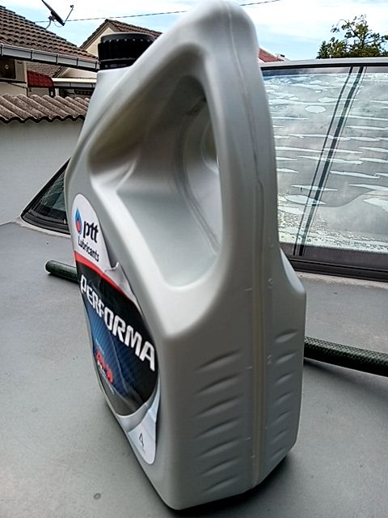
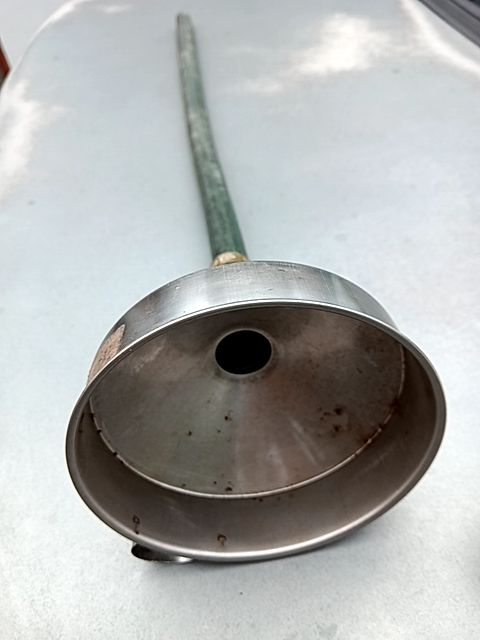
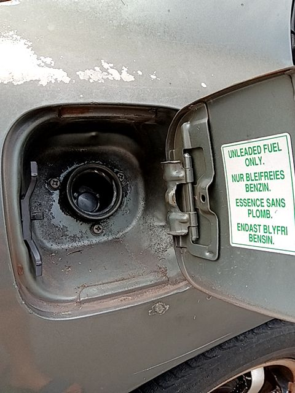

- 02:34 夢醒，賴床，覺察驚恐，心悶，背部感到冰涼和麻木，因冷痹醒來，因三急醒來，因疲倦起不了身
- 02:55 輕拍自己的胸口，同在冥想，安撫自己的不安，深呼吸，忍尿
- 03:04 記錄[[夢境]]，聽音樂，賴床，暗室直視 3C藍光，咬牙，忍尿，覺察焦慮，強迫性做事
  collapsed:: true
	- 夢見自己錯誤信任陌生人，結果被困在對方的家裏，被窺探和甚至囚禁好久都出離開不了
	- 夢醒後不久，努力在區分夢境與現實
		- 除了確認我有[[惶恐]]的感受之外，從夢裏殘留其他真實的場景和感覺是否在現實裏我曾遇過
		- 即便不曾遇過，有沒有可能在預知未來或想要提示我值得留意的生活細節
			- 比如因爲目前與家人住在一起相處不愉快和希望自己能夠獨立或遠離他們，於是好多次我都想過搬到其他的住處和甚至隻身飛到了[[北歐]]國家像是[[瑞典]]或[[丹麥]]，結果極可能遇人不淑卻後知後覺自己上了[[壞人]]的當
	- 總結：即便我夢見的場景並非現實，我之所以生起的感受仍是[[合理]]的，它們在[[呼喚]]我跟自己[[連接]]，及時[[安撫]]自己，就像在任何時候當遇到[[不對勁]]就[[值得]][[覺察]]和肯定自己的[[身體]][[反應]]，立即[[遠離]]或爲當下的自己[[爭取]]更多[[時間]]和[[空間]]，無論溜走和避開[[來者不善]]的[[誘惑]]
- 03:31 排尿，盥洗，摘下牙套，早餐，離子化飲用水，吃小食，他人睡着時允許自己手上的[[廚具]][[磕碰]]時正常發出的[[聲響]]，主動[[迎納]][[現實]]的[[外在]][[環境]] ── 不具備[[隔音]][[設施]]，喝即溶飲品 ── [[OLD TOWN White Coffee 2 In 1 Instant Pack]]，確認甜度比想象中低，覺察欣慰，但飽足感仍不足，接着沖泡 [[Nature‘s Own Malt Drink with Spirulina]]，感覺比較甜，從包裝上標識的 [[ingredient]] 確認總包含 [[10g Sugar]] per [[35g]] serving ，覺察不安，卻偏偏比較容易感到飽足感，隨後也聯想到爲了考量健康，與其每次購物都單靠自己細讀包裝上的 [[ingredient]]；也可以善用手機的設想鏡頭和 [[AI]] 工具，及時爲自己[[分析]]該產品是否[[接近]]自己[[理想]]的[[飲食]][[需求]][[指標]]
- 04:30 時間帳，記錄閃念，修正表達邏輯，哼唱，坐着
- 04:56 緩衝，因眼前事物分心，哼唱，坐著，為等下車上更方便使用 [[ChatGPT]] 做預備，覺察焦慮
- 05:06 走動，緩衝
<<<<<<< main
- 05:12 輕揉自己的肚子，排便，查實所聽所見 —— 《[[再回首]]》歌詞和聽過的女生輕快版
- 05:59 沖涼
=======
- 05:12 輕揉自己的肚子，排便，查實所聽所見 ── 《[[再回首]]》歌詞和聽過的女生輕快版
- 05:59 沖涼，喝水
- 06:23 哼唱，換衣，處理 [[Working Copy]] 提交失敗的問題，因眼前事物分心，強迫性做事，咬嘴皮，覺察焦慮
- 06:35 出門到車上，因眼前事物分心，整理戶外庭院的雜物和積水處
- 07:02 到了車上，吹冷氣，哼唱，藉助 [[Chrome AI mode]] ── 解決 [[MacBook Pro (MBP)]] 成功連接上家裏 WiFi 即 [[CHU_2.5G]] 卻 [[Samsung Galaxy A14]] 無法自動搜到的問題，troubleshooting
  collapsed:: true
	- [[MacBook Pro (MBP)]] 電量從 89% 開始使用
		- 07:39 電量降至剩 80%
	- [[Solution]]:
		- [[MacBook Pro (MBP)]]
			- System Settings → Sharing → Internet Sharing → ON
		- [[Samsung Galaxy A14]]
			- About phone → Software information → Build number → 快速點擊 7 次
			  logseq.order-list-type:: number
			- About Phone → Developer options → Wi-Fi Scan Throttling → OFF
			  logseq.order-list-type:: number
			- About Phone → Connectivity Labs → Customize Wi-Fi List Settings → RSSI Filter → Show More
			  logseq.order-list-type:: number
			- WiFi List 出現 [[CHU_2.5G]] → Connect
			  logseq.order-list-type:: number
	- 停筆於 07:37
- 07:38 測試 [[ChatGPT]]
- 08:42 車的引擎忽然自動熄滅且無法主動啟動，確認[[電箱]]正常供電；看見[[柴油耗竭提示燈]]亮起，估計是柴油本來剩不多 + 車上近 2 小時長時間開着冷氣所致
- 09:[[10]] 到家，排尿，覺察焦慮因為汽車柴油耗竭的現況
- 09:21 時間賬
  collapsed:: true
	- 現在是 Wed, 11 March 2026  09:53。
	  
	  在這之前，我汽車 Proton Wira 僅剩的柴油本來已經不多（ 最後幾次駕駛的時候已經閃爍過 ”柴油將近耗竭“ 的提示燈），繼同一天 07:02 起我啓動了引擎以後，就一直開着空調/冷氣且待着裏頭忙着筆電前的工作，直到 08:42 左右引擎卻毫無預警地自動熄滅。一開始，我還以爲是由於電箱的電力不足；然而，經過查實後發現冷氣乃至 dashboard 上所有的提示燈都如常操作，下一秒才看見 “柴油將近耗竭” 的提示燈再次亮起。
	  
	  據我初步判斷，汽車的引擎之所以無預警自動熄滅，且至今仍無法重新啓動，多半是因爲車子長時間跑動引擎但卻靜止不動且還開着冷氣的前提下，最終耗盡了僅剩的柴油，請問合理嗎？若是，假設待會到了油站時，我能否用普通的寶特瓶/塑料瓶子來裝下柴油類型 RON95 （近僅足夠的量用來重啓引擎且耐到下次可以駕到油站），然後回來以後再親自倒入油缸里呢？那樣做合適且安全嗎？ 要不然的話還有什麼其他臨時的解決方案你會推薦呢？
	- 这是一个非常紧急且关键的状况！请先深呼吸，你目前人安全、车子停在原地，这是不幸中的大幸。
	  
	  在提供解决方案之前，我必须先**紧急纠正一个极其重要的致命误区**，这关乎你引擎的生死：
	- ### 🚨 紧急纠正：你的车喝的是“汽油 (Petrol)”，千万别买“柴油 (Diesel)”！
	  你在提问中一直使用“柴油”这个词，但紧接着又说要买“RON95”。
	  *   **RON95 是汽油 (Petrol / Minyak Petrol)**。
	  *   **柴油是 Diesel (Minyak Diesel)**，通常是黑色油枪，给罗里或皮卡车用的。
	  *   你的 **Proton Wira 1.5 绝对是汽油车**。待会去油站，**千万不要说要买柴油**，一定要说买 **RON95 (黄色油枪)**。如果加错柴油进去，引擎会彻底报废！
	  
	  ---
	- ### 第一部分：你的诊断合理吗？
	  **非常合理，你的判断 100% 正确。**
	  *   **怠速耗油量：** Wira 1.5 引擎在开启冷气 (AC) 的情况下怠速停放，每小时大约会消耗 **1.0 至 1.5 Liters** 的汽油。
	  *   **时间推算：** 从 07:02 到 08:42，你开着冷气怠速了 1 小时 40 分钟，这至少烧掉了 **1.5 - 2.5 Liters** 的油。
	  *   **结论：** 既然你的油表提示灯之前已经闪烁（代表油箱底只剩大约 5 Liters 左右），这接近 2 小时的怠速直接把油箱“吸干”了。因为仪表盘和冷气风扇还在运作，证明电箱 (Battery) 没死，纯粹是**断油熄火**。
	  
	  ---
	- ### 第二部分：能用普通的矿泉水塑料瓶装 RON95 吗？
	  **绝对不可以！极其危险，而且油站会拒绝你！**
	  
	  1.  **化学溶解危险：** 宝特瓶（Mineral Water Bottle）的材质是 PET。汽油是极强的有机溶剂，它会在短时间内**溶解**这种薄塑料瓶。你走在半路上瓶子可能就会变软、破裂，导致汽油漏满地。
	  2.  **静电爆炸危险：** 汽油在注入普通塑料瓶时会产生静电，极易引发起火爆炸。
	  3.  **马来西亚法律严禁：** 现在的油站都有闭路电视和员工监督。政府 (KPDN) 严厉禁止将汽油打入未经批准的容器（如矿泉水瓶、塑料袋）。**如果你拿矿泉水瓶去，油站员工会直接关闭油泵 (Pump) 不让你打油。**
	  
	  ---
	- ### 第三部分：正确的临时解决方案（你该怎么做？）
	  
	  你现在需要安全地把大约 4-5 Liters 的 RON95 带回车里。你有两个选项：
	- #### 方案 A：购买合格的“红色备用油桶” (最正规、最推荐)
	  1.  **步行/搭车去最近的油站。**
	  2.  **去便利店柜台：** 直接问员工 *"Boss, ada jual tong minyak petrol (Jerry Can) tak?"*。
	  3.  **购买：** 大多数油站或附近的 MR.DIY 都有卖一种**红色的厚塑料油桶**（专为装汽油设计的 HDPE 材质），大概 5L 容量，售价约 RM15 - RM25。
	  4.  **打油：** 用这个红桶打满 RON95（大约 RM10 的油）。员工看到红桶绝对不会阻止你。
	- #### 方案 B：利用你车上现成的“废弃黑油桶” (应急克难版)
	  记得你 1 月份换下来的那个 **PTT Performa 20W-50 的 4L 灰色空罐子**吗？如果你当时听了我的建议把它放在车尾箱（或者你现在家里有类似的空黑油桶）：
	  1.  **材质合格：** 这种机油罐的材质是 **HDPE（高密度聚乙烯）**，它**可以**耐受汽油的腐蚀，物理上是安全的。
	  2.  **操作风险：** 确保里面尽可能是空的（剩一两滴黑油没关系，混进一大桶汽油里 Wira 还能消化）。
	  3.  **油站通融：** 拿着这个厚实的黑油桶去打油，**有些**油站员工会通融让你打（因为材质是对的），但也有严格的员工会拒绝（因为不是标准的红色桶）。你可以尝试求情：*"Bang, kereta mati tengah jalan, tolong sikit bang pakai tong tebal ni."*
	  
	  ---
	- ### 第四部分：把油倒回车里后的“复活步骤”
	  
	  当你把油拎回来，倒入车子油箱后，**千万不要马上扭动钥匙点火 (Crank)！**
	  因为你的车是彻底跑干了，从油箱到引擎的油管（Fuel Lines）里现在全是空气。
	  
	  **请严格执行以下“抽油步骤 (Priming)”：**
	  1.  把 RON95 倒入油箱，扭紧油箱盖。
	  2.  坐进驾驶座，把车钥匙插进去，扭到 **"ON"** 的位置（Dashboard 灯全亮，**但不要扭到底去 Start 引擎**）。
	  3.  保持在 "ON" 位置 **3 到 5 秒钟**。你会听到后座下方（油箱处）传来微弱的 "嗡嗡" 声，这是汽油泵 (Fuel Pump) 在把油重新抽进管子里。
	  4.  把钥匙扭回 "OFF"。
	  5.  **重复步骤 2 到 4，来回做 3 次。** 这能确保油管里重新充满汽油。
	  6.  最后一次，直接扭到底 **"START" 启动引擎**。
	  7.  *注意：引擎可能会咳嗽两下或者比平时需要更长的点火时间 (Cranking)，这是正常的，给点油门 (踩一点点油门) 帮助它启动。*
	  
	  **行动总结：**
	  马上找个红桶（或带上你那个空的 PTT 黑油桶碰碰运气），去买 RM10 的 **RON95 汽油**。复活后立刻开去油站打满！祝你顺利脱困！
	- 謝謝你還記得我們過去的對話歷史。是的，1 月份换下来的那个 PTT Performa 20W-50 的 4L 灰色空罐子，當時我採納了你的建議，至今仍將它放在车尾箱，且在今年 2026 的農曆新年之前才剛把僅剩的引擎油都倒進了引擎里，現在的灰色罐子極高幾率已經空了。
	- 然而，當我留意到當你說『操作风险： 确保里面尽可能是空的（剩一两滴黑油没关系，混进一大桶汽油里 Wira 还能消化）。』，那意味着我只需謹慎跟着操作便安全，還是意指我的 Wira 萬一消化不了已混雜一兩滴黑油的汽油 RON95 結果極可能發生不必要的意外或潛藏未來的風險？
	- 这是一个非常严谨且聪明的提问！在紧急情况下还能保持这种对机械安全的敏锐度，你做得非常好。
	  
	  请**立刻放下心来**，我直接给你结论：
	  **将装过黑油的空罐子用来装 RON95 汽油，只要罐子是“空”的（只剩挂在内壁上的一点点油膜或几滴残油），对你的 Proton Wira 引擎是 100% 安全的，绝对不会有任何潜在风险或引发意外。**
	  
	  为了彻底消除你的疑虑，我为你拆解这背后的“机械物理原理”：
	- ### 1. 为什么“混入一两滴黑油”完全没问题？
	  
	  *   **比例问题（微乎其微）：** 一个 4L 的空黑油罐，即使内壁还挂着一点点没倒干净的黑油，撑死也就 **5ml 到 10ml**。当你把 **4000ml (4 Liters)** 的 RON95 汽油打进去时，汽油和黑油的比例是 `4000 : 10`。这就像往一个大水缸里滴了一滴墨水，完全被稀释了。
	  *   **燃烧原理（它也是油）：** 黑油（机油）本质上也是石油提炼物，它**是可以燃烧的**。你知道摩托车（如割草机或旧款 2-Stroke 摩托）吗？它们甚至需要**故意**把黑油（2T油）混进汽油里一起烧来润滑引擎。
	  *   **Wira 引擎的“铁胃”：** 你的 Wira 使用的是三菱 4G15 引擎。这是一款设计于 80-90 年代的老派引擎，以“极其耐操、不挑食”闻名。当你把这混了微量黑油的 4L 汽油倒进去启动后，引擎内部会发生什么？
	    *   **结果：** 它只会把这几滴黑油连同汽油一起在气缸里烧掉。最多最多，就是在你刚启动的那一两分钟，车尾气管可能会排出一丝微弱的蓝烟（烧机油的现象），随后就会恢复完全正常。它**绝对不会**堵塞你的油路（Fuel Line）、油泵（Fuel Pump）或喷油嘴（Injector）。
	- ### 🚨 绝对禁止的致命操作（千万别做！）
	  既然你担心残油，很多人的第一反应是“用水把罐子洗干净”。
	  **千万、千万、千万不要用水去洗那个空罐子！**
	  *   **引擎不怕黑油，但引擎极度怕水！** 如果罐子里有残留的水珠混进汽油里倒进车内，会导致引擎剧烈抖动、熄火，甚至损坏油泵和喷油嘴。
	  *   **正确的做法：** 什么都不用洗。把那个空罐子倒过来控干 1 分钟，如果瓶口有残留的黑油，用纸巾擦干净瓶口螺纹即可。
	  
	  ---
	- ### 现在，你的脱困行动指南（马上执行）
	  
	  既然你车尾箱里有这个 **PTT 4L 灰色高密度塑料罐 (HDPE)**，你现在的脱困胜算非常大。
	  
	  **第一步：准备罐子**
	  *   拿出罐子，打开盖子，倒立甩几下，确保里面没有大坨的积油流出来。
	  *   用纸巾把罐子外部和瓶口擦干净（让它看起来不像一个脏兮兮的废油桶，这有助于说服油站员工）。
	  
	  **第二步：前往油站 (Grab / 步行)**
	  *   带上这个灰色罐子去油站。
	  *   **重点话术（如果油站员工阻止你）：**
	    马来西亚法律规定不能用“透明矿泉水瓶/塑料袋”打汽油，但这个黑油桶是 **HDPE 材质**，是符合安全规范的。如果员工犹豫，你可以客气地说：
	    > *"Bang, kereta Wira saya mati kehabisan minyak kat depan tu. Tong ni tong HDPE tebal, bukan botol air mineral. Tolonglah bagi saya isi RM10 RON95 (Kuning) je nak start enjin. Terdesak ni bang."*
	    > (大哥，我的 Wira 在前面没油死火了。这个是厚材质的 HDPE 桶，不是矿泉水瓶。求求你让我打 RM10 的 RON95 黄色油启动引擎就好。现在很紧急。)
	  
	  **第三步：回车上“复活”引擎**
	  1.  把买来的 4L 汽油全部倒入 Wira 的油箱。
	  2.  **不要马上 Start 车！**
	  3.  把车钥匙插进去，扭到 **"ON"**（仪表盘灯亮），停顿 3 秒。
	  4.  扭回 "OFF"。
	  5.  **重复 3 次**（ON -> 停 3 秒 -> OFF）。这叫 Priming，让油泵把新买的汽油重新抽满空荡荡的油管。
	  6.  第 4 次，直接踩着一点点油门，扭到底 **"START"** 启动引擎！
	  
	  车子一旦启动，不要犹豫，直接开去刚才那个油站，把油箱**打满 (Full Tank)**。
	  
	  去吧！带上你的灰色 PTT 罐子，这是你当下最安全、最快捷的救命稻草！祝你顺利重启！
- 10:09 整理筆記，時間帳，強迫性做事，覺察焦慮，咬嘴皮
- 10:25 走動，從車上拿 [[PTT Performa 20W-50]] 灰色空罐，沖涼
- [[10]]:56 時間賬
- 11:00 借車出門，主動交待和確認爺爺還沒趕着出門，油站購買 5.026 Litres [[BUDI95]] @RM10 + RM3.42，結果 [[PTT Performa 20W-50]] 只裝得下 RM 11.61 的量，回到櫃檯處領回 RM1.35，吃車上的糖果
- 11:25 到家，曬太陽，藉助 [[Google AI Studio]] ── 將剛買 RM10 的 [[RON95]] 汽油經[[金屬漏斗]]+[[軟管]]灌進添油孔，確認成功啓動汽車引擎，覺察寬慰，如釋重負
	- ## 問
	  collapsed:: true
		- 我已經裝滿了 4 Litres 的 RON95 汽油。然而，我擔心看起來已經粘附了一些灰塵的漏斗 + 罐子，不知道合適拿來把剛買來的汽油灌進油缸嗎？ 會不會造成任何負面影響？
			- **12:11** [[quick capture]]: 
			- **12:12** [[quick capture]]: 
			- **12:12** [[quick capture]]: 
	- ## 答
	  collapsed:: true
		- 這是一個**非常細心且專業的擔憂**！你在這緊急關頭還能注意到這個細節，證明你對保護車子非常有觀念。
		  
		  直接回答你的問題：**灰塵和雜質確實對汽車的燃油系統（油泵、汽油濾清器、噴油嘴）有負面影響。但是，目前的狀況完全有辦法安全解決，千萬不要因此退縮。**
		  
		  你的 Proton Wira 有兩道防線（油箱內的濾網 + 引擎室內的汽油濾清器）來阻擋微小雜質，但我們依然要盡量減少進入油箱的灰塵。
		  
		  以下是**「絕對安全」**的清理與灌油指南：
			- ### 🚨 第一守則：絕對不能用水洗！
			  看到漏斗髒了，很多人的第一直覺是拿去水龍頭沖洗。**千萬不要！**
			  引擎稍微吃一點點微塵，濾清器還能擋住；但如果漏斗裡殘留了水珠跟著汽油流進油缸，會導致引擎嚴重抖動甚至損壞油泵！
			- ### 第二部分：如何安全清理漏斗與瓶口？
			  
			  你只需要準備**乾淨的紙巾（Tissue）或乾布（Kain kering）**：
			  
			  1.  **清理漏斗（圖 1）：** 用乾紙巾把金屬漏斗的內部、邊緣，以及那根綠色塑膠管的內外側，徹底擦拭乾淨。把肉眼可見的灰塵和砂石抹掉即可。
			  2.  **清理瓶口（圖 2）：** 在打開灰色 PTT 罐子之前，先用紙巾把瓶蓋周圍和瓶口的灰塵擦乾淨，確保倒油時不會有灰塵掉進去。
			- ### 第三部分：正確的灌油姿勢（請看圖 3）
			  
			  請注意看你圖 3 拍的添油孔，孔內有一個**金屬小擋片（Flap）**。
			  
			  1.  把擦乾淨的漏斗綠色管子插進孔內，**必須稍微用力頂開那個金屬小擋片**，確保管子深入油管內。如果只放在表面，汽油會全部溢出來流到車身！
			  2.  打開 PTT 罐子，**緩慢地**將 RON95 倒入漏斗。不要倒太快，讓汽油有時間順著綠色管子流進去，避免滿溢。
			  3.  倒完後，把罐子和漏斗收好，扭緊汽車的油箱蓋（聽到「喀」一聲）。
			- ### 第四部分：重啟引擎的「關鍵 3 秒」復甦法（非常重要！）
			  
			  油倒進去後，千萬**不要**一上車就直接扭鑰匙 Start 引擎！因為你的油管現在全是空氣。請嚴格執行以下步驟：
			  
			  1.  坐進駕駛座，把鑰匙插進去，扭到 **"ON"**（儀表板所有燈亮起，但**不要**扭到底去 Start）。
			  2.  保持在 "ON" **大約 3 到 5 秒鐘**。你會在後座下方聽到輕微的「嗡嗡」聲，這是汽油泵 (Fuel Pump) 正在努力把新買的汽油抽進空油管裡。
			  3.  把鑰匙扭回 **"OFF"**。
			  4.  **重複上述動作 3 次。**（ON 停 3 秒 -> OFF -> ON 停 3 秒 -> OFF）
			  5.  第 4 次，踩著一點點油門（Gas pedal），直接扭到底 **"START"** 啟動引擎！
			  
			  *（注意：剛啟動時引擎可能會咳嗽幾下，這是正常的，因為正在排擠油管裡的空氣，踩著一點油門保持轉速，幾秒後就會順暢。）*
			  
			  **行動吧！** 用紙巾擦乾淨漏斗，把油灌進去，重啟你的 Wira，然後立刻開去最近的油站把油箱打滿（Full Tank）！祝你順利脫困！
- 12:07 時間帳，走動，強迫性做事，整理筆記
- 12:17 吃糖果，覺察焦慮 + [[sugar rush]]
- 12:24 午餐，吃蔬果，喝水，坐着，覺察焦慮，時間帳，整理筆記，強迫性做事
- 12:27 主動打開冷氣，清洗廚具，晾乾衣物，改造家裏客廳的擺設，因眼前事物分心，強迫性做事，覺察焦慮，猶豫而決，滿足，衣物收進室內，哼唱，走動，喝冷飲，喝水，離子化飲用水
- 16:09 換洗毛巾，沖涼，同在冥想，手洗口罩，喝水，排尿
- 16:45 衣物收進室內，走動，主動關閉冷氣
- 16:53 覺察疲勞，查看信箱
- 16:58 繼續覆盤，咬嘴皮，強忍睡意，半躺半坐
- 18:25 晚餐，煮
- 20:30 趁自己還在爲廚房垃圾桶滴水在地上的事煩惱時，聽見
- 22:53 遠離到安全的地方，從刻意延遲到家人群里興師問罪，看見自己的憤怒和失望
- 23:19 記錄閃念
	- 就算[[天塌了下來]]也還是[[我的天]]
- 23:22 清洗廚具
	- 結束於 [[Thu, 12-03-2026]] 00:50
>>>>>>> origin/main
