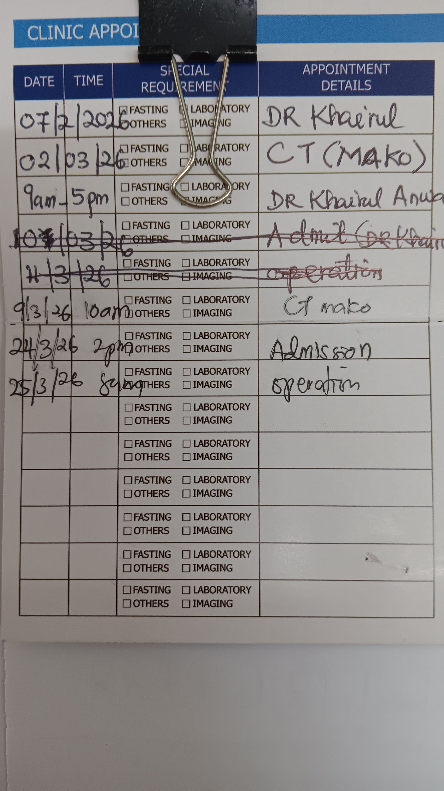
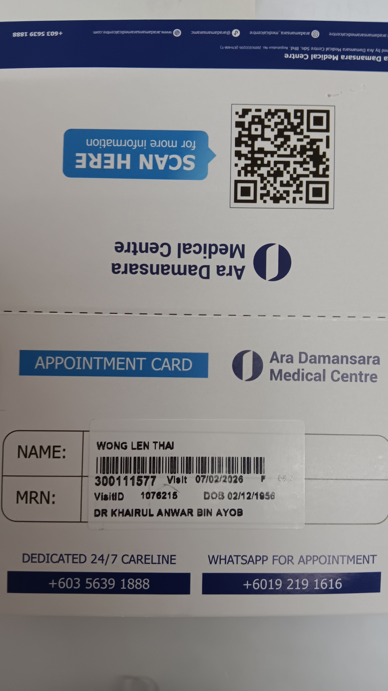

-
- 00:52 不小心睡着，燈還亮着，睡睡醒醒
- 08:40 因身體不適醒來，時間賬，因疲倦起不了身
- 08:44 賴床，覺察心悶，胃不舒服，雙手冷痹麻木，輕撫自己的頭
- 09:04 半躺半坐，修正 [[Notify for Mi Band]] 睡眠記錄
- 09:12 編輯信息，覺察不安，猶豫而決，向實習諮商師 [[Valerie Tan Jin Wen]] 確認來臨 session  —— [[Sat, 21-03-2026]] 15:00
- 09:21 半躺半坐，覺察焦慮，猶豫而決，藉助 [[ChatGPT]] 修正給諮商師 [[Jacqueline Kon Jia Min]] 送出的信息
  collapsed:: true
	- Hi Jacqueline,
	  Hope you're settling back in well 😊
	  
	  Just checking in on the OCPD assessment report and the mid-March follow-up we mentioned earlier. I wanted to check if you might still need more time, or if we should arrange the final video call.
	  
	  Wishin' you a smooth transition back home.
- 11:14 [[reload]] RM5，備份收條，因眼前事物分心 —— 為從 [[CelcomDigi]] 獲得 [[e-invoice]] 結果忙於 [[income tax]] 賬號和準備身份證副本卻依舊失敗，強迫性做事
- 12:18 走動，緩衝，忍尿
- 12:30 喝水，排尿，摘下牙套，午餐，喝水，覺察抑鬱，難過，沖涼
- 14:01 時間賬，主動提問自己好奇的事情，觉察抑郁，难过
  collapsed:: true
	- [[Mon, 23-03-2026]] 14:00 入院
	- [[Wed, 25-03-2026]] 08:00 手术
	- 
	- 
	-
- 14:24 確認嫲嫲入院的事項 + 試圖讓對方明白
- 15:30 主動問對方是否暫停對話，覺察錯愕，時間賬
- 15:33 排尿，喝水
- 15:40 繼續對他人說教，他人的請求 —— 為了避免扛起任何責任，試圖通過讓對方明白具體怎麼親手做，覺察焦慮，不甘心，遺憾，難過
- 17:49 覺察大腿屁股麻痹，走動，覺察疲勞，
- 18:00 打哈欠
- 18:13 開門迎接修理冰箱的人，覺察焦慮，緊張
- 18:26 編輯信息，刷社媒
- 19:32 走動，狂打哈欠，覺察疲勞，發呆，急救式抱頭
- 19:43 看視頻，瀏覽遊戲 demo
- 19:52 晚餐，清洗廚具，覺察排斥
- 21:13 強忍黏膩的皮膚，拆解屋外的舊櫃子，強迫性做事，因眼前事物分心，修剪樹枝，搬動重物，大幅度調整屋外月台的空間和擺設，覺察將可再回收舊物件放到車上
	- 結束於 [[Fri, 20-03-2026]] 04:10