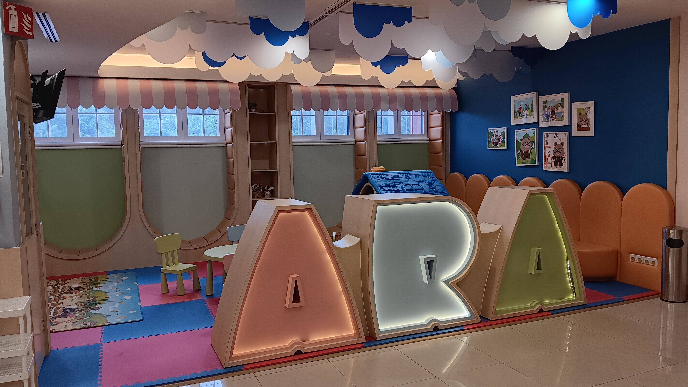
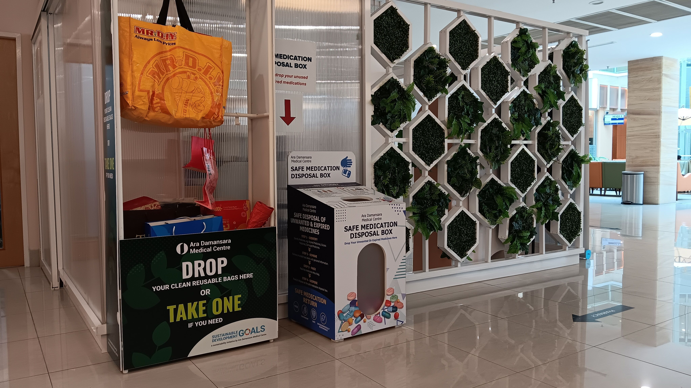

- 00:25 緩衝，主動打開冷氣，乾洗 3C 產品
- 00:52 緩衝，哼唱，為明天預備背包裡的東西
- 03:50 睡覺
- 07:22 因爺爺說話的聲音才驚醒，沒聽見手機 05:40 及 06:20 的鬧鐘響起，驚覺小時鐘上設好的鬧鐘也不曾被開啟
- 07:26 Call 嫲嫲，坦誠自己睡遲了，趕不及到對方麻醉之前到現場
- 07:30 坐着，對話中斷後僵持， [[4-2-6 Deep Breathing]]，覺察羞愧，害怕，失望，難過，
- 07:36 時間賬，覺察心悶，發呆
- 07:50 聽見爺爺趁自己坐着動不了的時候叫我幫對方蒸熱麵包，覺察排斥，主動關上自己的房門，選擇迴避，花時間陪伴我的感受
- 07:54 躺着，覺察挫敗， [[4-2-6 Deep Breathing]] 仍覺得胃不舒服，像是大口大口吸進了高溫的氧氣卻排不出來
- 08:10 回籠覺
- 10:52 因敲門聲醒來
- 10:58 商量，猶豫而決
- 11:01 坐着，發呆，覺察疲勞
- 11:09 走動，盥洗，摘下牙套
- 11:53 開車出門
- 12:14 在外用餐，覺察疲勞，強忍睡意
- 12:50 安全抵達 [[Ara Damansar Medical Centre, Subang]]，看見親戚探訪，主動問嫲嫲時得知對方感覺腿酸，對方也清醒地認得當下是幾點
- 12:56 遠離到安全的地方，走動，覺察猶豫而決，坐立不安，焦慮
- 13:05 喝水，發呆，時間賬，哼唱
- 13:25 回想 [[Sun, 22-03-2026]] 諮商師 [[Jacqueline Kon Jia Min]] 坐在我的旁邊，感覺到安心和觸動，渴望獲得安全感，也想起小時候即便媽咪答應帶我去一個兒童友好的人體探索展覽，卻到了現場唯獨我任我一個人去逛和看，感到孤單和孤獨，當時渴望獲得家人的陪伴和引導
	- 
- 13:37 移動到沒有空調的空間，喝水
- 13:56 嗅見經過我身邊留下的香味，感到安撫，藉助 [[ChatGPT]] 繼續覆盤
- 14:29 覺察腋下流汗，移動到室內有空調的空間，喝水，走動
- 14:34 坐着，留意到有趣的 [[Reusable Bags Drop-off / Collection Booth]] + [[Unwanted / Expired Medication Disposal Box]]
	- 
- 14:37 喝水，走動，覺察焦慮，路過時以為別人看着，走路的姿勢開始變得拘謹
- 14:42 閱讀
- 14:46 借鑑 [[Today Reset]]，繼續整理完成《[[反 OCPD 中斷策略]]》
  collapsed:: true
	- {{embed ((69c38951-d52d-46f5-a489-55ac57dc77f7))}}
- 15:32 走動，排尿，喝水
- 15:39 即便已經預料上一位探病者未走，推開房門時看見新的探病者，我還是感到拘謹、害怕、焦慮，僅禮貌地打招呼，預備要拿走的 [[MacBook Pro (MBP)]] + 毛衣
- 15:45 遠離到安全的地方，時間賬，看見能量很滿的孩子在我附近玩耍和發出聲響，且還看見對方的媽媽或照顧者平靜地回應孩子，我感到很欣慰，也很渴望自己充滿活力，且在公眾場合發出聲響時也獲得迎納和引導
- [[16]]:06 因眼前事物分心，強迫性地在 [[Notion]] 的頁面調整 UI
- [[16]]:26 排尿
- [[16]]:39 繼續
- 17:55 走動
- 19:12 离开医院
- 20:00 等候
- 在外用餐
- 21:00 到家，發呆，坐着
- 21:14 時間賬，回顧 gallery
- 21:30 走動，修甲，因延期那事物分心，吃小食
- 21:47  強迫性做事，咬嘴皮，調整已經同步的睡眠記錄
- 21:58 手洗衣物，沖涼，盥洗，戴上牙套，晾乾衣物
- 22:33 [[quick capture]]: #voice-memo 
  - **在想什麼 hum**
    - 
