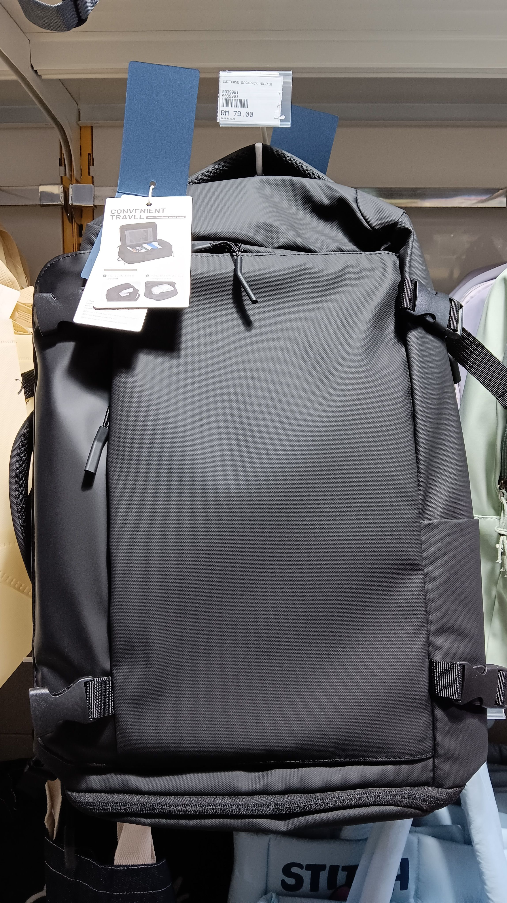

- 02:50 睡覺
- 06:36 夢醒，整理床單脫落，走動，時間賬
- 06:45 回籠覺
- 10:45 因外部聲音醒來，賴床，躲避非同居者造訪，覺察害怕，覺察胃不舒服， [[4-2-6 Deep Breathing]]
- 11:53 時間賬
- 11:59 坐着，抱抱自己，同在冥想
- 12:08 走動，煮，覺察自己炒飯的味道不理想，允許自己嘗試失敗，
- 14:13 看見爺爺的車停在家門口，主動 Call 說出自己的選擇，哼唱
- 14:20 喝水，因眼前事物分心，將浴室地階看見的蝸牛🐌移到不易被踩到的地方，沖泡熱飲
- 14:35 排便
- 14:54 沖涼，盥洗，喝[[清肺茶]]
- 15:33 換衣，儀容裝扮，走動，覺察焦慮
- 16:28 開車出門
- 04:35 安全抵達 [[PJ Newtown]] 的 [[Mayabank]] [[ATM]] [[deposit]] RM [[500]]
- 04:40 到隔壁的 [[Mr DIY]] 選購和實測看中的雙肩揹包
  collapsed:: true
	- 
- 17:17 安全抵達 [[Pretonas]] 油站，時間賬
- 17:22 預備添汽油的錢
- 17:29 添汽油 + [[打風]]
- 17:38 時間賬，覺察焦慮，強迫性做事，咬嘴皮， [[Spotify]] [[podcast]] 挑選 《[[心理小學堂]]》 [[5-1]]，
- 17:53 走動，洗手
- 17:56 前往 [[Ara Damansar Medical Centre, Subang]]，聽 [[podcast]]
- 18:23 安全抵達附近的 [[McDonald's]]，為避免 2 小時，測試將車子停在距離店門口更遠的停車位
- 18:26 走動到 [[Ara Damansar Medical Centre, Subang]]
- 18:40 安全抵達醫院，因應激對嫲嫲說教，翻舊賬，合理化自己的行為
- 21:58 離開醫院到車上
- 22:14