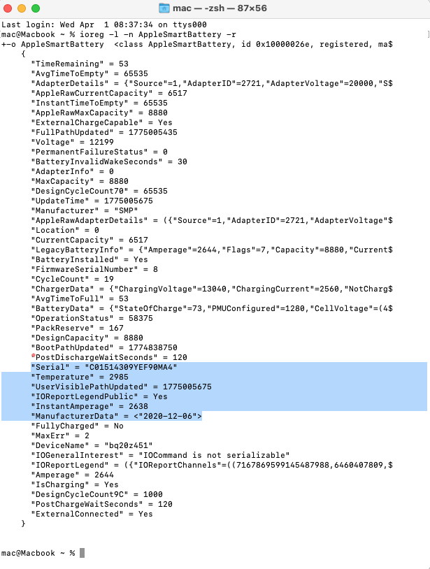
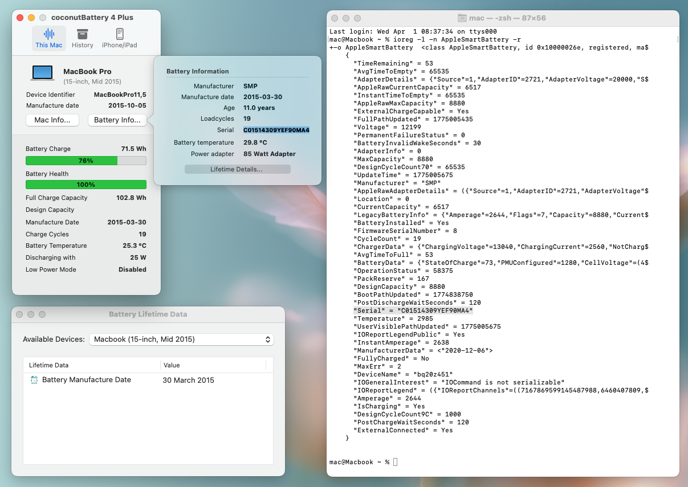

- 02:15 洗碗時有的[[創作靈感]]
	- [[F: [[靈感]]筆記]]
	- [[quick capture]]: #voice-memo
	- **[[聽你]] DEMO**
		- 
- 02:21 [[quick capture]]: #voice-memo
	- **[[聽你]] Verse**
	  collapsed:: true
		- 
- 02:27 [[quick capture]]: #voice-memo
	- **[[聽你]] Chorus**
	  collapsed:: true
		- 
	- **[[聽你]] DEMO 2**
		- 
- 02:34 [[quick capture]]: #voice-memo
	- **[[聽你]] Final Chorus**
	  collapsed:: true
		- 
- 02:37 [[quick capture]]: #voice-memo
	- **[[聽你]] Chorus Unplugged**
		- 
- 02:40 [[quick capture]]: #voice-memo
	- **[[聽你]] Chrous Hum**
		- 
- 02:43 走動，清洗廚具
- 03:10 [[quick capture]]: #voice-memo
	- **tatayima DEMO**
		- 
- 03:15 晾乾衣物，走動，熱水澡，喝[[清肺茶]]
- 04:20 走動，處理垃圾，因眼前事物分心，整理屋子門前的雜物
- 04:48 到車上，因眼前事物分心，整理背包
- 05:02 到了車上，主動打開冷氣，時間帳，咬嘴皮，覺察焦慮，調整睡眠記錄，吹冷氣
- 05:17 主動關閉冷氣，繼續演練[[高敏人如何溫和且堅定地爭取[[消費者]]的[[權益]]]]
	- ### 書面憑證審核清單
	  
	  老闆同意換「暫代電池」時, 單據需包含:
	  
	  *   暫代性質: 註明 "Temporary replacement battery"
	  *   新品承諾: 註明 "Owner entitles to a replacement of newer stock (manufactured within 1-1.5 years)"
	  *   保固延續: 註明 "Original warranty remains valid"
	  
	  需警惕字眼:
	  
	  *   警惕 "Compatible" / "Equivalent": 要求改為 "Same model" 或 "Reliable quality cell""
	  *   警惕 "Service fee may apply": 要求改為 "Total free of charge for future swap"
	  *   警惕 "As-is condition": 要求刪除, 或註明 "Functional guarantee for temporary use"
- 08:52 覺察室溫提升和皮膚變得黏膩，離開車
- 09:01 到家，走動，暗室直視 3C 藍光
- 09:05 強迫性做事，將電池信息備份到手機，哼唱
	- 
	- 
- 09:20 躲避與家人碰面，覺察排斥，走動，測試軟件 [[Swish]] 新功能
- 09:34 喝水，
- [[10]]:[[16]] 走動，早餐，遇到非同居者造訪，身體僵固，覺察羞愧，勉強打招呼，輕撫自己的頭，他人的請求，午餐，沖涼
- 13:54 他人的請求，主動確認對方的需求，遇到對方陰陽怪氣時失控地審判
- 15::15 忍尿，覺察臉部發麻， [[4-2-6 Deep Breathing]]， 身體僵固，躺下，不小心睡着
- 16:09 因冷痹醒來，時間帳
- 16:12 排尿，走動，離子化飲用水
- 16:34 輕撫自己的頭，坐着， [[4-2-6 Deep Breathing]]
- 16:37 咆哮
- 18:18 急救式抱頭
- 18:30 排尿
- 18:56 時間帳
- 19:07 恐嚇對方，出房門時看見爺爺和對方的兒子跟媳婦在屋外圍觀，覺察不安，流淚，難過，失望，坦誠會面對
- 23:25 時間帳，身體僵固，忍尿，忍餓
- 23:37 忍尿，忍餓，遠離到安全的地方
- 23:50 睡覺
	- 醒於 [[Thu, 02-04-2026]] 05:00