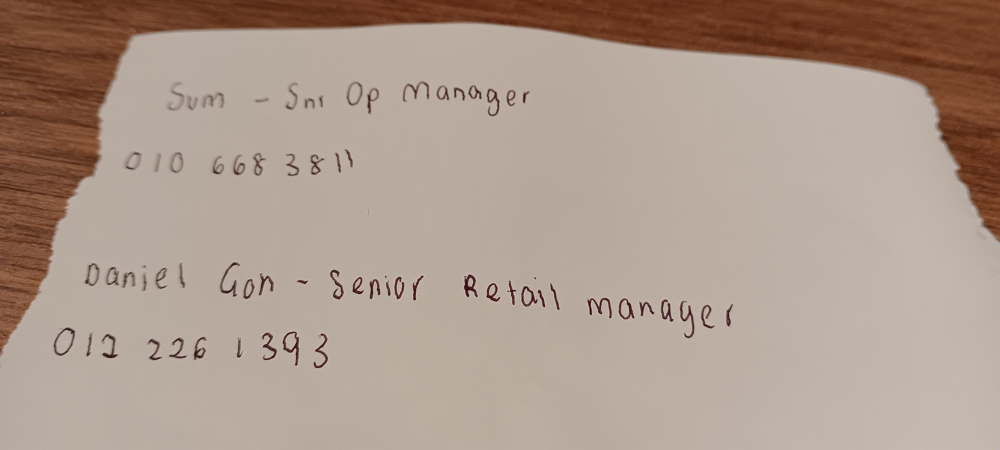

- 00:40 到戶外再次 [[call]] [[Lifeline Association 生命線協會]] @ [[03-42657995]]，沒人接通，才發現 [[credit]] 仍被扣除直到剩下 RM2.80，證實剛購買的 RM1 [[talktime extension]]  無效，往原本的路線反方向回到 [[The [[Sunway]] [[Library]] by [[BookXcess]] @[[Sunway Square Mall]]]] 時遇到同一個 [[guard]] 阻攔，堅持門口的規則只能出不能進，嘗試過反問無效，決定繞遠道，覺察失望和被上一件事情遷怒
- 01:15 時間帳，咬嘴皮，記錄剛發生的事
- 01:41 走動，將瓶子盛水，排尿
- 02:01 強迫性做事 ── 整理桌上的東西，覺察猶豫而決
- 02:11 回到了桌位，趴在手上睡覺
- 02:53 因外部聲音醒來，喝水
- 02:58 繼續趴著休息
- 03:12.發現暫時睡不著，將 [[MacBook Pro (MBP)]] 從合起來將蓋打開時，忽然『啪』一聲，覺察受驚嚇，確認電腦暫時正常運作，還是有點擔心
- 03:15 走動，排尿，返回的路上看見剛遇到的人，主動詢問關於職缺的相關問題，
  collapsed:: true
	- 
- 03:33 回到了桌位，紀錄剛的發生
- 03:46 喝水，猶豫而決，緩衝
- 04:19 排尿，
- 06:05 回到桌位
- 04:19 排尿，藉助 [[Gemini Live-Mode]] 訴說
- 06:05 回到桌位，總結剛剛的對話
	- https://docs.google.com/document/d/1XLUUqUb109tPAYv-ri_ZMdmO3HoOfAz4qYr6_LKmNOU/edit?tab=t.0#heading=h.mifo416zbwir
- 06:30 猶豫而決 ── 只把車移動位置 + 吃麵包 + 取洗漱用品
- 06:36 走動到車上
- 06:56 到了車上
- 07:38 決定停在 [[Entrance E, Sunway Square Mall]] 附近，走路回到 [[The [[Sunway]] [[Library]] by [[BookXcess]] @[[Sunway Square Mall]]]]
- 07:49 到了廁所盥洗，覺察着急、害怕被其他人看見、焦慮我離開桌位時間過長
- 08:11 回到了桌位，緩衝，查實所聽所見，看見所有重要物件都在，覺察安全感，
- 08:25 走動，將瓶子盛滿水，排尿
- 08:35 閱讀 [[Gemini]] 最新的回應
- 08:50 覺察疲勞，打哈欠，強忍睡意，咬嘴皮，
- 雙手趴在桌上睡覺