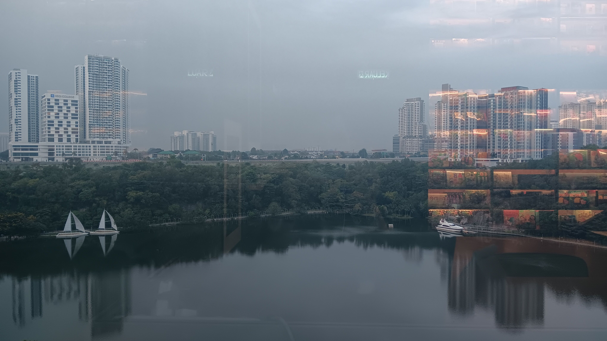

- 00:09 整理背包
- 01:02 走到 [[The [[Sunway]] [[Library]] by [[BookXcess]] @[[Sunway Square Mall]]]]
- 01:27 找到了面向 [[South Quay Lake view]] 的桌位，先安頓
- 01:32 走到浴室
- 01:37 確認沖涼設備有水，表層清潔馬桶
- 01:41 排便
- 01:51 結束
- 01:56 熱水澡，儲備 [[hand towel]]
- 03:10 緩衝，去除腳汗的異味
- 03:22 因眼前事物分心 ── 整理桌上不規律的擺放位置，強忍睡意
- 03:35 聽音樂，入耳式耳機，雙手趴在桌上睡覺
- 04:30 因身體不適醒來
- 04:36 摘下耳機，繼續休息
- 05:05 睡不着，排尿，走動，儀容裝扮，覺察自己過度在意外表
- 05:19 回到了桌位，繼續休息
- 05:43 睡不着，整理桌上的東西，轉移到最靠近角落的桌位，走動，喝水
- 05:58 吃小食，覺察滿足，想要吃完時刻意延遲滿足，聽音樂，看視頻
- 06:35 走動，盛水
- 06:50 回到了原桌位，確認皮包還在，感到如釋重負，記錄[[閃念]]
	- [[二次創作]]：香港樂隊 [[Beyond]] 名曲 【[[光輝歲月]]】 [[verse]] + 《 [[Digimon]] 》初代主題曲【 [[Butterfly]] 】 [[chorus]]
- 06:57 聽音樂，感到輕盈，打瞌睡
- 07:30 聽音樂，強忍睡意，咬嘴皮，猶豫而決，拍照紀錄眼前的瞬間
	- 
- 07:43 排尿，盥洗
- 08:22 聽音樂，入耳式耳機，咬嘴皮，為 [[additional session]] 回信和預約 [[Valerie Tan Jin Wen]]
- 09:01 睡覺
- [[10]]:11 因身體不適醒來，
- [[10]]:21 繼續趴在桌上睡覺
- [[10]]:42 因身體不適醒來，額頭覺得麻痺
- 10:48 回籠覺
- 10:54 排尿，逛櫥窗，選購午餐
- 12:29 回到了桌位，刷社媒，猶豫而決，挑選電影
- 13:09 觀賞電影《 [[Project Hail Mary]] 》，午餐
- 14:41 打瞌睡，睡覺
- 18:00 因身體不適醒來，緩衝
- 18:15 排尿，走動到車上，移動停車的位置
- 18:41 到了車上，睡覺，睡睡醒醒，因室內悶熱醒來
- 21:51 緩衝，猶豫而決，脫下兩層衣服
- 22:01 離開車子
- 22:20 回到原桌位時，發現重要物件[[不見]]，猶豫而決向[[櫃檯處]][[詢問]]，覺察羞愧，擔憂，焦慮，結果確認真的被值勤員工安全收在了[[籃子]]里，放在籃子裡
- 22:24 時間帳，確認重要物品，整理背包，找空桌位，過程才想起
- 22:54 終於安頓了下來，時間賬，發呆，覺察悲觀思緒
- 23:03 走動，盛水
- 23:15 回到了桌位，緩衝，看見隔壁右邊桌位其中一人因沒了椅子站著，覺察到自己的[[雷達]]從來沒有停過，也還不知道如何關閉，難過
- 23:22 記錄[[閃念]]，猶豫而決
	- [[主觀]] 和 [[客觀]] 是[[衝突]]的嗎？如何[[相融]]？
- 23:27 繼續觀賞電影《 [[Project Hail Mary]] 》和相關解說
	- 結束於 [[Mon, 06-04-2026]] 02:17