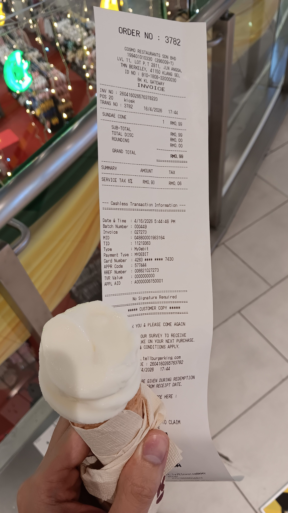
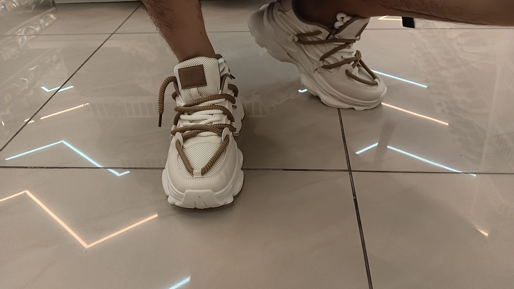
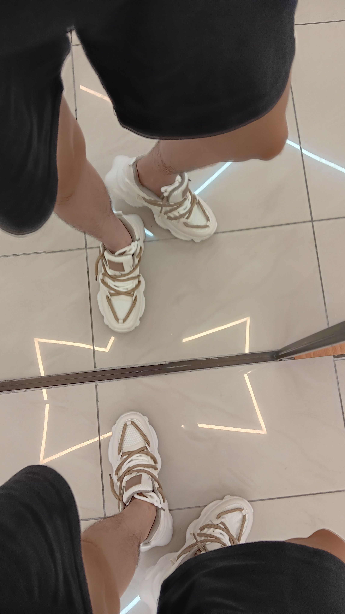
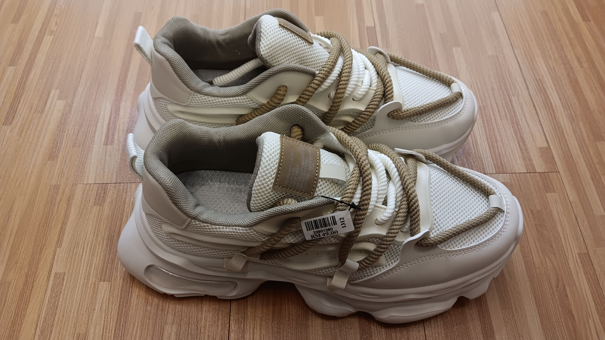
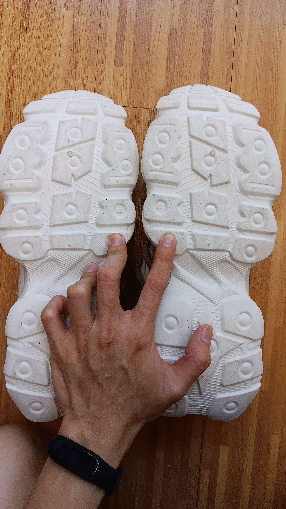
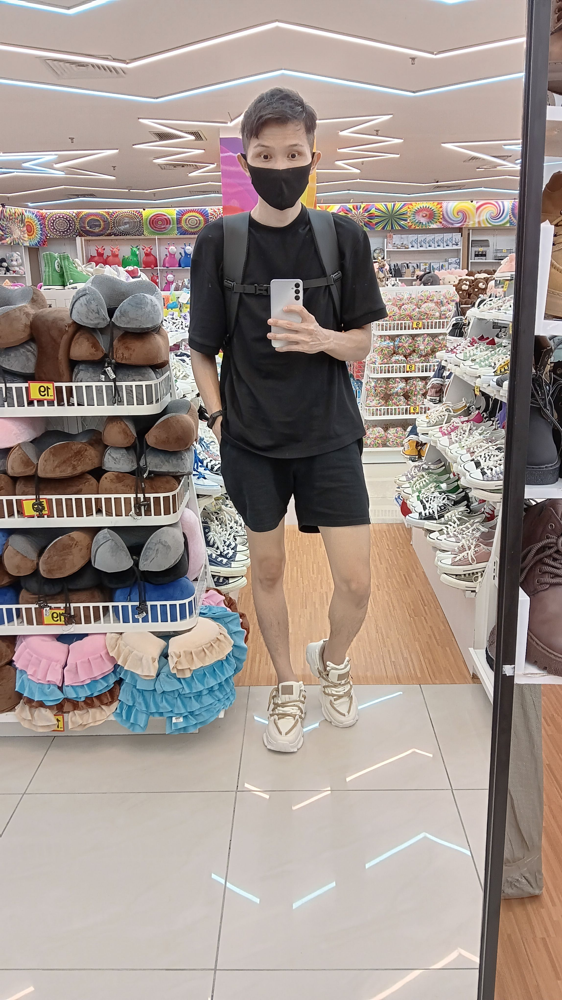
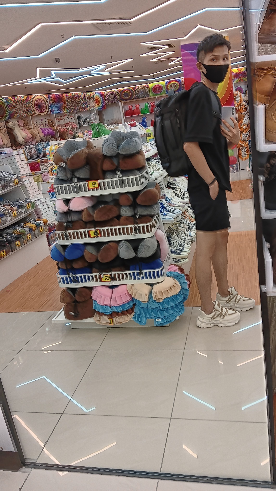
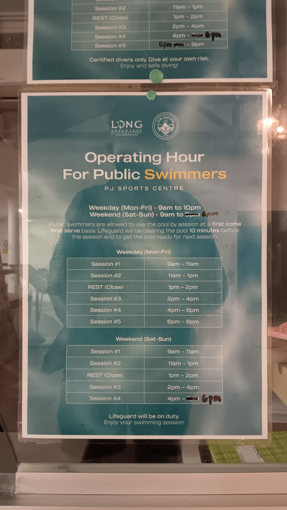
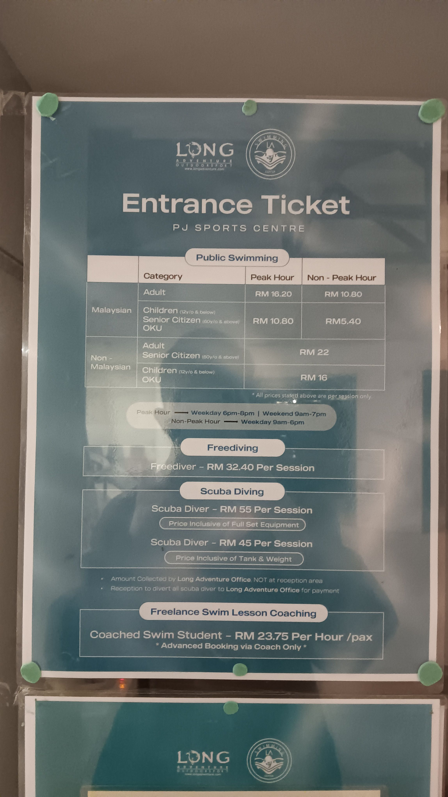
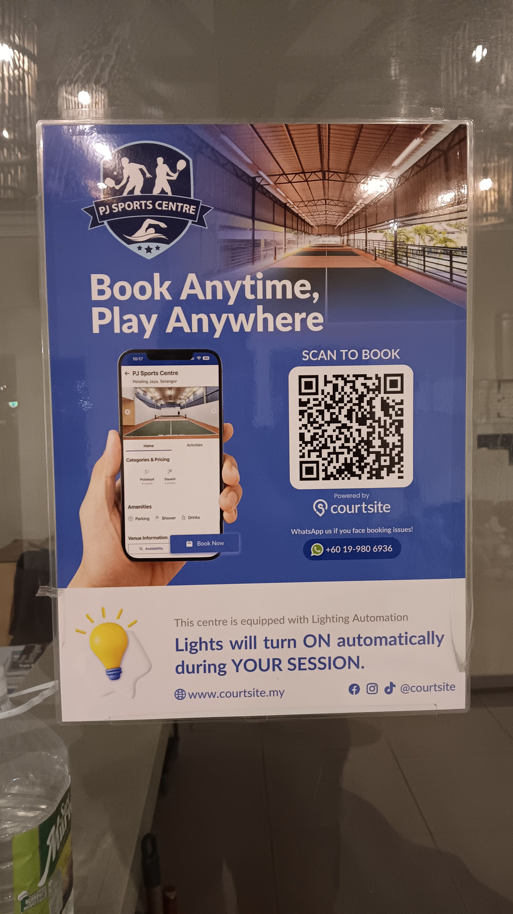

- 07:18 因三急醒來，蹲廁所，覺察猶豫而決，給 [[Valerie Tan Jin Wen]] 發確認預約簡訊
- 07:30 蹲廁所，刷社媒
- 07:41 結束，熱水澡
- 08:15 回籠覺
- 09:00 因鬧鐘醒來，賴床 睡睡醒醒
- 09:35 因身體不適醒來，解除鬧鐘，查看信箱，確認 [[Valerie Tan Jin Wen]] 回應諮商 [[appointment]] 是今天 15:30，覺察焦慮，反覆回想過去自己說過的[[狠話]]，賴床
- 09:53 因身體不適醒來 ── 頭部發麻，時間帳，半躺半坐
- 09:57 起床，喝水，走動，早餐，覺察羞愧，刻意不發出聲音，頭部發麻
- [[10]]:53 更新自己的日曆，咬嘴皮，覺察焦慮，整理舊筆記
- 11:33 走動，喝水，確認自己的手尾，清洗廚具
- 11:53 沖涼，準備出門，收拾背包
- 12:40 躲避與家人碰面，身體僵固，躺着，覺察羞愧，刻意不發出聲音
- 12:58 喝水，午餐，因眼前事物分心，覺察羞愧，刻意不發出聲音，整理雜物
- 14:05 啓動引擎時發現電箱電量耗盡，覺察緊張，確認無法靠敲擊恢復且徹底沒電，將水瓶放回屋外的桌子上
- 14:14 走路到 [[LRT - Asia Jaya]]
- 14:25 [[NRIC]] 不通過時，覺察慌張， [[reload]] RM10
- 14:28 搭 [[LRT - Asia Jaya]] ─ [[LRT - University (KL Gateway)]]，時間帳，咬嘴皮，摘下口罩
- 14:36 抵達 [[LRT - University (KL Gateway)]] ，確認收費 RM1.60，感到難過，走路到 [[Serene Pschological Services Center (Lifecare Center, Bangsar South)]]
- 14:51 安全抵達 [[Serene Pschological Services Center (Lifecare Center, Bangsar South)]]，坐着，擦乾汗水，時間帳
- 14:56 感到不安， [[4-2-6 Deep Breathing]]
- 14:58 修甲，走動
- 15:02 排尿，覺察焦慮
- 15:11 閱讀 [[NKK OCPD 評估報告（重點標示）]]
- 15:21 移步到諮商室附近的沙發， [[4-2-6 Deep Breathing]]
-
- 17:28 諮商結束，排尿
- 17:36 走路回到 [[KL Gateway Mall]]
- 17:43 安全抵達
- 17:46 嚐 RM1 雪糕@ [[Burger King]]
  collapsed:: true
	- 
- 17:54 逛櫥窗@ [[Hot Market]]
  collapsed:: true
	- 幸運看見心儀款式的鞋子 @RM49
	- 
	- 
	- 
	- 
	- 
	- 
- 18:57 逛櫥窗@ [[H&M]]
	- 19:32 試穿
- 21:46 離開 [[KL Gateway Mall]]
- 21:54 搭 [[LRT - University (KL Gateway)]] ─ [[LRT - Asia Jaya]]
- 22:04 在 [[LRT - Taman Jaya]] 下站，進到 [[A&W]] 看看菜單，最便宜的食物是 [[Mashed Potato Single Scoop]] @RM3.50； [[Beef Burger]]@RM8.4
- 22:14 離開，經過 [[PJ Spoets Centre]] 步入了解 [[Long Adventure Swimming Pool]] 收費
	- 
	- 
	- 
	-
- 22:48 到家