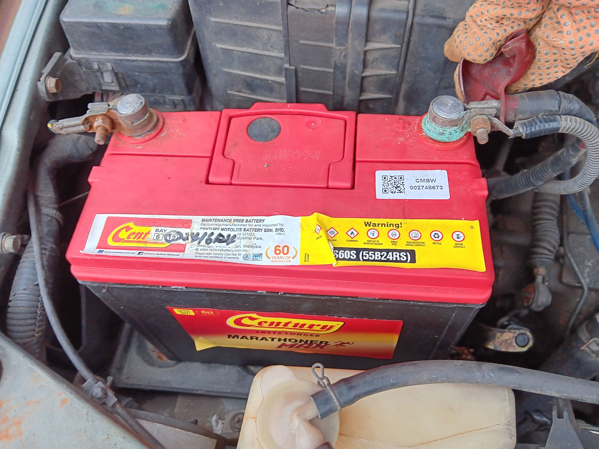
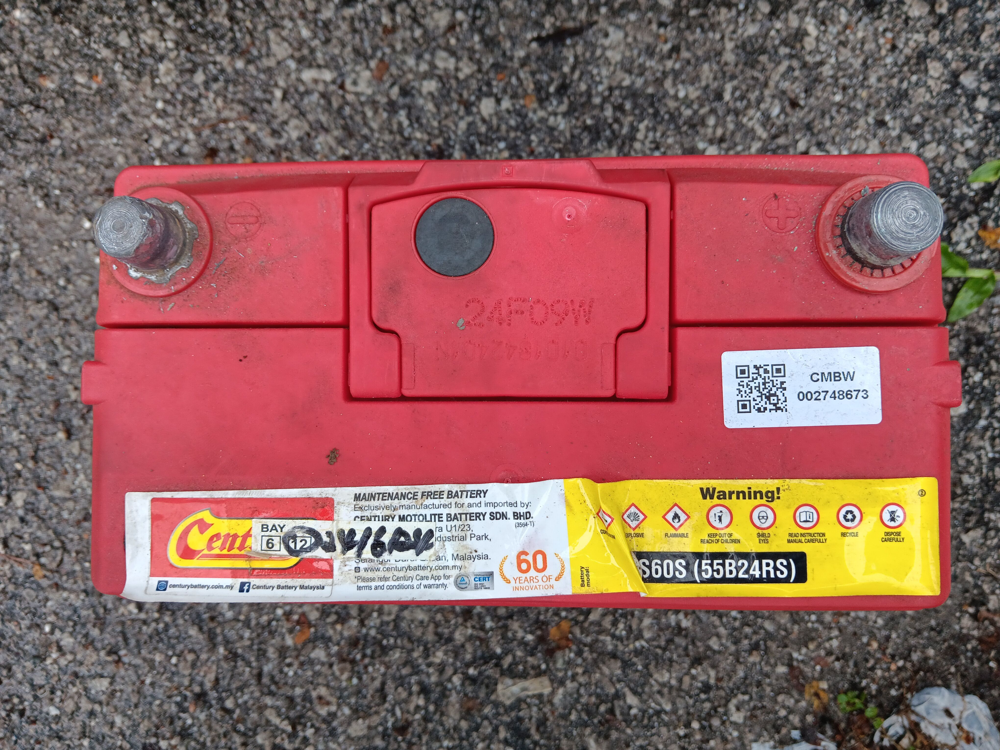
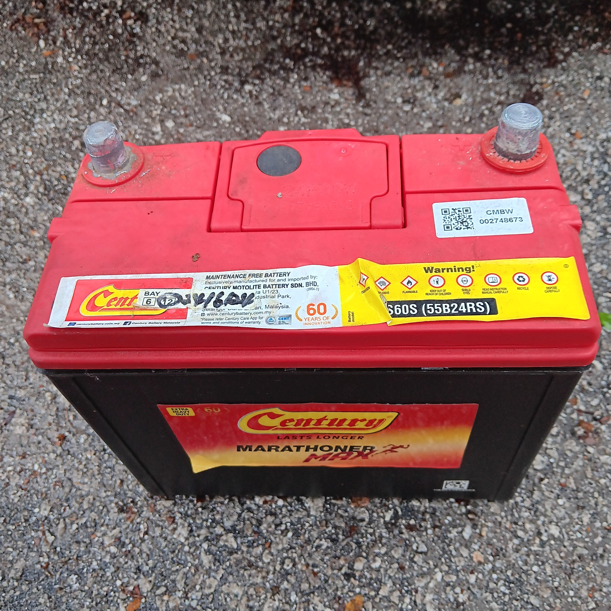

- 00:07 緩衝
- 00:12 OGC，入耳式耳機
  00:28 喝水，走動
- 00:37 居家觀賞電影《 [[悲傷逆流成河]] 》
- 02:34 打哈欠，走動，排尿
- 02:45 睡覺
- 07:00 因鬧鐘醒來，解除鬧鐘，回籠覺，睡睡醒醒
- 08:12 因冷痹醒來，重新蓋被，身體僵固，主動關閉風扇，因疲倦起不了身，覺察抑鬱，對昨晚看的電影劇情和橋段次序發生回憶困難，性幻想，無輸出
- 09:31 起床，無風狀態，半躺半坐，打哈欠
- 09:40 下載及安裝 [[App Lock]]，因眼前事物分心 ── 查看 [[Discord]] 信箱時追蹤 [[Logseq DB ver.]] 的動向，咬牙，強忍大腿屁股麻痹，強迫性做事
- 11:50 走動，打哈欠，排尿，午餐，暴食，吃甜食，喝水，覺察匱乏
- 13:09 排便
- 13:25 沖涼，手洗衣物，晾乾衣物
- 14:01 覺察疲勞，咬嘴皮，確認沒留着現有起汽車電箱的 [[Receipt]]
- 14:36 排尿，走動
- 14:54 主動打開冷氣，半躺半坐，咬嘴皮，暗室直視 3C 藍光，裸上半身，強迫性做事，瀏覽遊戲 [[DEMO]]，網搜資訊，忍尿
- 16:49 主動關閉冷氣，排尿，蒸米飯
- 17:09 網搜資訊，覺察焦慮，咬嘴皮
- 17:34 將汽車上電量耗盡的電箱取下放到家裏，刻意不發出聲音，覺察羞愧，咬嘴皮
  collapsed:: true
	- 
	- 
	- 
	- 
	-
- 18:09 流汗，換衣，無風狀態，強迫性做事，時間帳
- 18:11 走動，喝水，確認自己的手尾 ── 飯已經被蒸熟
- 18:16 打遊戲
- 19:24 主動確認嬤嬤已經吃飽且留下的飯菜是我的
- 19:40 躲避非同居者造訪，覺察受驚嚇
-