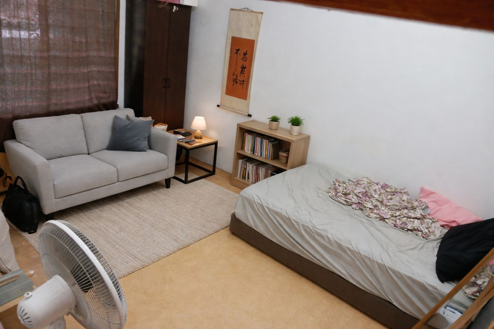
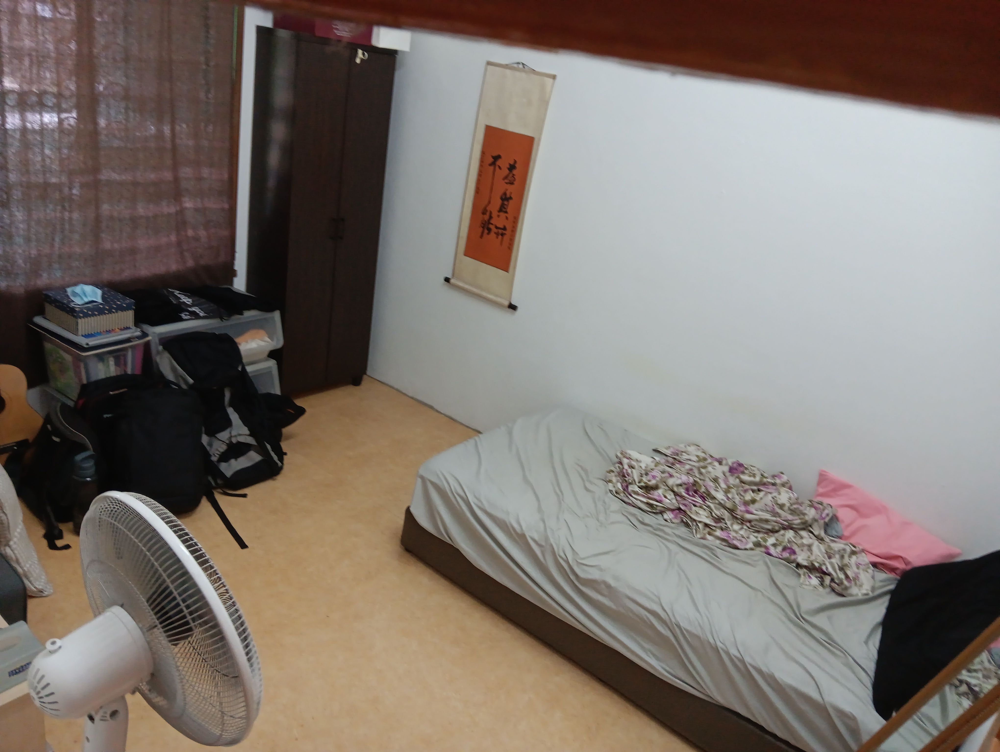

- 01:10 清洗廚具，盥洗，戴上牙套，排尿
- 01:31 睡覺
- 10:59 夢醒，因身體不適醒來，頭部發麻，賴床，因疲倦起不了身，睡睡醒醒，回籠覺
- 12:04 起床，坐着，爲日常方便調整手機 [[extend unlock]] 的設置
- 12:12 時間帳，坐着
- 12:15 走動，測試 [[chatGPT Images]] 修圖功能
	- 
	  collapsed:: true
		- 
		- Using the photo of this room, add new furniture in a cohesive, realistic way. Keep the existing layout, architecture, and lighting intact. Introduce thoughtfully chosen pieces that matches the room's style and scale—for example: a sofa, armchair, side table, art, bookshelf, or console. Ensure correct perspective, natural shadows, and seamless integration. Preserve all original objects unless the request specifies removal. Show the updated room as a single, polished interior design visualization.
- 12:25 強迫性做事，半躺半坐，整理 [[Chrome]] 上的 [[bookmarks]]
- 12:28 喝水，排尿，走動，盥洗，摘下牙套，午餐，沖涼
- 13:44