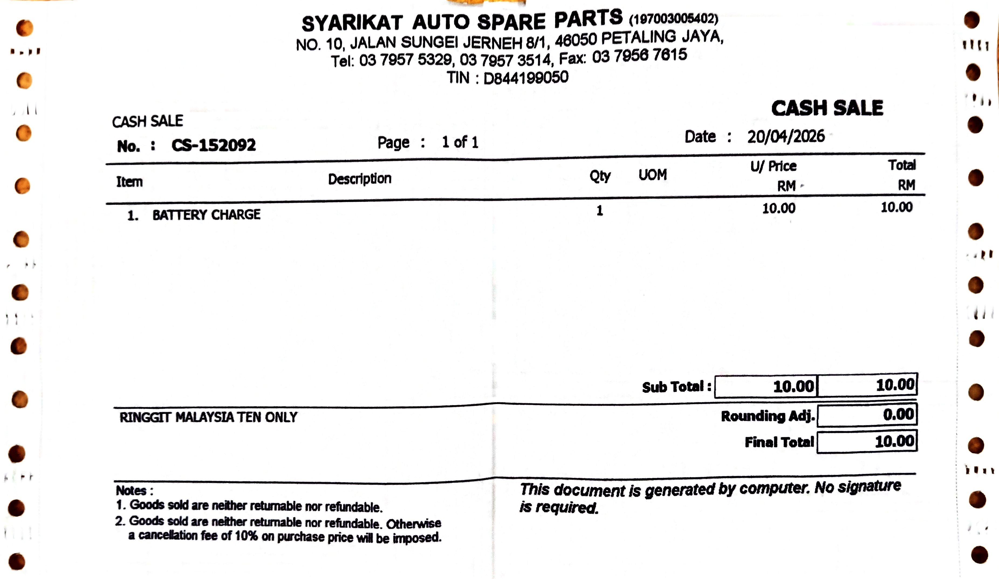
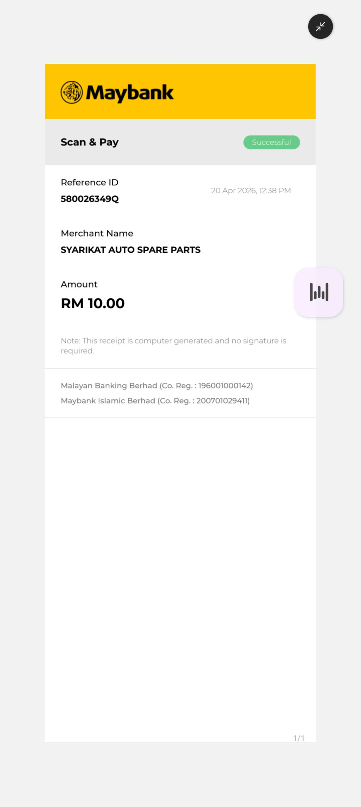

- 00:40 蹲廁所，沖涼，藉助 [[Gemini]] 討論選購策略
- 01:27 喝水，查看路線
- 01:56 強忍睡意，入耳式耳機，看視頻
- 03:04 睡覺
- 09:59 夢醒，賴床，因疲倦起不了身，回籠覺
- 10:34 因外部聲音醒來，賴床，頭頂覺壓迫
- 10:51 喝水，時間帳，緩衝，查看行程
- 11:03 排便，盥洗，走動，沖涼，猶豫而決
- 11:52 時間賬
- 11:57 喝水，換衣
- 12:02 走路到附近 [[Auto Star Car Care Centre]]，[[【[[Hankook]]】Top Gold Tyre Sdn Bhd]]，[[KYB 聯業汽車公司]] 詢價
  collapsed:: true
	- **12:40** [[quick capture]]: 
	- 
	- 
- 12:46 到家，強迫性做事，備份收條，換衣，覺察焦慮
- 13:00 喝水，走動，躲避與家人進一步聊天，午餐
-