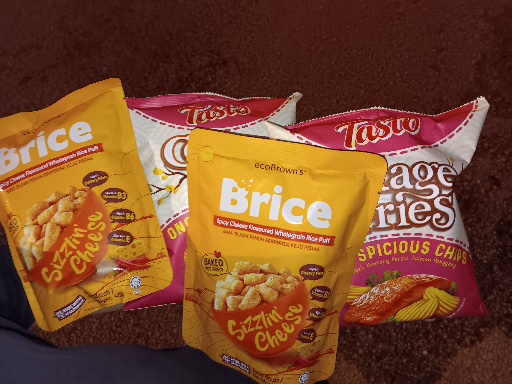
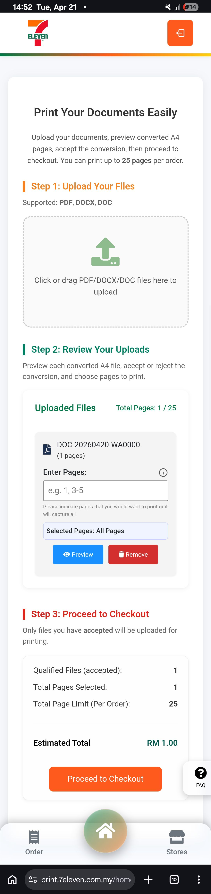

- 00:00 走動
- 00:03 到了附近的 [[7-Eleven]]，逛櫥窗，猶豫而決，嘗試詢問店員我不確定的物品
- 01:22 買完，走路回家
  collapsed:: true
	- 
- 01:26 到家，時間帳，刻意不發出聲音，覺察羞恥
- 01:33 因眼前事物分心，整理家裏二廳被調換位置的物品
- 01:45 熱水澡，排尿
- 02:26 喝冷飲，喝啤酒，吃小食，入耳式耳機，居家看電影《 [[新石紀/石紀元]] 》[[S4P3]] +《 [[Mercy]] 》，排尿，暴食，吃小食，沖泡熱飲，喝水
- 06:05 睡覺，睡睡醒醒，夢醒，因外部聲音醒來，因疲倦起不了身，因冷痹醒來，重新蓋被，躲避非同居者造訪，覺察恐懼、排斥、緊握拳頭、頭部發麻
- 14:43 起床，賴床，查看信箱，測試軟件
  collapsed:: true
	- 
	-
- 15:07 走動，喝水，閱讀
- 15:13 走動，摘下牙套，盥洗，午餐，暴食，吃小食，覺察滿足，清洗廚具，覺察難過
- 16:52 時間帳，藉助 [[GEMINI.md]] [[researxh]] 關於 [[Mentari Malaysia]] 的身心科服務
- 20:18 走動，喝水，弄熱冰箱的食物，晚餐，清洗廚具，排尿，忍糞
- 21:48 [[quick capture]]: #voice-memo
	- **是什麼阻擋我們看見了傷 hook**
		- 
- 21:51 [[quick capture]]: #voice-memo
	- **是什麼阻擋我們看見了光 hook 2**
		- 
- 21:57 [[quick capture]]: #voice-memo
	- **是什麼阻擋我們看見了光 DEMO**
		- 
- 22:02 處理自己的手尾，走動，排便，打哈欠，熱水澡
- 23:06 [[quick capture]]: #voice-memo
	- **我想過和你一樣 Hook**
		- 
- 23:11 [[quick capture]]: #voice-memo
	- **K_Chorong Whey DEMO**
		- 
- 23:12 閉目養神，聽音樂