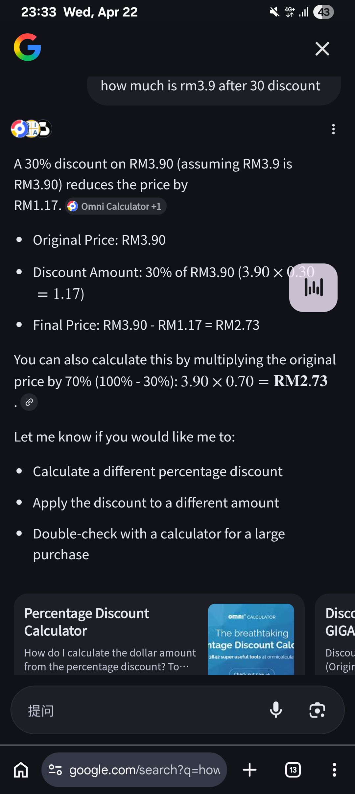

- 00:14 居家觀影《 [[The Super Mario Galaxy Movie (2026)]] 》，暗室直視 3C 藍光，入耳式耳機，坐着，手捏 [[Cold / Hot Pack]]
- 02:02 時間賬，走動
- 02:05 睡覺
- 08:00 因外部声音醒来，聽見嫲嫲向街坊交代自己的現況時我感到特別的不安、排斥和焦慮，覺察心悶，練習課題分離，因冷痹醒來，重新蓋被，因三急醒來，忍尿
- 08:09 賴床，忍尿
- 08:13 起床，因三急醒來，主動關閉風扇，走動，等廁所用，忍尿，覺察右腳的膝蓋和右胳膊的關節微痛，初步懷疑最近吸取過多蛋白質所致
- 08:19 時間賬，無風狀態，忍尿
- 08:30 賴床，回籠覺，作夢
- 09:22 因三急醒來，起床，走動，將未乾的衣物移到陽光下
- 09:27 排尿，蹲廁所
- 10:00 熱水澡
- 10:24 吃甜食，遠離到安全的地方，刷社媒
- 11:12 閉目養神
- 11:20 補眠，夢遺，因外部聲音醒來，因疲倦起不了身，睡睡醒醒
- 14:54 起床，衣物收進室內，午餐，清洗廚具，沖涼，手洗衣物，喝水，離子化飲用水，覺察焦慮，排尿
- 17:03 OGC，半躺半坐，入耳式耳機
- 17:54 走動，排尿，吃小食，沖泡熱飲，喝水，清洗廚具
- 19:08 覺察頸背不適，走動，咬嘴皮，因眼前事物分心 ～
- 20:14 入耳式耳機，咬嘴皮，正式收聽跟【[[焦慮的意義]]】相關的播客，覺察滿足
	- https://www.xiaoyuzhoufm.com/episode/69d26060e2c8be31556e3122
	- 焦慮分兩種
		- 顯性
		- 隱性
	- 我們可以迴避焦慮
	- 相比失敗帶來的焦慮，造成無論失去自我或人格變得貧乏；選擇冒險或嘗試一種新事物，即便失敗了，這帶來的焦慮是不是要小一點呢？
- 22:14 走動，喝水，處理垃圾，沖涼
- 22:56 換衣
- 23:13 開車出門
- 23:21 到了附近的 [[7-Eleven]]
  collapsed:: true
	- 確認 [[7meals]] [[30% Discount]] 不限於當前 [[Wednesday]]，決定暫時打住不買
	- 
- 23:36 開車前往 [[New Town, PJ]] 的 [[Maybank]]，覺察[[耳鳴]]
- 23:45 抵達目的地
- 23:50 成功 [[deposit]] RM700，在 [[ATM]] 發現身旁[[陌生人]][[靠近]][[求助]]，覺察[[不對勁]]、[[害怕]]、[[警惕]]，[[溫和且堅定]]地[[拒絕]]和遠離
- 23:52 到了附近的油站[[打風]]
- 23:59 時間帳，強迫性做事，咬嘴皮，無風狀態
	- 結束於 [[Thu, 23-04-2026]] 00:03