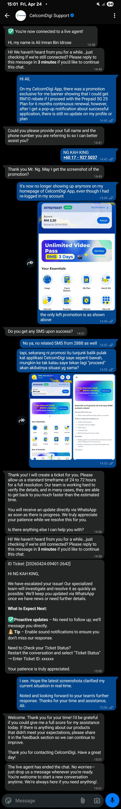
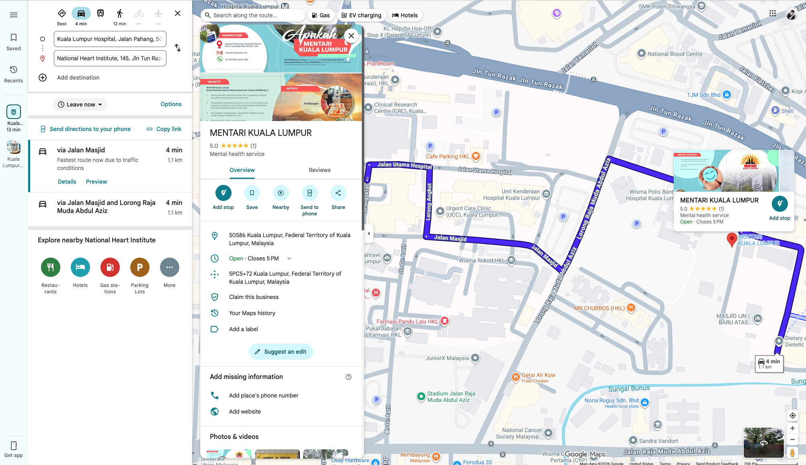
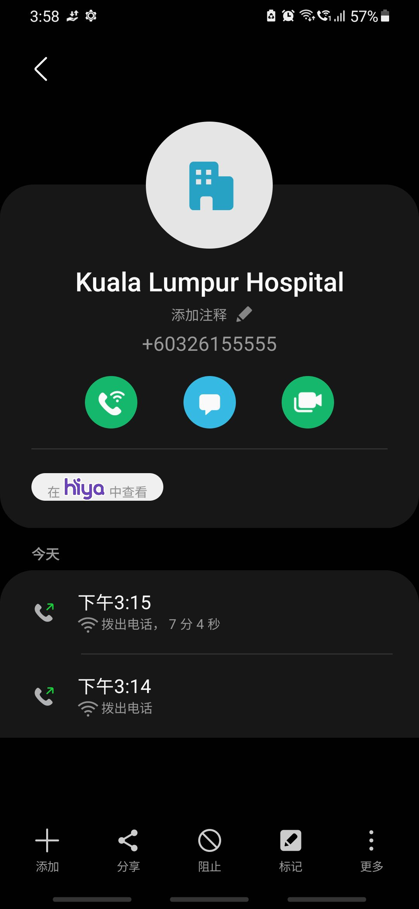
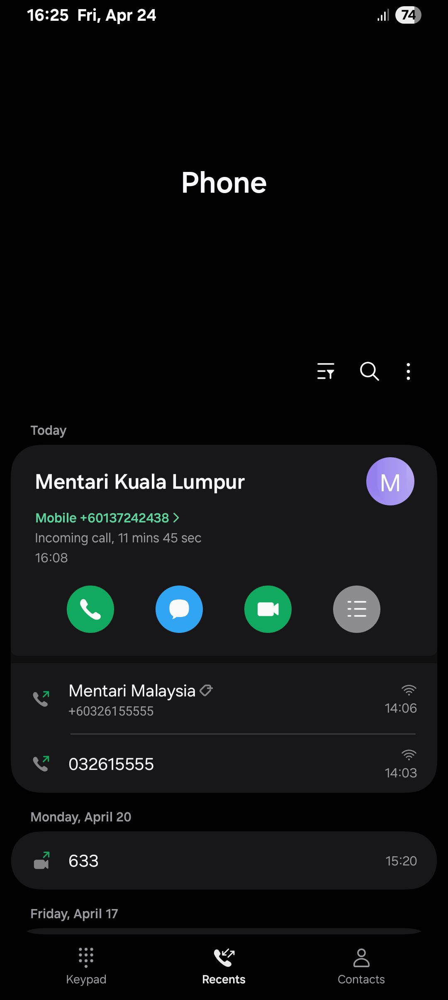

- 02:17 排尿，清洗廚具，夜宵，吃甜食
- 02:56 沖涼，盥洗，戴上牙套
- 03:21 藉助 [[Gemini]] 進一步討論待會【 [[預約 MENTARI Kuala Lumpur (HKL) 需注意事項]] 】：
  collapsed:: true
	- {{embed ((69ea918a-297b-45c7-9476-7f7f80bd0246))}}
	- {{embed ((4aa21271-798c-4ad8-bad1-b3d3cd95f1ca))}}
- 05:02 走動，喝水，強迫性做事，整理舊筆記
- 05:42 半躺半坐，強迫性做事，強忍睡意，測試軟件新功能
- 06:11 打哈欠，刷社媒，強迫性做事，強忍睡意，半躺半坐
- 07:33 睡覺
- 13:33 因室內悶熱醒來，起床，覺察後腦勺覺壓迫， [[4-2-6 Deep Breathing]]，閉目養神
- 14:01 走動，入耳式耳機
- 14:06 查實所聽所見：
	- 當前 [[credit]] RM2.80 成功呼叫  +6032615555，長達 1 min 8 secs 後剩餘 RM2.60
	  logseq.order-list-type:: number
	- 接線員得知我的目的後，回應今天星期五，請我直到 14:45 後再 [[call]] 預約
	  logseq.order-list-type:: number
- 14:08 時間帳
- 14:19 因眼前事物分心 ── 尋求[[客服]]協助 [[Prepaid 5G 25 Plan]] 申請失效的問題
  collapsed:: true
	- 
	  collapsed:: true
		- 
		- 
		-
- 15:04 排尿
- 15:[[10]] 經 3 次轉接後，終於成功再次聯繫上 +6032615555｜ [[MENTARI Kuala Lumpur (HKL)]]，長達 7 mins 4 secs；然而從接線員卻得知：
	- [[MENTARI Kuala Lumpur (HKL)]] 部門最近剛從 [[Hospital Kuala Lumpur]] 搬遷到 [[Institut Jantung Negara (IJN)]] 停車場附近
	  collapsed:: true
		-  
		  https://maps.app.goo.gl/ZwMxP9aYEeo7AYLA8
		- 
	- 需要我提供聯絡號碼和全名
	- 對方將通知該部門再次聯絡上我，但沒保證幾點前
- 15:23 緩衝，時間賬
- 15:30 仍在等待
- 15:39 藉助 [[Gemini]] 覆盤現況
- 16:21 如期等到 [[MENTARI Kuala Lumpur (HKL)]] 的電話，通話長達 11mins 45 secs，確認事項有：
	- [[Mentari Malaysia]] 服務
	  logseq.order-list-type:: number
		- 只包括：
		  logseq.order-list-type:: number
			- [[mental health screening]]
			  logseq.order-list-type:: number
			- [[psychological counselling service]]
			  logseq.order-list-type:: number
			- [[Program Sokongan Pekerjaan]]
			  logseq.order-list-type:: number
		- 不包括：
		  logseq.order-list-type:: number
			- [[psychristric treatment]]
	- 快速見 [[psychiatirst]] 的條件：
	  logseq.order-list-type:: number
		- 需有 [[referral letter]]，由前精神科主診醫生撰寫最為有效
		  logseq.order-list-type:: number
		- 到 [[Hospital Kuala Lumpur]] 第 4 樓 [[精神科部門]] 掛號
		  logseq.order-list-type:: number
		-
		- [[P/S]]：若通過 [[MENTARI Kuala Lumpur (HKL)]] 引見 [[psychiatirst]] 需等 3 - [[6]] 個月
		-
	- 通話記錄
	  collapsed:: true
		- 
- 16:21 時間帳