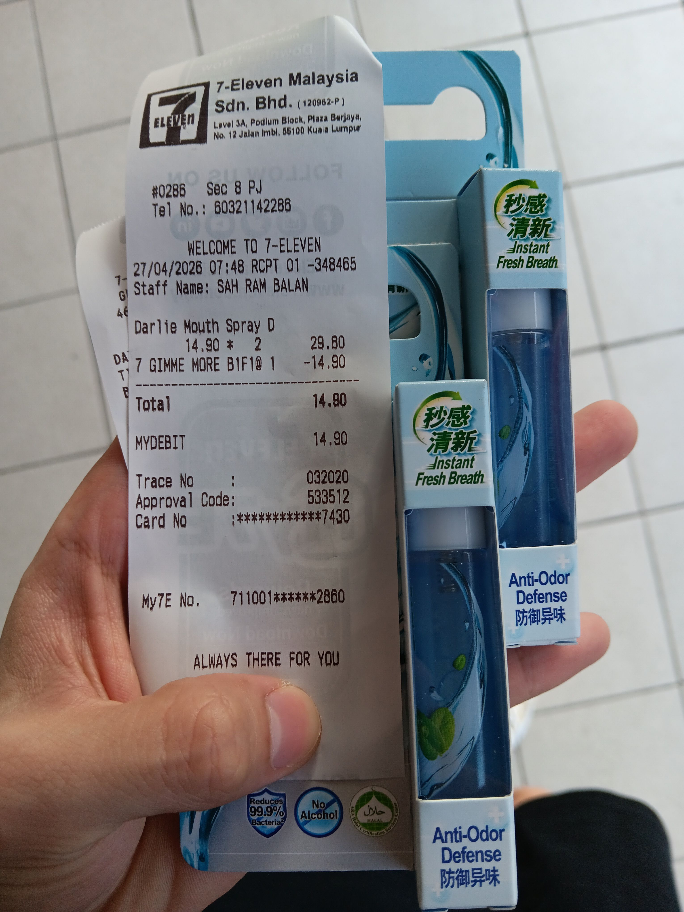
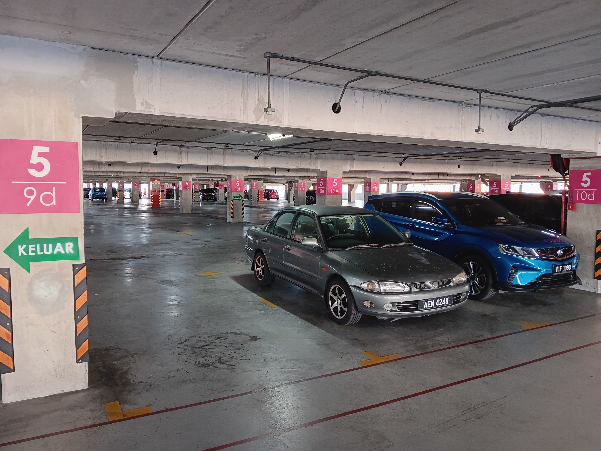
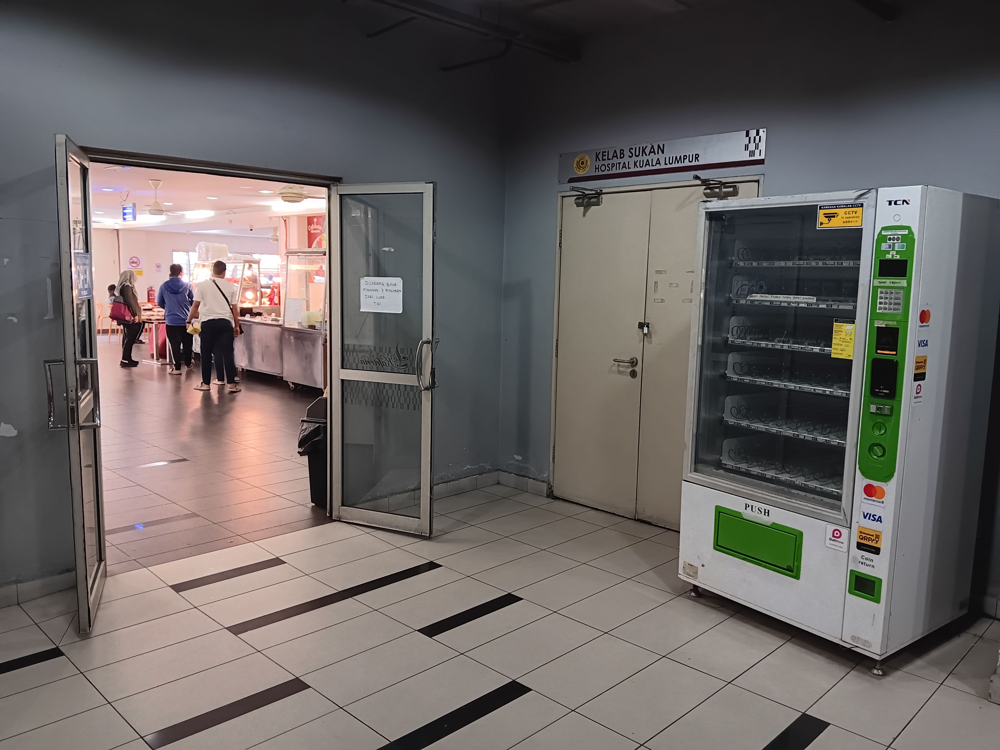
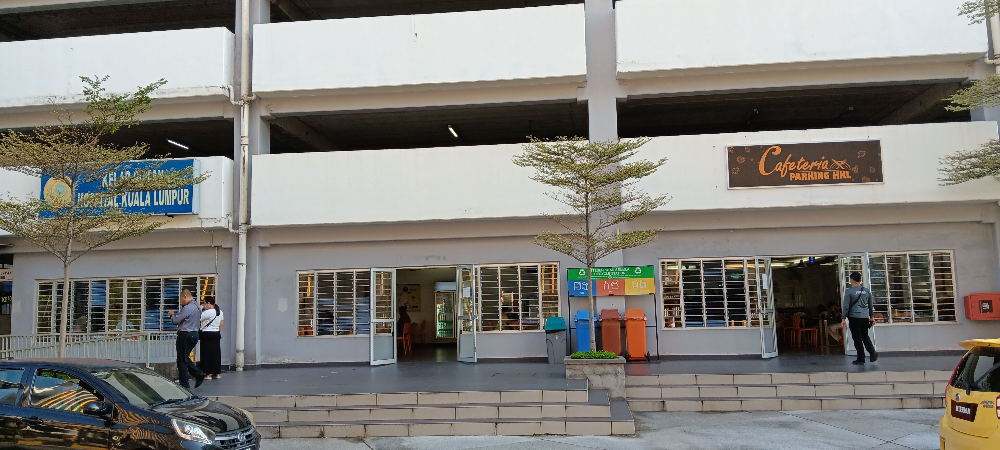
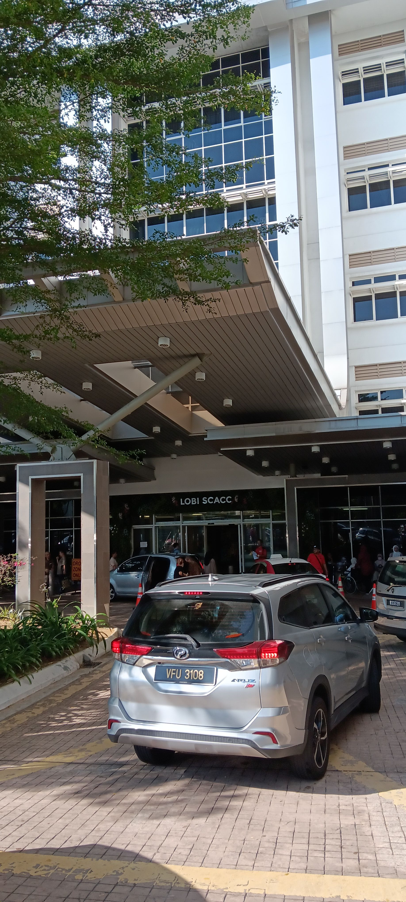
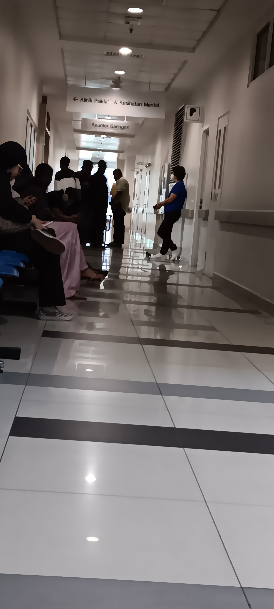
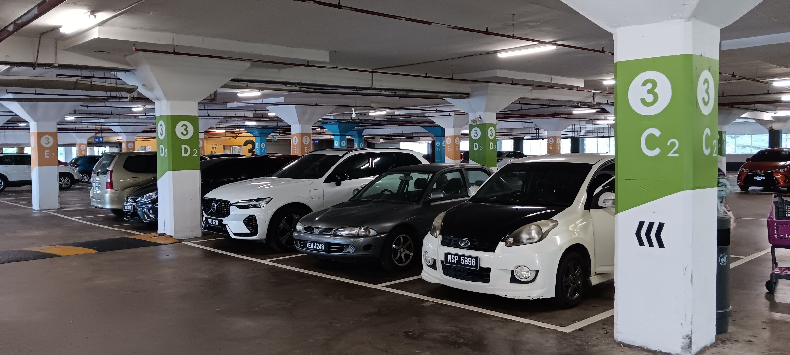

- 01:57 煮，清洗廚具，覺察如釋重負
- 03:37 排便，查實所聽所見 ── [[Hospital Kuala Lumpur]] 附近的 [[parking rate]]
- 03:55 沖涼
- 04:04 乾洗 3C 產品
- 04:07 盥洗
- 04:25 緩衝，規劃路線
- 04:41 離子化飲用水
- 04:48 咬嘴皮， [[reload]] RM25 @[[CelcomDigi]]  + [[Prepaid 5G 25 (Unlimited)]]
- 05:44 走動，咬嘴皮，測試撥通電話，確認撥通，因眼前事物分心 ── 調整嬤嬤手機的 [[UI]]，測試軟件
- 06:07 整理背包
- 06:42 排尿，沖涼，早餐，沖泡熱飲，吸取咖啡因，吃小食
- 07:07 換衣，儀容裝扮
- 07:15 緩衝，排尿，主動回應嬤嬤的提問
- 07:23 查看路線，無風狀態
- 07:32 走路到車上
- 07:41 開車出發，覺察緊張， [[4-2-6 Deep Breathing]]
- 07:46 到了 [[7-Eleven]]，決定買[[口腔噴霧劑]]
  collapsed:: true
	- 
- 07:52 聽音樂，開車出發前往 [[Hospital Kuala Lumpur]]， [[4-2-6 Deep Breathing]]
- 08:26 聽音樂，到了停車樓，找停車位
- 08:41 喝水，時間帳
- 08:46 下車
  collapsed:: true
	- 
- 08:50 走出停車場
  collapsed:: true
	- 
	- 
- 08:57 找 [[Klinik Psikiatri & Kesihatan Mental]]
- 09:12 進到了 [[SCACC]]，排尿
  collapsed:: true
	- 
- 09:18 前往 [[level 4]]，等待升降梯
- 09:26 前往 [[Klinik Psikiatri & Kesihatan Mental]]
- 09:30 詢問櫃檯人員後確認唯有 [[referral letter]] 才能見到 [[psychiatirst]]，時間帳
  collapsed:: true
	- 
- 09:36 離開 [[SCACC]] 走路回到停車樓，覺察緊張，害怕當他人看自己的眼光，走路姿勢僵硬， [[4-2-6 Deep Breathing]]
- 09:53 回到車上，抹乾汗水，喝水
- 09:58 覺察自己的眼睛因[[散光]]感到不適，移動停車的位置
- 10:01 規劃路線
- 10:30 離開了停車樓，感到緊張，害怕超過 2 小時，收費 RM4，覺察後悔，安撫自己， [[4-2-6 Deep Breathing]]
- 10:36 前往 [[Wangsa Maju AEON Mall]]
- 11:00 安全抵達 [[Wangsa Walk Mall]] 停車場，離開時收費 RM1.10，覺察後悔，自我安撫，忍尿
- 11:18 到了 [[Wangsa Walk Mall]]，排尿
  collapsed:: true
	- 
- 11:36 逛櫥窗
- 14:37 回到車上，開車離開停車場
- 14:52 在附近的油站打風
- 15:02 繼續
- 15:38 安全抵達
- 17:56 到了 [[KFC]]
- 18:06 通完電話確認嬤嬤比較想要留到改天吃 [[KFC]] [[promotion]] 套餐，回到了車上，查實所聽所見 ── [[7-Eleven]] [[promotion]] [[Monday Madness]] 是僅供 [[members]] 兌換積分的選項，無風狀態，哼唱
- 18:12 到了 [[7-Eleven]]，猶豫而決
- 18:26 嘗試駕到另一間 [[7-Eleven]]，成功買到 [[Monday Madness]] 的面包
- 18:45 到了 [[Mr DIY]]，覺察亢奮
- 19:53 開車回家
- 20:01 到家，緩衝
- 20:14 沖涼
- 20:32 晚餐