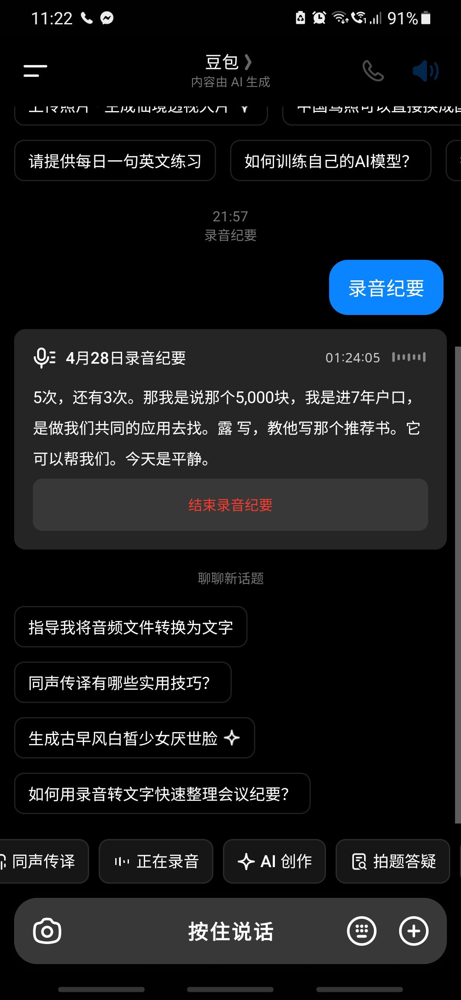
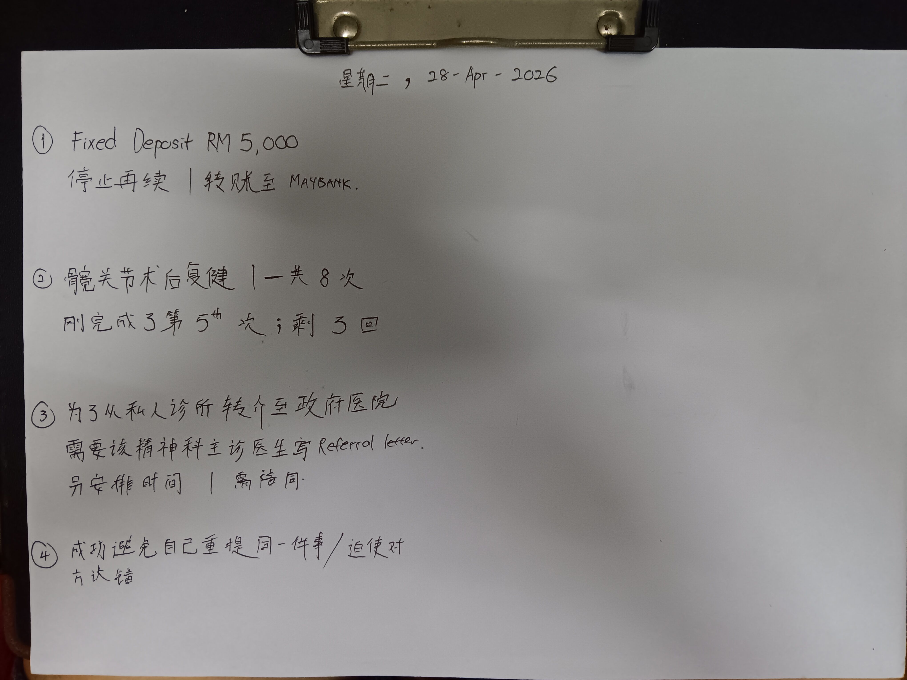
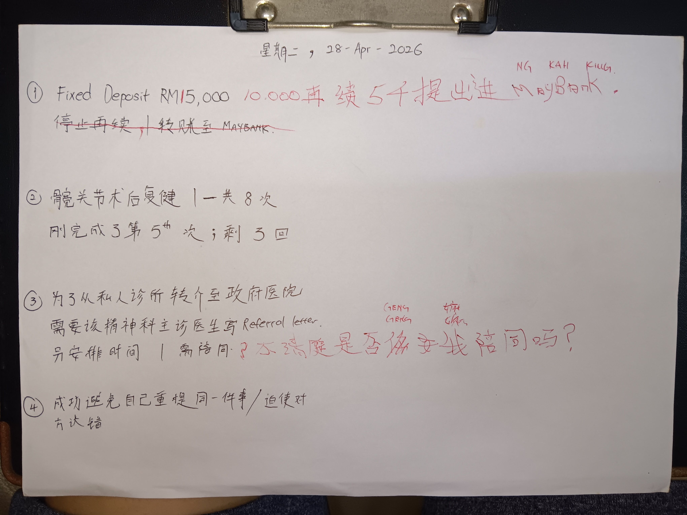
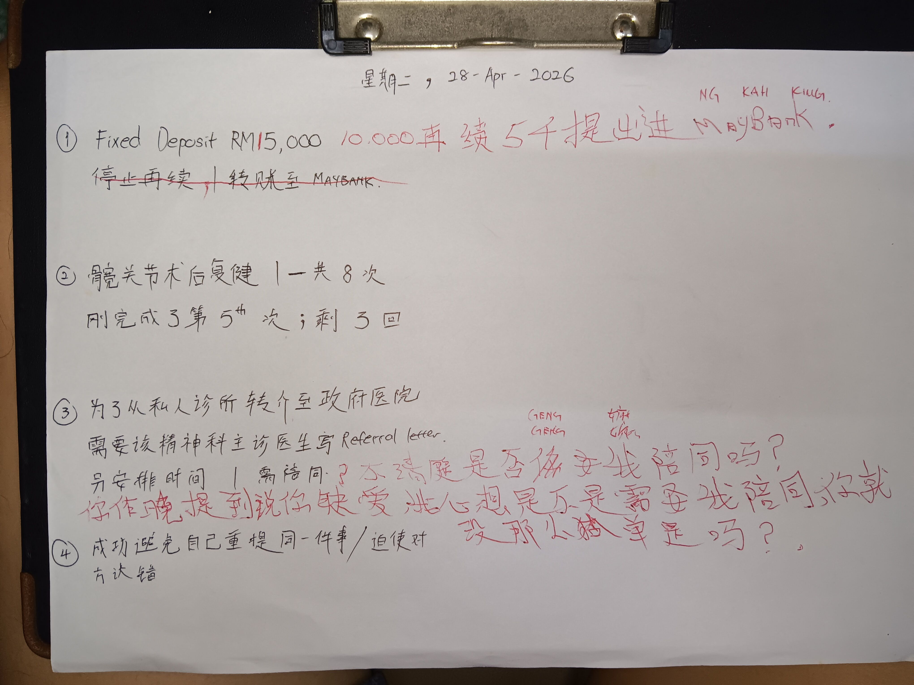
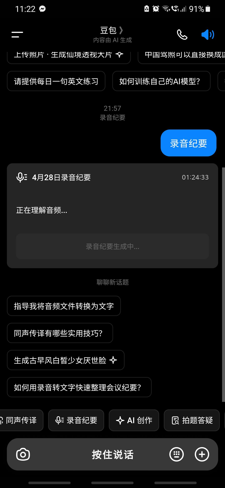
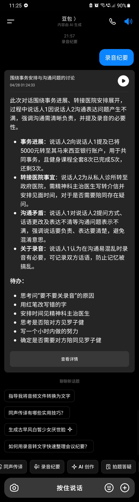

- 00:57 中途遇到家人干預，[[急救式狂抓頭]]，覺察困惑、憤怒、惱怒、不甘心、懷疑、失望、無助
- 03:15 對話中斷時僵持，發呆，咬嘴皮
- 03:50 時間賬，無風狀態
- 04:00 沖涼，排尿，盥洗，主動迎納剛發生的一切
- 05:15 繼續
- 06:05 睡覺
- 20:09 起床，晚餐，喝水，沖涼，離子化飲用水
- 21:34 覺察頭很漲，喝水，刷社媒
- 21:51 当嬷嬷主动提问能能否开始聊，我在无法掌控回应的次序时，选择指使对方使用[[豆包 AI 會議記錄]] + 主动写下重点
	- 
	- 
	- 22:34 主動[[確認]]且允許对方[[糾正]]后
	  collapsed:: true
		- 
		- 
- 22:45 繼續話題過程，針對我是否需要對方陪同下向 [[psychiatrist]] [[Dr. Francis Low Chee Chan 羅子鍵]]  請求寫 [[referral letter]] 時，因嫲嫲將我回應的『[[不確定]]』非但理解為『[[不需要]]』且還多次確認後依舊堅持認為我『[[不需要]]』，開始發生[[衝突]] ──
- 23:25 结束[[豆包 AI 會議記錄]]
	- 
- 23:27 获得总结
	- 
	  collapsed:: true
		- **23:37** [[quick capture]]: 围绕事务安排与沟通问题的讨论
		  2026-04-28  21:58
		  
		  【智能总结】
		  此次对话围绕事务进展、转接医院安排展开，过程中说话人1因说话人2沟通表达问题产生不满，强调沟通需清晰负责，并提及录音的必要性。
			- **事务进展**：说话人2向说话人1提及已将5000元转至其马来西亚银行账户，用于共同事务，且健身课程全套8次已完成5次，还剩3次。
			- **转接医院事宜**：说话人2为从私人诊所转至政府医院，需精神科主治医生写转介信并安排见面时间，对于是否需要陪同存在疑问。
			- **沟通矛盾**：说话人1对说话人2提问方式、话语更改及表达不清等沟通问题表示不满，强调说话要负责、表达要清楚，避免混淆意思。
			- **关于录音**：说话人1认为在沟通易混乱时录音有必要，可记录双方话语，防止记忆被搞乱。
			  
			  【待办】
			  1. 思考问“要不要关录音”的原因
			  2. 用红笔改写错的字
			  3. 安排时间见精神科主治医生
			  4. 思考是否陪对方见罗子健
			  5. 写一个小时内做的努力
			  6. 确定是否需要对方陪同见罗子健
			  
			  【原文】
			  
			  说话人 1
			  你刚记得你讲什么？再来一次。
			  
			  说话人 2
			  我讲什么？我今天我去了这个这银行做那个将50块钱，然后我把5000块转去你的那个马来西，马来西亚银行。那边，我去那边，然后我今天也有去附近，是平静了，没有事情发生了。是我那个，我的那个教练他要休息一个星期，等我就延后一个星期，星期三就是5月6号再继续。这个附件，刚我一共一，全套是八八次，连我一共做了5次，还有3次。那我是说那个5000块，我是进去你户口是是做我们共同的应用啊，去去找路啊，啊啊。写，叫他写那个推荐信。他这可以帮我们哟。
			  
			  说话人 2
			  今天是平静。
			  
			  说话人 3
			  啊？嗯。
			  
			  说话人 2
			  我今天点了一个南瓜，很好吃。
			  
			  说话人 2
			  啊关了录音。
			  
			  说话人 1
			  为什么啊？
			  
			  说话人 1
			  我不我不是，现在全部，我需要你想清楚，刚你问这个是为什么？你要等一下回答我。我现在写啊，你不要你不要让我觉得我现在在花时间，你在做什么？你弄完你的脚，现在你有时间，你帮我想一下，你刚为什么这样问？这，我等下会问你啊，你不要讲不知道。
			  
			  说话人 1
			  你想你想清楚了，是吗？讲我刚问你什么？你刚问我什么？我问你，你问我要不要关门。哦。
			  
			  说话人 1
			  有有吗？还是你现在你现在开始思考？还是你你要怎样做？什么？什么没有讲什么？我我问你为什么要问我这个问题？
			  
			  说话人 2
			  是是是不是要关掉吗？
			  
			  说话人 1
			  想清楚为什么？你不可能你不可能突然间问我这个事情的。浪费电。什么浪费电？你帮我看现在有多少电？帮我看帮我看，多少电？帮我看。
			  
			  说话人 3
			  90度有更好的理由吗？
			  
			  说话人 1
			  还是你真的觉得这样子被见识？你想你想一个来。我在写东西，我我已经讲了，我在花时间，你在做什么？你能不能也也给点诚意啊？你问的你负责。为什么要问我这个问题？怕有电，我现在就看你，现在90多，你要怕什么？
			  
			  说话人 1
			  这样我够负责吗？我等下等下问你，我一定屌你，为什么？我就想你中，你好像没有在想，还是你能不能想？你想了一个吗？你想怕没有电吗？现在我就问你多少就再想一个。什么？你又没有写，你什么？你说，你只是做一个很简单的东西，你都不做，你一定被我屌。为什么你你你会不会努力一点？
			  
			  说话人 1
			  你要工作吗？现在我给你一个工作。我给你什么？我给不到你钱，是吗？我给你尊重。你的工作现在就想清楚，你为什么刚问我要不要关录音？ 
			  
			  说话人 3
			  OK 你自己点样你都冇 set 到 key 你准备好了吗？
			  
			  说话人 1
			  对，确定当我问你准备好了，有没有可能呢？你现在在我看到你的视线范围内啊，你是也可以站这，对吗？不过你选择做对吗？你看这个是不是你想聊的？
			  
			  说话人 3
			  请问是啊？嗯。
			  
			  说话人 1
			  请问我有没有写任何可以纠正的地方。有需要纠正吗？
			  
			  说话人 2
			  就好，不不要进进去那边户口啊。
			  
			  说话人 1
			  什么？
			  
			  说话人 1
			  什么意思？我现在问你，现在这边有没有写，我有没有写错？
			  
			  说话人 1
			  都是对的，是吗？就为什么刚你讲说不要短距变变，什么意思？
			  
			  说话人 2
			  第一个。
			  
			  说话人 1
			  什么意思？错，我写错了什么？你告诉我。
			  
			  说话人 2
			  你说请停止转转去那边嘛。
			  
			  说话人 1
			  你你看我写什么？你先看清楚，你你你认真再拿起来了，拿起来拿起来。嗯。
			  
			  说话人 2
			  停止再继续转账至那边了。
			  
			  说话人 1
			  你看到再续的时候，是不是有一个有一个有一个中间的的直线呢？嗯。是吗？所以你想问我什么意思？你是不是想问我？那个像是一个逗号。逗号是什么意思？
			  
			  说话人 2
			  逗号就是停止。暂停哦。
			  
			  说话人 1
			  你能不能帮助我啊？
			  
			  说话人 1
			  这个是你写的吗？
			  
			  说话人 3
			  嗯。
			  
			  说话人 1
			  是吗？能够告诉我你里面有逗号吗？ Danny 指给我看。哪一个是逗号？这个是逗号啊，什么是句号？
			  
			  说话人 2
			  不是圆圈句号。
			  
			  说话人 1
			  OK。 告诉我逗号的作用是什么？
			  
			  说话人 2
			  就是还继续写。
			  
			  说话人 1
			  你告诉我，如果这个是逗号是什么意思？
			  
			  说话人 1
			  那红笔是改改改成逗号。
			  
			  说话人 1
			  这样有没有现，你是老师啊，不是我是老师。你用红笔改我写的字，现在你觉得你看得懂吗？什么意思？你告诉我。
			  
			  说话人 1
			  啊？什么意思？
			  
			  说话人 2
			  不知道，我看不懂。
			  
			  说话人 1
			  什什么看不懂，你就你就你就你就问我咯。
			  
			  说话人 2
			  问什么意思？
			  
			  说话人 1
			  你是不是停止再去 Facebook deposit 啊？你是不是没有再续啊？
			  
			  说话人 2
			  这是直播室有10圈，我拿出5圈来。
			  
			  说话人 1
			  意思说你有再续。有。
			  
			  说话人 2
			  是，有假期续续3个月。
			  
			  说话人 1
			  是同一笔啊。
			  
			  说话人 2
			  同一笔，本来是是是5000，我拿5000出来。陈思谦。
			  
			  说话人 1
			  谁啊？
			  
			  说话人 1
			  写错了年级啊。我也写错了，你就改。要酸，要个，要甜，随你。
			  
			  说话人 1
			  请确保你看得明白啊，就是说你改了过后，我也看得懂。就可以。如果停止再去是，不是一个正确的事情，你会怎么做？你会删什么字？请做。 
			  
			  说话人 1
			  OK，所以正确的东西是 fix 的东西哦，有这么多，然后其中一部分再续，其中一部分进了内存。这内存是谁的？
			  
			  说话人 2
			  你呢？
			  
			  说话人 1
			  请问还有需要改的吗？我的意思是其他有吗？是不是都是正确？是啊。所以第二个是髋关节术后复复那个附件呢一共要8次，现在完成了第5次。然后呢还剩下最后3次。第三样是你为了从私人诊所转接到政府医院。现在需要做的事情是需要那个精神科主治医生呢写一份转介信。然后还要做第二件事情，就是要安排时间去见他。然后还有，同时你需要陪伴的吗？还是你一个人做？是哪一个？
			  
			  说话人 2
			  你你也是要。
			  
			  说话人 1
			  所以，什么意思？等等等等。
			  
			  说话人 2
			  你不用啊。
			  
			  说话人 1
			  哦，意思说，我是说，意思说你你不，你现在觉得是，是两个人啊，你你就写啊写啊写啊写啊。
			  
			  说话人 1
			  然后你不确定的时候，我教教会你一个符号嘛，叫放问号。啊，你不确定就放个问号。
			  
			  说话人 3
			  嗯。
			  
			  说话人 1
			  啊，所以你这边加了一个问号，你是是问说，哎，是谁陪同？还是需不需要陪同？所以这个是想要讨论要放个问号，因为你现在是知道你需要陪同，还是你不知道我，你想要知道我需不需要？嗯。写写写写写写。你不了解什么？你在那个问号旁边呢，你是不知道我需要陪同，你是不知道自己吗？还是说你不知道对方顶进去需不需要陪同呢？还是说是吗？
			  
			  说话人 1
			  这个是什么意思啊？
			  
			  说话人 2
			  清楚哦。
			  
			  说话人 1
			  不是，你不清楚是否你什么，你什么。
			  
			  说话人 2
			  我是你们想是陪你上去，罗子健比较比较熟嘛，就叫他写推荐信。
			  
			  说话人 1
			  玉总，你现在确定的是你在问我需不需要你陪同，是吗？嗯。不是你要，是吗？不是。玉总你问我需不需要写这个信啊？是吧？
			  
			  说话人 2
			  哎，假如是要我就陪你去拿了，不要我就没关系啊，每个月啊。那边，我那边拿嘛。
			  
			  说话人 1
			  所以这东西搞清楚了，然后就是说，你是在问我需不需要，所以不是你。然后第4个人就是你成功避免今天重提同一件事情，或者迫使对方认错。所以你感觉到今天很平静的一天。是这样吗？嗯。 OK 啊。
			  
			  说话人 2
			  昨天你不是说你去暧昧，我是心里面想，我就陪你去吧，有有个伴吧。
			  
			  说话人 1
			  谁啊？
			  
			  说话人 1
			  第几个？你觉得现在你讲的这个东西是第几个？
			  
			  说话人 1
			  跟哪个最有关？哪一个？写写。
			  
			  说话人 1
			  哦，就现在，你想要纠正的东西就是与其写说，为了从私人诊所转接到政府医院，需要该精神科医生先写 referral。然后从呢，哎，这个是从黄连地的需求呢，纠正成说，哦，是不是仅仅需要呢？仅仅需要这 refer letter 呢？需要这个转接性呢？那还是他需要这个他自己妈妈的陪同呢？然后你还在那补充说，哎，这个你是不是给你昨晚提到说你给给缺爱，所以黄年弟心想，是不是需要黄年弟陪同呢？这样子这个点点呢就没有那么感觉到孤单是吗？是这样意思。
			  
			  说话人 3
			  是啊，OK。 
			  
			  说话人 1
			  你还有什么要纠正的吗？正确的，对吗？
			  
			  说话人 1
			  妈妈，我给你一个机会，你想清楚啊。从一开始就录音，你知道为什么吗？你改什么，全部都录下来。所以你确定不是刚刚一样，现在一样哦？你知道为什么现在你可能，你存在一个疑虑是吧？如果你搞乱我的记忆。这边就在这里啊。你想清楚啊。我一定 drop 的。因为我记得的，好像是你问我明天得不得空。能不能陪你去看罗子健？你想清楚哦。你你想清楚没有？你想清楚你讲过就好，为什么？你不负责，我不先不管你啊，因为我现在已经，我已经善用工具啊。你如果搞乱我的记忆的话。我要黄年的负责到底，我同佢踩到准。自己记得啊。我记得的很清楚，对吧？是你问我昨天，明天的不到工资，对吧？那那你问我能不能陪你去见罗子健，对吧？我现在换成我需不需要他呀？
			  
			  说话人 2
			  我我的心里面是是是想陪你去哪？
			  
			  说话人 1
			  帮助我想，我现在需要谁？你等下就问清楚，你不要你不要那边等下一样，现在一样。因为东西全部录起来，你觉得你还有要的吗？你不需要就不要。等等，想清楚你你要上厕所，你上了你回来，可以吗？没有。OK。 
			  
			  说话人 1
			  我再讲一次啊，不懂的东西就问，什么叫想？我给你想100遍哦，你你多你要自己挖坑给自己跳。可以，不要扯到。你让我跌了，我痛了，我一定屌你，我一定骂你。为什么？你挖的坑啊。又不是我挖的。不要挖坑，就是问问清楚。你是不清楚，所以你想要清楚吗？还是你有疑虑，所以你想要有人陪你一起确定？而不是我想这个，然后等下我想这个。还是你一直在避免，因为自己讲过的话不想要负责。所以，没有，我只想，所以你想要 B 掉，你要 cover 刚刚你讲的东西。你刚刚明明是讲说，你问我得不得空。你问我明天得不得空，然后呢，你然后你讲说，哎，能不能够陪你去看罗子健。
			  
			  说话人 2
			  因为那天你有跟我讲起一下，是罗子健，还有还有你以前的那个这这上那个什么啊？跟男的可以帮帮助你推荐，写这个推荐信吗？
			  
			  说话人 1
			  那个男的是谁？
			  
			  说话人 2
			  我不知道什么医生呢，我不认识啊。
			  
			  说话人 1
			  问我，我现在就跟你讲多一次，你不要用讲的，问我。什么意思？什么哪个？
			  
			  说话人 2
			  你的第一个那个医生呢？
			  
			  说话人 1
			  哪哪一个？在哪里？
			  
			  说话人 2
			  再加一加药万吗？
			  
			  说话人 1
			  加药万是吗？加药万接哪哪一个医师？我有两个，一个叫精神科医师，一个叫心理咨询师。
			  
			  说话人 2
			  你在问哪一个？现在是要精神科医生推荐吗？
			  
			  说话人 1
			  对不对？所以你想问我的是，想问我的是哪一个？
			  
			  说话人 2
			  精神科啊。
			  
			  说话人 1
			  哦，在尤文精神领袖是叫 Doctor Aun，Doctor Aun。 
			  
			  说话人 2
			  没有没有那个我不认识嘛，但罗子健我认识。
			  
			  说话人 1
			  我想问你正常吗？然后你要 cover 什么？我再问，是我需要谁来帮我写推荐信？不懂就问。
			  
			  说话人 2
			  我不懂你那天你有讲这样哦，我说你需不需要我去见一见罗子娟，跟她讲我们的情况。
			  
			  说话人 1
			  等等，周梦你会提到我们呢？我现在问啊，你现在是知道我想要谁帮我写推荐信吗？你不懂现在就问，现在，马上，立刻。
			  
			  说话人 2
			  我知道你你，要不要，就是这样提一把了。
			  
			  说话人 1
			  你这么一直在那保护你自己，我觉得你现在不需要保护你，是为什么？我还没，我还我还没有做出很激烈的动作，你你不需要保护到这样，你很没品，你明白吗？你能不能告诉我，现在你想知道什么，你就问。不要讲，问，你要问什么？你不要跟我讲不知道不知道就问问啊。
			  
			  说话人 2
			  就问问你要不要我帮忙去见一下罗子建，写那个推荐信呢？
			  
			  说话人 1
			  我觉得这个问题哦，好像很难回答，为什么呢？就好像刚刚我真的听了很久，我在想啊，我已经跑到去那个都 SKL 了，然后呢？我现在又已经见了咨商师，我现在问 Jacy 能不能够写，叫叫 Dr N 写给我。这样，我在想哦。
			  
			  说话人 2
			  我需要你陪同吗？叫你不需要就不要咯。
			  
			  说话人 1
			  哎，什么意思？我是讲不需要吗？不要帮我做决定啊。我现在很困惑，我到底需不需要你？告诉我。
			  
			  说话人 2
			  你知道你困惑什么吗？
			  
			  说话人 1
			  你听见什么？
			  
			  说话人 2
			  你要帮我就我就告诉我你听见什么。说你说那个解释他们会帮忙就 OK 了。你有。
			  
			  说话人 1
			  我现在需要回答你罗子健这一个就好。你你你你没有需要跟我玩东西，我现在很清楚，我有很多东西现在在帮助我。你要知道你现在很不利哦。你最好就帮助自己，你诚实是没有问题的，明白吗？现在回到罗子健这课题，当你问我需不需要你帮助，陪同我去见他，拿那封信。我现在讲说我很困惑，我不知道我需不需要。你能告诉我你听见什么吗？
			  
			  说话人 2
			  说你很困惑，不，不懂你需不需要。
			  
			  说话人 1
			  所以到底是需要还是不需要呢？
			  
			  说话人 2
			  知道，你没有讲哦。
			  
			  说话人 1
			  我讲困惑，所以就是不知道哦。你你你你凭什么跟我讲说我不需要？你又凭什么讲我需要？明白吗？听见什么就是什么。什么？你摇什么头？你告诉我。你觉得我问你吗？你觉得我问你吗？你觉得我问你吗？没有，因为我讲什么进去，你讲什么进去，没有的 what 的，这东西是没有的 what 的。 what 不了。我有我有冤枉你吗？还是你现在有没有做出那东西要你讲你讲我不需要，我有回应你吗？我回应你这样我很困惑。
			  
			  说话人 1
			  困惑是什么意思？困惑是什么意思？
			  
			  说话人 2
			  我们就是不确定啦。不确定哦。
			  
			  说话人 1
			  因为现在是谈我啊，对吗？然后刚刚我听到是谈你哦。
			  
			  说话人 1
			  然后现在你讲到什么？我昨晚提到，你是要聊这个吗？因为我现在确定一个东西就是啊，已经过去一个小时了，是什么？你讲东这个东西之前一个小时，然后现在我要来确定哦，我花了一个小时来确定。代表什么意思？你有你有多少时间？然后你能不能告诉我啊？要讲这些东西，是不是你你认为一个小时可以搞定呢？你告诉我，意思说你讲的东西我一定听得懂吗？还是现在你刚刚有出现一个状态叫做我讲我困惑，你讲我不需要？你觉得我现在跟你是普通人在聊天是吗？最好是啊，就没有这些问题。能不能告诉我，现在一个小时过去了，你有，你你能不能告诉我，这是不是一个小时里面可以聊得完的东西？你帮助我，我需要讲话。你不知道啊？这样怎么办呢？还是我现在想告诉你啊，其实每一天几乎都是这样的。一坐下来你问我，我谢谢你为什么？刚你谢谢问我，你问我能不能讲话吗？其实你是不是想问我，给你你得空吗？有得看我跟你确认了，接下来你讲了这4样东西，你有看到我的表情吗？我很困惑。
			  
			  说话人 1
			  我其实几乎东西我几乎很多时候我跟你讲话我都很困惑。你突然间给我讲这个讲那个，我我怎么办？我要写下来啊，怎么办？我就帮助我写下来哦。还是现在写下来，你感觉到，哦，原来我有听错啊。我困惑吗？我困惑啊，所以我写，然后我给你纠正。可以了吗？现在是不是你不知道要花多长时间？所以有什么意思？你你你知不知道你这个不知道很可能分分钟啊？你会诬赖我在浪费你时间，其实没有啊，因为在一开始你讲你不知道要花多长时间。我即便写了下来4样东西，你跟我讲不知道。还是你愿意告诉我我们花了多久？那花了多久，花了多长时间？一个小时一个小时我们做了什么努力？你讲一下。我讲我们呢，我没有去否定你啊，我们做了什么努力？这一个小时。
			  
			  说话人 2
			  学校呢？
			  
			  说话人 1
			  还有，露营，还有。写下来，我要针对写下来这东西有什么努力。写下来就写下来，写信也可以，写一个 point 也可以，写一个字也也叫写下来。写什么？现在写什么？
			  
			  说话人 2
			  是我，我就也是，也跟你讲的几件几几件事。
			  
			  说话人 1
			  OK，然后有错误吗？我记得有错误吗？
			  
			  说话人 2
			  有啊，有啊。
			  
			  说话人 1
			  有啊，然后呢？接下来，你有纠正吗？可以告诉我这一个小时最特别的点，这写什么？是写正确还是写错？
			  
			  说话人 2
			  有错又正确。
			  
			  说话人 1
			  然后这个这个过程叫什么？确认咯确认咯。所以你能告诉我这一个小时做的那个东西叫什么？再多一次。确认确认咯，你能告诉我确认要用花多长时间吗？跟你。告诉我。你以为我在重复，我现在一遍一遍在换那个词来问你，你能告诉我确认用了多久时间吗？一个小时一个小时。你能告诉我啊，你觉得这东西会白费吗现在？为什么？因为我能够问，你要先聊哪一个？一连确认都要一个小时，我就能够很清楚啊。
			  
			  说话人 1
			  第一个 point 真的聊完了吗？第二个点是不是聊完了？就算聊完了，你觉得花了多长时间呢？才能够聊得完？是不是起码一个小时是跑不掉的？然后，你现在可以回答你自己那个问题吗？需要关掉吗？需要关掉吗？啊，讲话。关了。为什么？为什么？告诉我原因啊。
			  
			  说话人 3
			  嗯嗯。
			  
			  说话人 1
			  为什么？
			  
			  说话人 2
			  不知道为什么一直要开除。
			  
			  说话人 1
			  因为当一个人不知道自己容易忘记东西，然后讲东西一直在那边改的时候，就要留下留下什么？留下自己讲过所有的话。为什么？这是扯扯到两个人，你一个人，你要你要录不录，喜欢你，你喜欢怎么舒服怎么来。但是你扯到第二个人是什么意思？如果我记得刚刚你明明是问我。明天得不得空，要不要陪你去看罗子健？你问，你那句话是你，我要不要陪你啊？你不是问哎，点点，你需要陪伴吗？你不是第一件你就问说点点你现在还需要那封信吗？为什么不是这样问？你在间接搞乱我的机，我一定总发火，我很火。
			  
			  说话人 1
			  你觉得我要不要录？我在保护我们，是吗？告诉我，我的理由充不充分？我的理由充不充分？当我记到这个东西是这样，但是换了，下一秒你给我换语言，你给我换句子。你改成什么？我需不需要你啊？陪同啊？我今，等等等时候你跑哪里去了？我见杰希时候你去了哪里？告诉我，有有没有有没有改句子？还有你还要扯到那东西，我就想讲，今天就聊这个就够了。因为什么？我就想针对这样。因为有时候你问，我问你，你不选嘛，我讲妈妈你要先来聊哪个，你就讲这。喜欢吗？我现在就聊第三点。其他今天不用聊，为什么？你够时间我就陪你聊，我他妈的可以讲7个小时，你可以吗？今天就再多一个小时，就聊第三点就够了。意思说我在告诉你，你要讲的东西啊，有时要花很多时间的。
			  
			  说话人 1
			  第三点啊，你写的。我没有 what 你，我让你自己写。你明白这个叫负责吗？如果我自己写会怎样？你觉得我写啊，他妈的，红笔是你写的，黑笔是我写的，我拍下来谁都能够，谁都能够看得懂。看他们负责是什么嘛。有花钱吗？你的皮有掉吗？一个都没有。但是就负责写，负责想清楚是不是自己想要讲的，自己想要写的，想要改的。我现在确定啊，你写的啊，红笔是你写的啊，你讲我缺爱吗？OK，你讲我讲是吗？你准备好啊，就谈这个东西。还是我先确认先？你已经知道我现在很困惑，不知道确不确定啊？你还是需要聊吗？还是你要聊的是你自己？我给你机会，为什么？如果，什么意思？什么意思？
			  
			  说话人 2
			  没有东西要聊啊？
			  
			  说话人 1
			  什么叫什么叫没有东西？什么叫没有东西？你写了这么多叫叫没有来聊啊？你写了这么多叫没有啊？什么意思？什么意思？你浪费我时间呐！你是不是浪费我时间？你是不是干叉浪费我的生命？还是哪一个？我现在聊第三个。
			  
			  说话人 1
			  你清楚吗？你只要讲没有，讲不知道，这全部都是在逃避啊。你不要花了别人一个小时时间，你跟我讲说没有，一样的。这样，你要跟我讲说，你做来讲又这样，你你一把棍子你打翻整艘船，你你你有后果你自己好好找。为什么？不用用我，谁来参与，他一定得，他一定屌你的。那些载你的人啊，陪你去的人，你好好去跟他们 deal 啊。为什么？因为这一次我没有参与。但是你写的这些，我现在看着的，我有参与吗？你最好讲没有帮助，你最好一竿子打翻整艘船。还是我再给你选？轰字是你写的吗？通知是不是你写的？好吗？一步一步来。一步一步来，宏志是不是你写的？妈妈。
			  
			  说话人 2
			  是是。
			  
			  说话人 1
			  怎样？你觉得我逼你啊？我音讯也有哦，我照片也有哦。你没有你没有任何理由讲我逼你，为什么？因为这个是给你纠正的。你试看你怎么变呢？
			  
			  说话人 1
			  所以要确定吗？确认吗？到底是想你还是要讲我？同一件事情吧，叫转接性。哪一个？
			  
			  说话人 2
			  讲你啦。
			  
			  说话人 1
			  我是吗？你刚听到我讲什么？我到底需不需要？
			  
			  说话人 2
			  不需要不要咯，不需不需要就好。
			  
			  说话人 1
			  讲什么？来讲清楚啊，我全部录起来，你最好讲一次，为什么我一条一条猜你根本没有，你没有尊严呢。你告诉我我到底需要还是不需要？
			  
			  说话人 2
			  你不需，你讲不需要嘛。
			  
			  说话人 1
			  你讲什么？我讲什么？
			  
			  说话人 2
			  你讲不确定吗？
			  
			  说话人 1
			  不确定是不是不需要？讲话，你现在是懵了啊？你要不要去老人院？你要哪一间？没有蒙就掰下来，好好用你的智商，不要侮辱自己的智商，也不要侮辱我的智慧。不确定是不是不不需要。告诉我。
			  
			  说话人 2
			  我觉得太复杂了。
			  
			  说话人 1
			  什什么叫不复杂？我顶唔顺。什么叫不什么叫不复杂？什么叫不什么什么叫太复杂？什么叫不什么叫太复杂？
			  
			  说话人 2
			  我快要爆炸了。
			  
			  说话人 1
			  喂，哎，请问。请问请问请问请问请问现在哦，花了一个小时多，然后呢这个东西没有结论。想请问是想要暂停啊？还是要继续继续？
			  
			  说话人 2
			  要什么结论？要就要，不要就拉倒。
			  
			  说话人 1
			  什么要就要，什么叫不要？我现在讲了，我不确定什么意思。什么意思？什么意思？什么意思？不确定是什么意思？跟前身有什么关系？你跟我讲扯，你跟我扯扯前身什么意思？是谁先提？告诉我。告诉我，我有没有冤枉你？我写够清楚吗？是谁用红字写的？
			  
			  说话人 1
			  讲话。
			  
			  说话人 2
			  哎，不用讲了，讲都是多余。
			  
			  说话人 1
			  什么意思？什么是叫讲叫多余？什么意思？什么意思？什么意思？周末医生，刚刚你，为什么你要问我能不能讲话？你为什么要问我？为什么？因为讲话多余，为什么？你现在是自己打自己嘴巴，你明白吗？什么意思？你问我能不能讲话，然后讲话多余，什么意思？什么意思？什么意思？什么意思？什么意思？你为自己发声，你为你自己说话。你为你自己回答，你为你自己去回应。
			  
			  说话人 2
			  我不知道，我很痛苦啊。
			  
			  说话人 1
			  你很痛苦，你要怎么做啊？什么意思？告诉我告诉我，是你痛苦吗？还是别人也有痛苦？告诉我，你现在眼前这个人有没有？有没有？告诉我，只有你是吗？你告诉我是不是只有你？你只要回答这一句，我给感感的，我看我想我要不要屌到你。你告诉我是不是只有你？你告诉我是不是只有你在痛苦啊？想啊，讲。
			  
			  说话人 1
			  不知道，为什么不知道？什么叫不知道？什么叫不知道？什么叫不知道？我问很简单，是不是只有你痛苦？叫做，现在这此刻只有你一个人是吗？我在跟鬼讲话。告诉我。什么叫不知道？是不是最回避最好责任的最好一句话？你从小练到大是吗？我跟你讲这这句话不管用了，现在在这里。什么叫不知道？什么叫不知道？什么叫不懂？什么叫不懂？你要哪一间？你告诉我，你是不是脑子坏掉现在？
			  
			  说话人 1
			  要哪回答嘛，你刚讲了句你很痛苦嘛，我听见了。那我再问你，是不是只有你一个啊？你跟我讲不知道，你就问我啊。你问我痛不痛苦嘛，为什么不问？哎，你不会确的，你不会确认的是吗？你不知道就确认，不懂就问。所以请问你，只有你一个人痛苦是吗？是不是只有你一个人痛苦？你没有权利讲不知道，请问是不是只有你一个人痛苦？请问是不是只有你一个人痛苦？请问是不是这样？
			  
			  说话人 2
			  全世界的人都痛苦。
			  
			  说话人 1
			  所以所以你在这你你在那边哀怨什么东西？你在哀怨什么东西？你在哀怨什么？你知道为什么你回答这东西会让我非常的非常的痛恨吗？为什么？你刚刚讲自己很痛苦，现在你又给我扯到全世界。就你不讲，现在两个人多痛苦。就问你讲不出这句话。就问你要扯到全世界，你要么就扯到一个人。为什么你要跟我玩黑白？怎么世界只有你？要不然就是全世界，是吗？70亿人口，你要再讲什么？你要再讲什么东西？啊？所以为什么要扯到前生？为什么要扯到今世？我只是刚刚问你一样东西，很确定东西叫做。红字是不是你写的？你讲是吗？我确定啊。接下来。我是不是讲困惑？你听到啊。我想问你，困惑是不是不确定？然后你讲说我不想要，我不需要。你在讲什么？你最好今天跟我讲清楚啊。不确定是不是不想要，不确定是不是不需要。喂？回应。我不懂啊。什么叫不懂？什么叫干不懂？我他妈的 fuck you around 你明白吗？你跟我讲清楚，不确定是不是不想要。不确定是不想要。不确定跟不想要是不是同一个字是嘛？又如何呢？什么叫如何？你 what 别人，你要别人你要别人原谅你啊？你干什么？你做大圣人是嘛？你以为全世界对你很好是嘛？什么意思？每个人都是凡夫，在扮什么圣人？
			  
			  说话人 1
			  什么？你把别人不确定听成不想要啊？你觉得什么意思？你觉得没有问题啊？你觉得没有问题是吗？这样我就让你感受到痛，为什么？你踩到别人痛了，你不知道吗？是不是？你要扯全世界都在痛，这你知道痛什么吗？你不知道你在扯什么全世界，你在扯什么？你在扯什么？我再问多一次，不确定是不是不想要？你再回答是或不是哎。不确定是不是不想要，不确定是不是不需要。不确定是不是，不是。告诉我。告诉我啊，我需要你讲？我不懂吗？我问的人我不清楚吗？你现在跟我玩这些游戏啊？哎，你算老几？你自己讲话你自己确认，你不用反问我。我反问回你就代表我他妈的清楚，不确定我自己有答案，因为我回答的，所以我现在拷问你。不确定是不想要是吗？你连这题都回答不了，你要走下一步，你觉得你走，你要走去哪里？不确定是不是不需要。
			  
			  说话人 1
			  告诉我，不确定是不是不需要。告诉我不确定是不需要。
			  
			  说话人 2
			  你不要为难我了。
			  
			  说话人 1
			  我为难你什么东西？你有为难我吗？告诉我告诉我告诉我，为什么？如果你感觉到被为难，你觉得你有没有为难别人？讲啊，你每一个字我一字挑，我跟你讲，我他妈的单挑，你要讲你要讲为难，我就要问你，你有没有为难我？你有没有为难我？你有没有为难我？为难你什么？来，你讲一遍啊，我再问你不确定是不是没有，你有没有为难我？你不回答你是干什么？你在为难我，你明白吗？你回不回答，不确定是不是不需要。不确定是不是不需要。讲。前世争咗嚟。
			  
			  说话人 1
			  为什么为什么要讲扯前世？我跟你我我我我跟你有什么关系？我点知啊？你都不懂，你在讲你在讲什么？你要讲前世你又不懂哦，你在讲什么？你在讲一个不懂的东西，你不懂你为什么要提？我现在提一样东西，我很确定叫确定叫确定，不确定叫不确定。你告诉我，不确定是什么意思？你给我扯先生先先生我不确定，我现在很确定，就现在。我很确定，我跟你讲我不确定，告诉我不确定是需要还是不需要？
			  
			  说话人 2
			  我。我自己讲嘛，我哪里知道？我是你的穷妹。
			  
			  说话人 1
			  哎，他妈的，我现在直接跟你讲啊，我讲一句你讲一句啊，不确定就是没有答案，暂时没有一个答案。所以所以到底是需要还是不需要？
			  
			  说话人 2
			  这没有答案咯。
			  
			  说话人 1
			  哎，这么你刚讲不，我不需要哎？
			  
			  说话人 2
			  说都要咬哦。
			  
			  说话人 1
			  哎，不是一天哦，你你你踩我一天我忍你哦，你踩我三次我警告你哦，你踩我五次我他妈的干掉你哦。明白啦？我现在清楚吗？我确不确定？我确不确定？我再讲一遍啊，你踩我一次我忍你，你踩我三次我警告你，你踩我十次我干屌你，你明白吗？而且哦，世界不是只有同一种人哦。有一些人你踩第一次，他就直接警告你啊，你踩他第二次，他就马上直接屌你。
			  
			  说话人 1
			  有踩到我吗？你不踩到我我在这说干嘛？玩文字游戏是吗？不确定就没有答案，你这一辈子懂了啊？你不懂就好好学。我跟你讲，你在我面前这样还好啊，你传到出去每一句不是事实的话，我跟你没完没了，明白吗？我管你跟爷讲什么。不是事实，我就跟你没完没了。
			  
			  说话人 1
			  一步一步做的东西，你以为我我是傻子做的是吗？我为什么要写下来？因为是就是，不是就不是。你请回到事实。我跟你聊感受，你不要理，我就跟你聊事实哦。
			  
			  说话人 1
			  他妈的，你跟我提缺爱，你要就好好谈。起来这两个字是什么意思？给你这样拿来给你这样拿来给你这样子来随便提的是吗？什么叫我缺，然后你就陪啊？我见 JC 的时候你跑哪去了？你滚去哪里了？你死去哪里啊？怎么现在才给我提这个东西？然后讲说要陪我。你明明是跟我讲说明天得不得空，能不能够陪你去罗子健那边。怎么突然间换成你陪我？为什么会这样子？跟现在不是玩的同一个游戏吗？
			  
			  说话人 1
			  你最好清楚知道你对不起是什么，你讲一遍呢，我就看我接不接受。你告诉我，你有讲清楚什么？
			  
			  说话人 2
			  我没有讲清楚，说我想陪你去咯。
			  
			  说话人 1
			  不错。
			  
			  说话人 2
			  说我昨天，我明天没得空嘛，30号我要，我就要看，开论了嘛。
			  
			  说话人 1
			  然后，怎么。
			  
			  说话人 2
			  你说我明天要不要我陪你去咯。
			  
			  说话人 1
			  怎么是明天呢？为什么不是3，不是1号啊，5号啊，为什么一定是明天呢？
			  
			  说话人 2
			  我是问你要不要？我没有讲清楚，我我不，我我讲的不够清楚。
			  
			  说话人 1
			  哦，这样子啦。就说你自己本来你想要赔，还是别人需不需要赔，你不清楚啦。你不清楚你自己想要怎么讲啊。这么一句话叫做，给给啊，这样你需要。那份 letter 你那时候不是讲出那转接信，你需要嘛。你需要帮助吗？怎么不问这个东西？
			  
			  说话人 2
			  你知道我不是这样多问题的人。
			  
			  说话人 1
			  什么什么叫不是这样多问题哦？你妈妈干查多问题是吗？你跟我讲你不是这样多问题的人。你现在把问题推到我这边，烧到我这边，你讲你没有问题，你在讲什么烂话？你讲清楚。讲清楚。不要这边那边道歉了算一回事哦，我要你是记一辈子的。随便道歉是吗？什么这个字叫随便，不要跟我随便。
			  
			  说话人 1
			  我跟你讲，你踩到我尾巴，我不会跟你装哦。你就是踩到我了，明白？你要讲为难我就跟你谈为难，你要跟我谈苦我就跟你谈苦。你不要踩一个先。你就走掉，要谈什么，讲什么，你讲清楚。我听得清楚就可以了，你讲不清楚我就他妈的要你讲清楚。
			  
			  说话人 1
			  因为你讲清楚就是你负责，我讲清楚就是我负责，有很难吗？我再试一次啊，为什么？今天录完了，我告诉你这个东西一辈子你都销毁不了，你为什么？不确定，就是没有答案。不要跟我讲说叫不需要，什么叫需要，你一个字你回答都错掉，为什么？那叫没有答案。你什么叫轻易叫叫觉得别人不需要，什么叫轻易觉得别人需要？你帮别人做主啊？我帮你做主好吗？我帮你做主，你还有自由吗？你在讲你什么自由？你那边跟我讲要男自由，你现在跟我剥剥削我的。你觉得你有没有踩到我呢？你最好不要回答，你自己心知肚明。你回答哪一句都动我屌。
			  
			  说话人 1
			  你还要跟我扯前事吗？你不确定的事不要提啊。我再讲一遍啊，这个录音我会传给你，你最好晚上你睡不着你自己听。不确定的东西不要提。所以刚我有怀疑你吗？因为我不确定啊，我还很坦诚告诉你我不确定，你再改我意思，你知道你你知道你在惹上什么祸吗？为什么你要你要扯到前程？你要很确定这是气话。你分不了，你再你再讲，你就是自己负责什么，你负责痛为什么？我一定屌你，我就干你冚家铲富家富贵，明白吗？不确定不要提。
			  
			  说话人 1
			  为什么你要聊精神吗？聊精神我就跟你扯，含噶你明白为什么吗？因为一，前世是很复杂的。所以你你清楚你要提你就负责，要不然就不要提。你要提苦吗？就聊，我就问你是不是一个人苦。你要你要挑为难，我就问你，你不为难别人，别人会为难你吗？怎样？我有无理取闹吗？你最好不要在我面前提到这是无理取闹，我一定跟你挑个够，为什么？无理吗？我就跟你讲哪一个都，哪个地方没有理。哪个地方没有理？因为你不聊感受时候，我就选择我要跟你句句，我跟你去挑那个理是哪里，我一刀一刀跟你割。你还要提精神？你还要听往事吗？还要提上辈子吗？你不确定不要在我面前提到这些混乱我思想的文字。字眼、关键字全部东西给我列掉。你能够，你就想清楚再讲，因为你想了清楚，你讲了你就负责。负责什么？负责讲清楚，要不然负责被屌，因为你讲不清楚。那你还要来混乱我，你踩了我，你还不负责，你还不确定，你还不肯定，你还不你还不承认。那就被我屌是理所应当。
			  
			  说话人 1
			  请你搞清楚啊，你刚刚是讲说我要不要去见卢子健，然后讲我们的问题，什么意思？为什么叫我们？跟那个转接性什么问题？全部录下来了。如果现在记得，里面也有的话，我的记忆就是正确的，你明白吗？你搞乱我一点点，我一定 cut 你的。什么叫告诉我们的问题？为什么讲 Referral 为什么讲一个转接性要讲到我们的问题？是你自己想要见他，你搞乱了，我需要见他，你分清楚哦。我跟你是不同人哦，你不要每次用我们这两个字来搞乱我的记忆啊。如果我要见他，我早就去见他了，明白吗？这个东西有很难吗？
			  
			  说话人 2
			  我见他是想来拿，帮你拿这封信。
			  
			  说话人 1
			  为什么我需不需要？我刚刚讲讲讲，我刚刚讲讲。需要你不是不讲不需要咯？我到底需不需要？告诉我讲。告诉我。高速哦。告诉我。告诉我，我到底需不需要？我已经给了你，我给了你那个回应啊，你最好就讲出来，讲出来。有吗有吗？在哪里？在哪里？在哪里？在哪里？在哪里？在哪里？在哪里？在哪里？
			  
			  以上文本由 AI 总结生成 2026-04-28 婆孙对话引发冲突
- **23:43** [[quick capture]]: 
- 23:29 時間帳，咬嘴皮，研究如何將[[豆包 AI 會議記錄]]的 [[Audio Recording]] 保存下來
	- 結束於 [[Wed, 29-04-2026]] 01:03