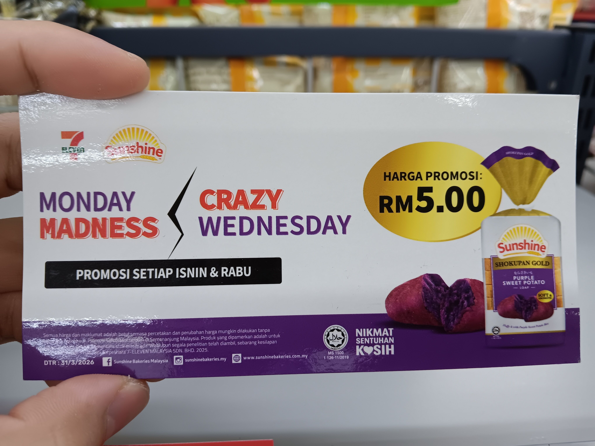
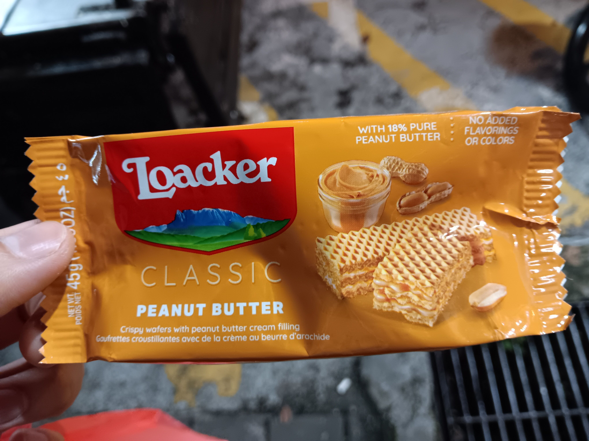

- 00:00 確認沒賣紫薯面包
- 00:04 開車前往下一家分行，覺察頭部兩側有電流，疑似 [[OGC]] 不久後的影響
- 00:08 安全抵達，查實所聽所見
	- 
	  id:: 69f22e42-700f-462a-be38-de738205a175
- 00:14 到附近油站打風
- 00:24 到了 [[New Town, PJ]] 靠近 [[Mr DIY]] 的 [[7-Eleven]]，確認欠缺 ((69f22e42-700f-462a-be38-de738205a175))，需等到下星期一才能查價
- 00:46 開車離開，喝冷飲
- 00:50 重返 [[2nd Street]] 對面的 [[PJ State]] [[7-Eleven]] 買 [[promotion]] 的 [[Loacker Classic Peanut Butter 45g]] @RM2
	- 
- 00:58 嘗試在 [[PJ State]] [[7-Eleven]] 店外的 [[blck food truck / Master Food Marketing]]
	- **01:07** [[quick capture]]: 
-