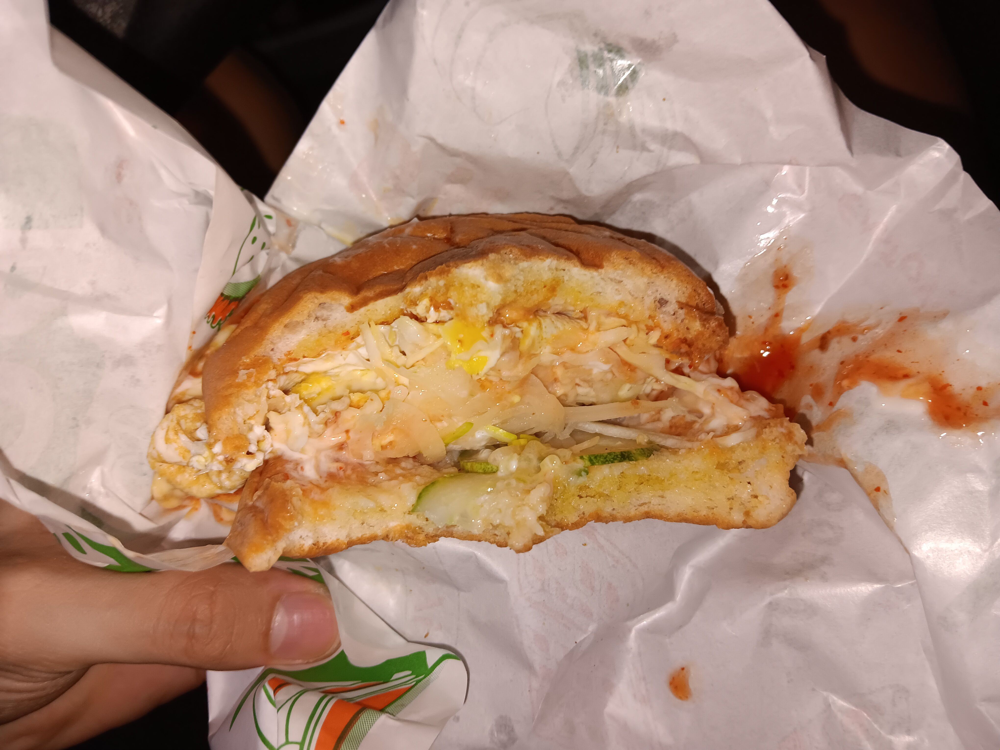

- 00:00 確認沒賣紫薯面包
- 00:04 開車前往下一家分行，覺察頭部兩側有電流，疑似 [[OGC]] 不久後的影響
- 00:08 安全抵達，查實所聽所見
  collapsed:: true
	- 
	  id:: 69f22e42-700f-462a-be38-de738205a175
- 00:14 到附近油站打風
- 00:24 到了 [[New Town, PJ]] 靠近 [[Mr DIY]] 的 [[7-Eleven]]，確認欠缺 ((69f22e42-700f-462a-be38-de738205a175))，需等到下星期一才能查價
- 00:46 開車離開，喝冷飲
- 00:50 重返 [[2nd Street]] 對面的 [[PJ State]] [[7-Eleven]] 買 [[promotion]] 的 [[Loacker Classic Peanut Butter 45g]] @RM2
  collapsed:: true
	- 
- 00:58 嘗試在 [[PJ State]] [[7-Eleven]] 店外的 [[blck food truck / Master Food Marketing]] 點餐 [[Benjo Cheese]] @RM5.5
  collapsed:: true
	- 
	- **01:07** [[quick capture]]: 
- 01:05 回到車上，吹冷氣，時間帳
- 01:11 夜宵，當嚐到 [[Benjo Cheese]] 只有 [[salad]] 、 [[fried eggs]] 和 [[cheese]] 且沒有任何 [[patty]] 時，感到[[錯愕]]且[[驚喜]]，因爲意外地[[合口味]]，喝冷飲，時間帳
- 01:26 開車回家
- 01:31 把車停在附近的公園，猶豫而決，時間帳
- 01:35 爲了剩下 [[Prepaid 5G 25 (Unlimited)]] 有限的 [[3GB Hotspot]]，決定把車移回自己的平時的停車位，鏈接家裏的 [[WiFi]]
- 01:42 停了車，無風狀態，因眼前事物分心 ── [[MacBook Pro (MBP)]] 的 [[Pages]] 軟件無法自適應 [[dark mode]]，troubleshooting：[[Ctrl ^]] + [[Option / Alt ⌥ ]] + [[Command ⌘]] + 8
- 02:21 無風狀態，強忍黏膩的皮膚，藉助 [[Gemini Live-Mode]]
- 03:48 因眼前事物分心 ── 爲手機 [[lock screen]]設置 [[torch light]] 快捷鍵 + 把家戶外草坪上被堆積的垃圾收納進最大的袋子
- 04:18 到家，喝水，沖涼，盥洗，戴上牙套，排尿
- 04:59 喝水，走動，時間賬
- 05:04 繼續馬拉松煲劇《[[玫瑰的故事]]》EP18 - 30，強忍黏膩的皮膚，半躺半坐
- [[14]]:30 排尿，沖涼
- 14:45 繼續馬拉松煲劇《[[玫瑰的故事]]》EP31
- 15:25 主動打開冷氣，睡覺
- 22:26 因冷痹醒來，起床，主動關閉冷氣
- 22:29 走動，閱讀，看視頻
- 22:58 摘下牙套，走動，弄熱湯，喝冷飲，喝牛奶，晚餐，暴食，吃甜食
	- 結束於 [[Fri, 01-05-2026]] 00:20