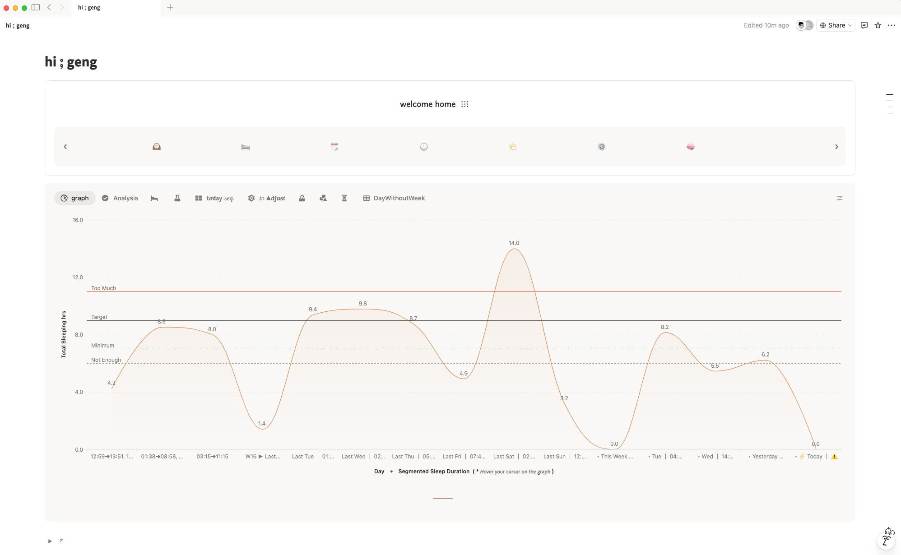

- 00:20 排便
- 01:06 沖涼
- 01:26 緩衝，喝水，規劃，更新日曆
- 02:00 查看信箱，因眼前事物分心，看視頻
- 02:21 刷社媒，坐姿歪斜，強迫性做事，強忍睡意，troubleshooting ── 解決 [[睡眠自動化系統 Mi Band→GAS→[[Notion]]]] 的 [[GAS (Google Apps Script)]] 因 [[authorization issue]] 造成最新睡眠記錄停留於 [[Wed, 08-04-2026]]，覺察焦慮
- 05:53 強忍睡意，聽書《[[不原諒也沒關係]]》，坐姿歪斜，咬嘴皮，入耳式耳機
- 06:43 強忍睡意，覺察[[噁心]][[想吐]]的感覺，聽書，哼唱，坐姿歪斜，入耳式耳機
- 07:20 入耳式耳機，強迫性做事，調整 [[UI]]
  collapsed:: true
	- 
- 08:06 喝水，看視頻，強迫性做事，覺察好奇，忍尿
- 09:[[16]] 走動，早餐，排尿，強忍睡意，沖涼
- 09:42 重啟 [[MacBook Pro (MBP)]]，備份手機剛下載的[[電子書]]
- 09:57 草擬信息向 [[Valerie Tan Jin Wen]] 確認 [[appointment]]： Therapy: Val #11 (Cont. Jacq 19 JC 46)
	- 成功送出於 10:15
- 10:15 因眼前事物分心 ── 回放 [[gallery]]
- 10:44 時間帳，哼唱，強忍睡意
- 10:47 睡覺
- 20:04 因冷痹醒來，因三急醒來，排尿，起床，晚餐，清洗廚具，吃小食
- 21:17 清理手機容量，備份重要資料到 [[MacBook Pro (MBP)]]，適當躺一下
- 21:44 時間賬，強迫性做事，蹲著
- 21:52 處理移動端 [[Logseq]] 同步的問題
	- 成功解決於 [[Sat, 02-05-2026]] 00:38
- 22:54 [[OGC]]，入耳式耳機，看視頻
- 23:20 走動，緩衝
- 23:54 繼續
-