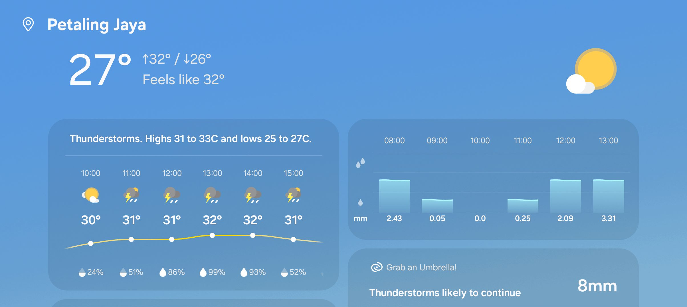
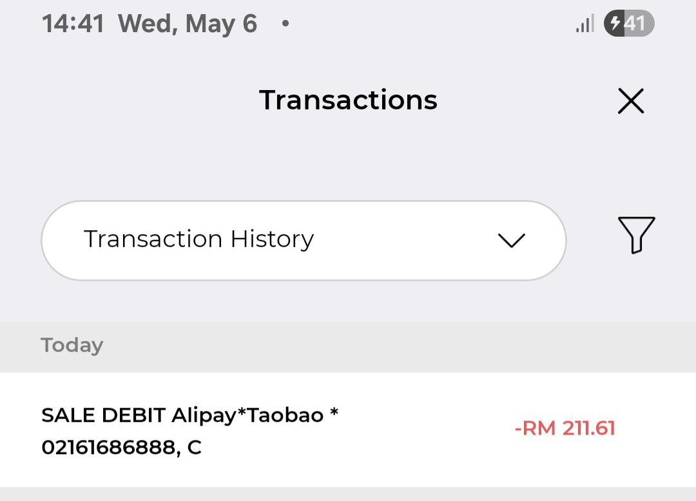
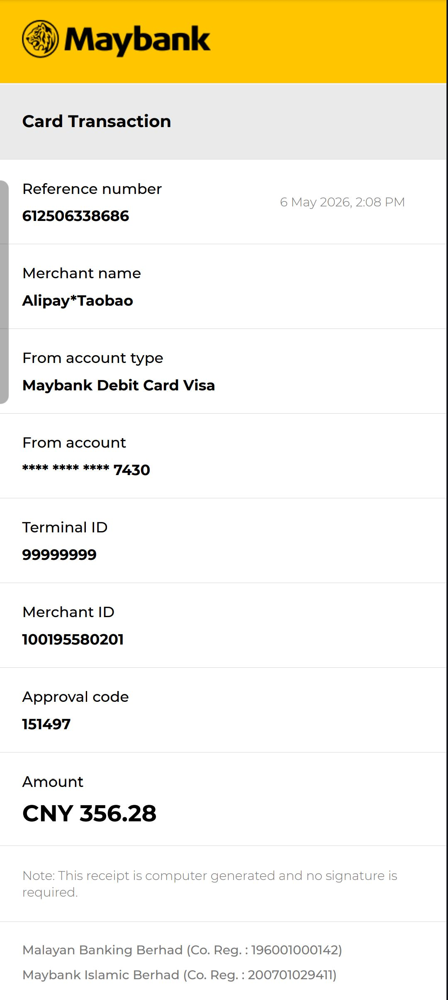

- 00:20 夜宵，吃蔬果，喝水
- 00:27 時間帳，查看信箱，打哈欠
- 00:33 喝水，清洗廚具
- 00:49 忍糞，因眼前事物分心，整理背包，覺察好奇，試戴手手飾
- 01:07 蹲廁所，刷社媒，看視頻
- 01:32 沖涼，盥洗
- 02:01 乾洗 3C 產品，打瞌睡，強忍睡意
- 02:23 排尿，因眼前事物分心 ── 換廁紙 + 替換包裝上不黏的透明膠紙
- 02:38 強忍睡意，咬嘴皮，時間帳，走動
- 02:42 戴上牙套，走動，強忍睡意
- 02:47 睡覺
- 06:27 夢醒，賴床
- 06:30 時間帳
- 06:36 閉目養神，躺著， [[4-2-6 Deep Breathing]]
- 07:00 起床，主動打開燈光，喝水，時間帳
- 07:04 借助 [[Wispr Flow]] 記錄[[夢境]]，關聯[[潛意識]]和已經發生的[[事實]]
  collapsed:: true
	- 夢見一個男人在逛 3C 產品的周邊專賣店。過程中，他好像遇到了一些問題：尤其當找不到自己想要的產品，或者事後才發現自己買到的東西貨不對版的時候，他還曾跟那裡的店員器起衝突。
	- 這很可能是在鏡像昨晚 [[Tue, 05-05-2026]] 我到 New Town 附近的 Mr. DIY 逛櫥窗的體驗，尤其是我當時非常害怕也自己因一時衝動，結果買到自己可能不是剛需的東西，比如任何不耐用或性價比很低的電子產品。
	- 於是，過程我花了將近一個小時在試戴和試聽當時現場售賣的[[耳夾式耳機]]上；然而，那樣的預防性行爲也許在下意識給我自己造成了無形的壓力。
	- 在夢裏，該男子和店員發生衝突的場景也很可能反映著昨晚的我非常擔憂店員趕走我，畢竟我拖到店員已經拉下半個閘門，加上營業時間即將結束我才捨得離開現場和付款
- 07:19 時間帳，覺察如釋重負、輕盈
- 07:22 因眼前事物分心 ── 為了實現和安卓版鼠鬚管輸入法 [[Trime]] 僅透過長按 P 鍵就可輸出破折號破折號（──），於是刻意在 [[Gboard]] 輸入法內的 [[dictionary]] 新增快捷鍵 pzh
- 07:43 半躺半坐，查實所聽所見 ── 今天 [[Wed, 06-05-2026]] [[天氣預報]]：不適合洗和曬鞋
  collapsed:: true
	- 
- 07:50 查看信箱，因眼前事物分心 ── 逛櫥窗 @ [[Carousell]] ，半躺半坐
- 08:09 喝水，走動，躲避與家人接觸，覺察羞愧，測試軟件 [[Alipay 支付寶]]，備份收據
  collapsed:: true
	- ((69fa8aa3-1007-4e15-a382-570a2f4a6470))
	-
- 08:27 藉助 [[豆包 AI]] 了解支付尾款的注意事項
- 09:23 忙著解決付尾款時，[[Alipay 支付寶]] 過不了賬，尋求客服的幫助
- 14:03 不甘心再試一次，結果幸運成功付完 [[綠聯 UGREEN HiTune X8]] 的尾款 [[RM211.61]]
	- 
	- 
- 14:52 沖涼，喝水，盥洗，摘下牙套，
- 15:15 傾盆大雨，開車出門，覺察緊張，午餐，
- 15:38 Therapy: Val #12 (Cont. Jacq 19 JC 46) 諮商開始，覺察緊繃
- 17:08 諮商結束，覺察疲勞，時間帳
- 17:15 離開停車場，回電[[淘寶]] & [[Alipay 支付寶]]的客服追蹤進度
- 18:08 客服電話結束，開車，堵車
- 18:34 到了油站，意外將車鑰匙留在車裏：自己被反鎖在車外面
- 19:18 走回家拿鑰匙
- 19:35 到家，返航
- 20:16 到家，熱水澡
- 21:06 緩衝，清洗廚具，中途遇到家人干預，反問對方我正在做什麼
- 21:12 接聽客服的電話，主動打開冷氣
- 21:24 時間帳，緩衝
- 21:30 煲劇馬拉松
- 22:39 睡覺，主動關閉冷氣
	- 結束於 [[Thu, 07-05-2026]] 03:50
-