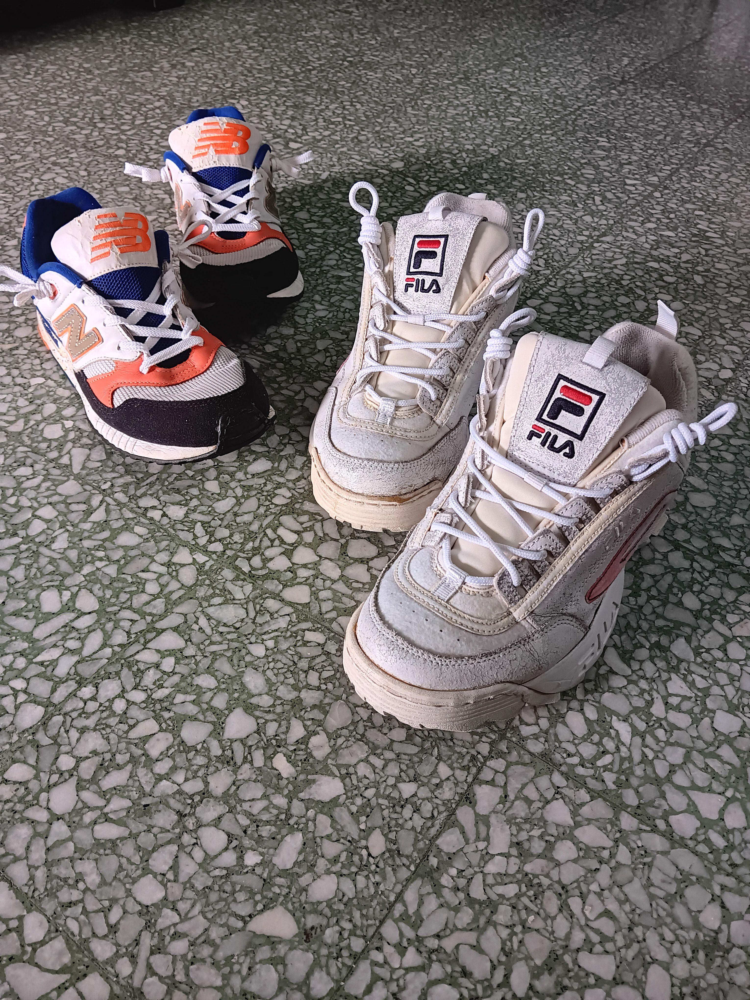
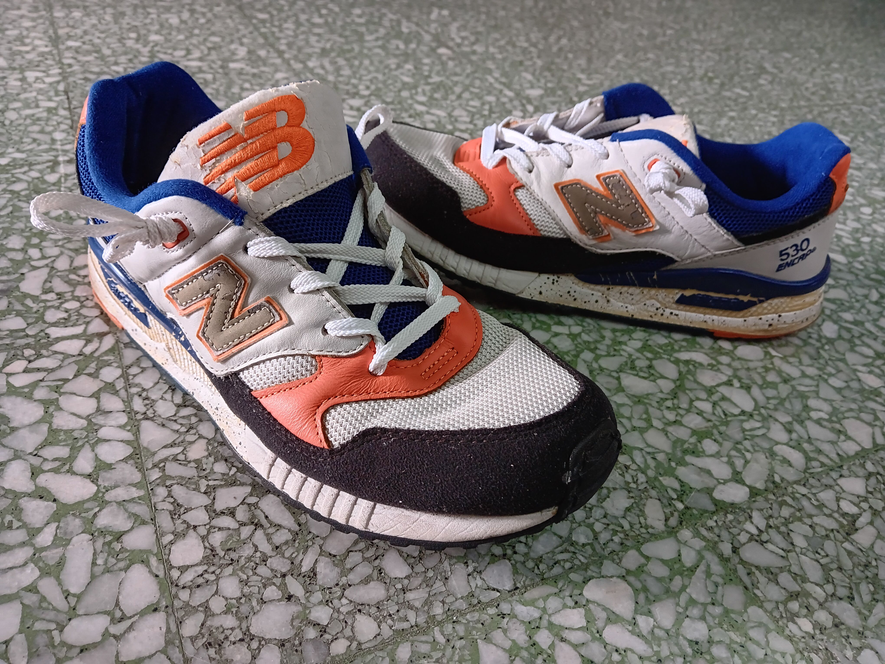
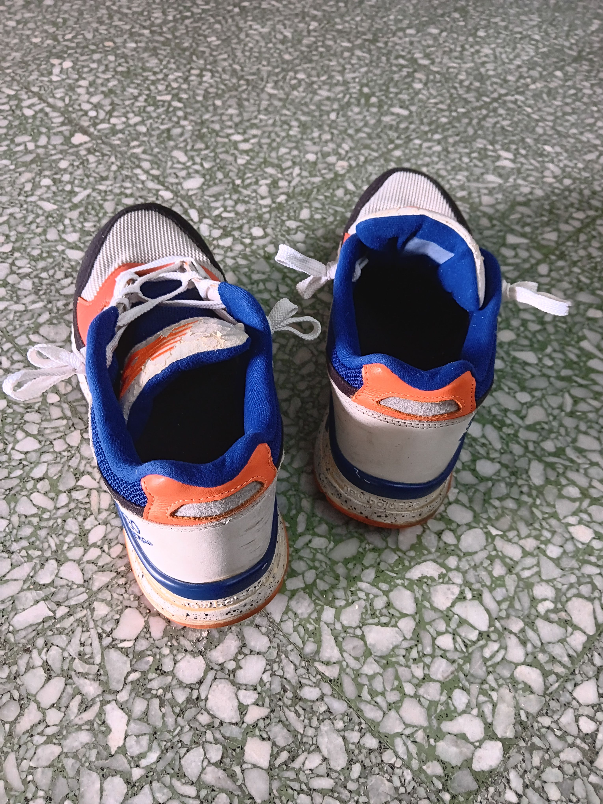
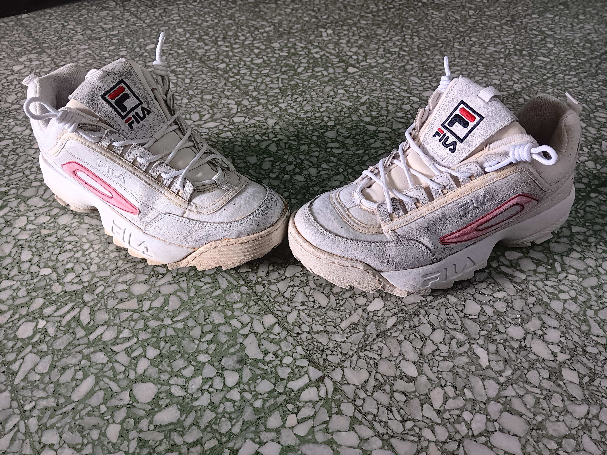
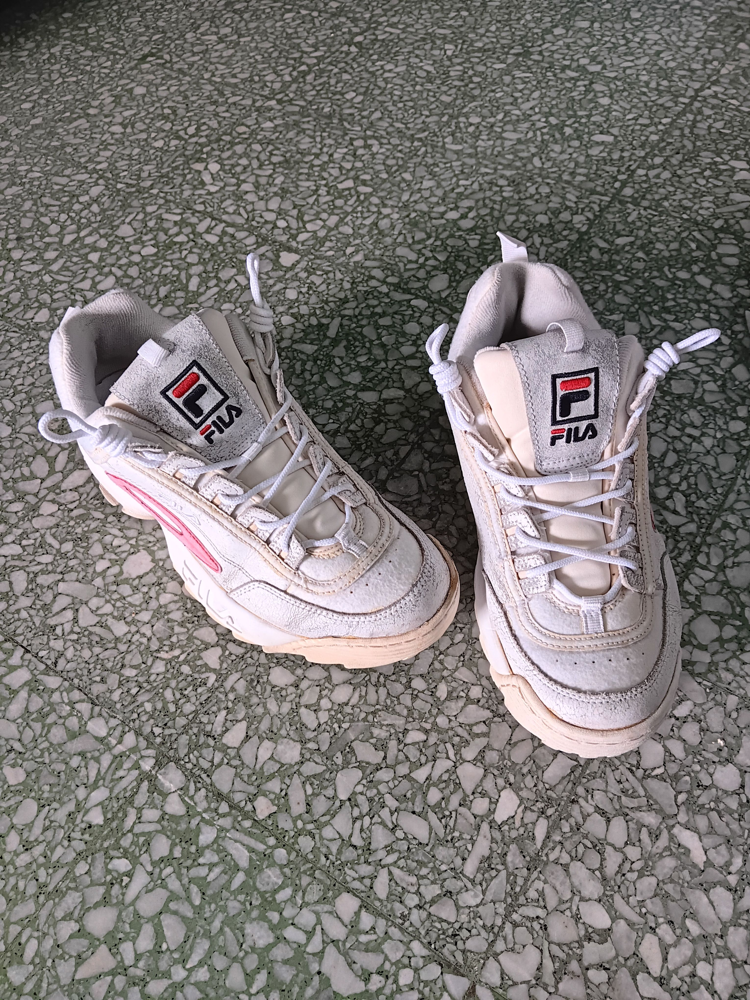
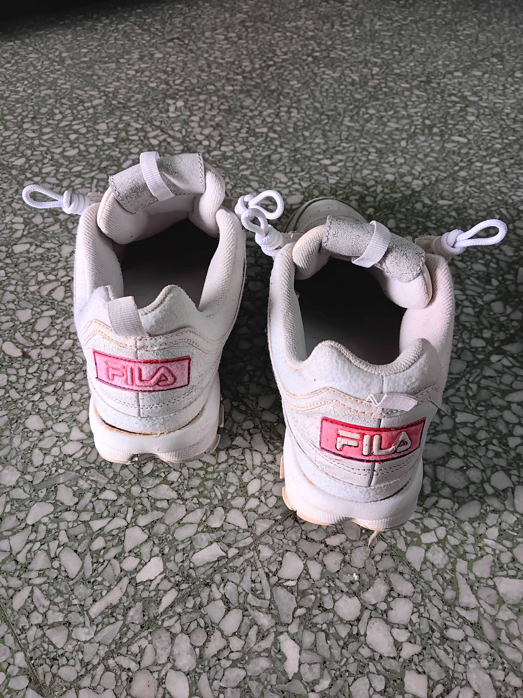

- 07:49 夢醒，賴床，回籠覺
- 08:31 因冷痹醒來，因三急醒來，走動，排尿
- 08:42 喝水
- 13:13 替鞋子設計和繫鞋帶
  collapsed:: true
	- 結束於 14:50
	- 
	- 
	- 
	- 
	- 
	- 
	- 
- 15:03 喝水，收納鞋子，主動向嬤嬤確認鞋櫃里的鞋子是否還能穿
- 15:20 主動回應嬤嬤的需求，聽見對方開始[[偏離話題]]和[[關注別人的議題]]時，嘗試沈默且冷眼地看着對方， [[hey, we've made it checklist]]，繞過了破口大罵 ── 主動問自己是不是難過 + 將視線轉移到戶外被風吹動的樹影 + 保持沈默直到對方遠離現場爲止
- 15:49 記錄閃念
- 15:53 覺察如釋重負，逛橱窗
- 16:44 回應嬷嬷提起關於對方主診醫師 [[Khairul]] 得知我曾在醫院 ，聯想起
- 17:47