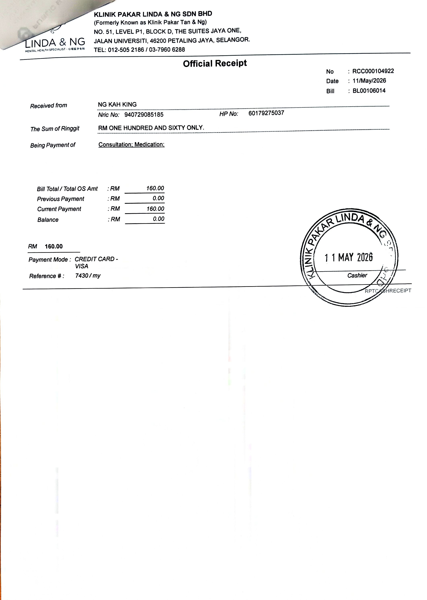
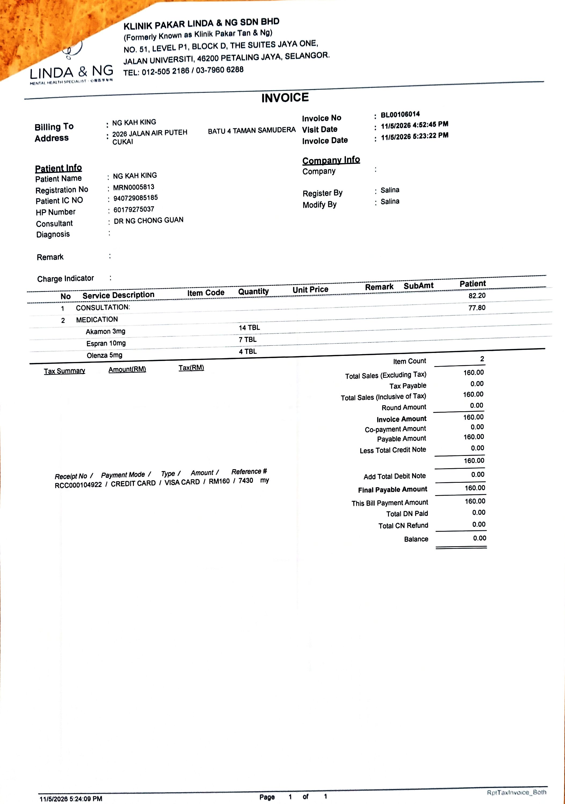
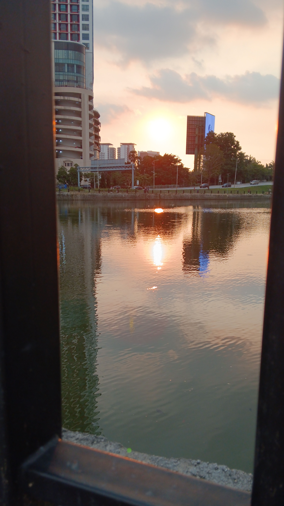

- 00
- 01:16 坐着，入耳式耳機，逛櫥窗
- 02:29 躺着，半躺半坐，入耳式耳機，聽歌，逛櫥窗，的打瞌睡，強忍睡意
- 03:56 猶豫而決
- 04:01 排便，沖涼，藉助[[豆包 AI]]進行[[貨比多家]]
- 04:30 躺着，不小心睡着
- 09:06 因身體不適醒來，賴床
- 09:19 起床，走動，藉助[[豆包 AI]]進行[[菜鳥集運省錢攻略]]，逛櫥窗
- 15:32 沖涼，盥洗，摘下牙套
- 16:18 開車出門
- 16:24 打風
- 16:30 前往 [[Jaya One Mall]]，聽歌，覺察亢奮
- 16:40 安全抵達 [[Jalan 17/ 1A, public parking lot]]，走到 [[Linda & Ng Psychiatry Clinic (formerly Tan & Ng)]]
- 16:51 到了目的地，等候， [[4-2-6 Deep Breathing]]
- 17:09 開始見 [[Dr. Ng Chong Guan]]，拿到了 [[referral letter]] 和 [[攝取精神藥物]]
  collapsed:: true
	- 
	- 
	- 
- 17:21 諮詢結束
- 17:27 後知後覺櫃檯員試探性問及自己的隱私，趕快付款離開，到了 [[Mr DIY]]
- 17:51 到了 [[Happy Hormones]] ，時間帳，覺察焦慮
- 17:53 到處走走，覺察羞愧、抑鬱
- 18:08 回到了車內，猶豫而決
- 18:14 開車回家
- 18:35 到了 [[Taman Jaya Park]]，看[[日落/夕陽]]，走動，入耳式耳機，聽歌，覺察抑鬱
  collapsed:: true
	- 
- 19:12 開車回家
- 19:26 到家，停車之前看見鄰居，感到害怕，緩衝
- 19:31 時間帳
- 19:35 緩衝，換衣
- 19:45 沖涼，查收所聽所見 ── 飯未煮熟，喝水
- 20:10 備份收條，咬嘴皮，無風狀態，哼唱
- 20:31 吃小食，
- 20:47 主動確認嬤嬤已經吃飽，晚餐，喝水，吃蔬果
- 21:25 [[攝取精神藥物]]
-