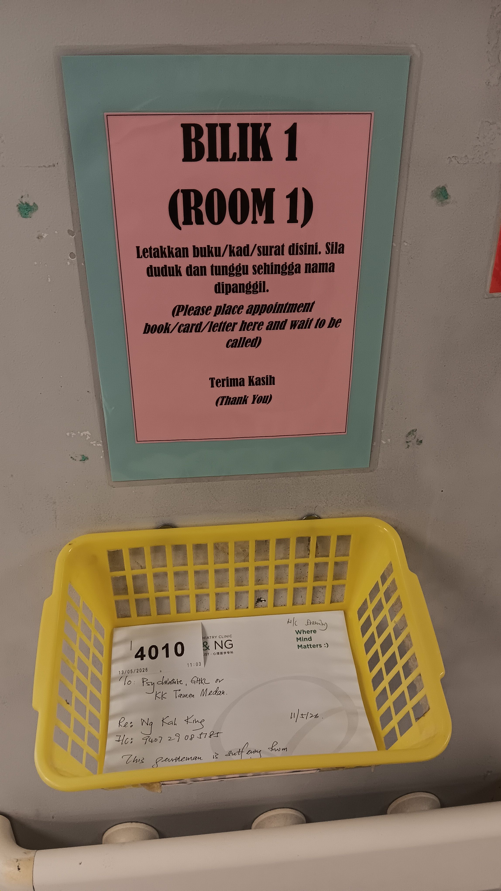

- 00:05 入耳式耳機，排尿，清洗廚具
- 00:20 借助 [[豆包 AI]]
- 01:14 沖涼，更高，盥洗
- 01:36 整理背包，走動
- 08:45 起床，盥洗，摘下牙套，沖涼，排尿
- 09:05 換衣
- 09:26 出門不久發現 [[referral letter]] 沒帶，返回家
- 09:34 二次回家才發現已經把水瓶待在車裡，見到鄰居，覺察羞愧、緊張
- 09:41 開車出門，聽歌
- 10:23 到了 [[Hospital Kuala Lumpur]] 的停車樓
- 10:24 走路到 [[SCACC]]
- 10:48 到了 [[Klinik Psikiatri & Kesihatan Mental]]
- 10:51 等候
- 12:38 醫護人員問起才發現需要將 [[referral letter]] 放在籃子上，需等到 13:30 醫生才來，離開
  collapsed:: true
	- 
- 12:41 到了戶外 [[Starbucks]] 的附近坐下
- 13:30 返回 [[Klinik Psikiatri & Kesihatan Mental]]，借助 [[豆包 AI 打電話]] 繼續[[菜鳥集運省錢攻略]]
- 14:00 被叫到名字時手忙腳亂地走進房諮詢室，回答 [[Dr Ong]] 提問時磕磕巴巴，覺察慌張、焦慮
- 14:17 諮詢結束，更新日期，時間帳
- 14:33 走路回到車上
- 14:57 開車前往 [[Serene Pschological Services Center (Lifecare Center, Bangsar South)]]，聽歌
- 15:36 到了諮商室外， [[4-2-6 Deep Breathing]]
- 15:45 諮商開始
- 17:51 諮商結束，回到車上
- 17:59 到了車上，開車回家
- 18:15 停在油站打風
- 18:35 到家，喝水，聽見嬤嬤在電話裡隔空和爺爺起口角，感到害怕，覺察自己想要干涉卻主動遠離
- 18:47 弄熱食物，預設備忘，借助 [[豆包 AI 打電話]] 繼續[[菜鳥集運省錢攻略]]
- 19:36 晚餐
- 20:18 清洗廚具，入耳式耳機，聽歌，躲避與家人進一步聊天
- 20:43 [[攝取精神藥物]]，喝水，排便，沖涼，盥洗，戴上牙套
- 21:26 查實所聽所見，主動回應嬤嬤的需求， [[hey, we've made it checklist]]
- 22:40 借助 [[豆包 AI 打電話]]