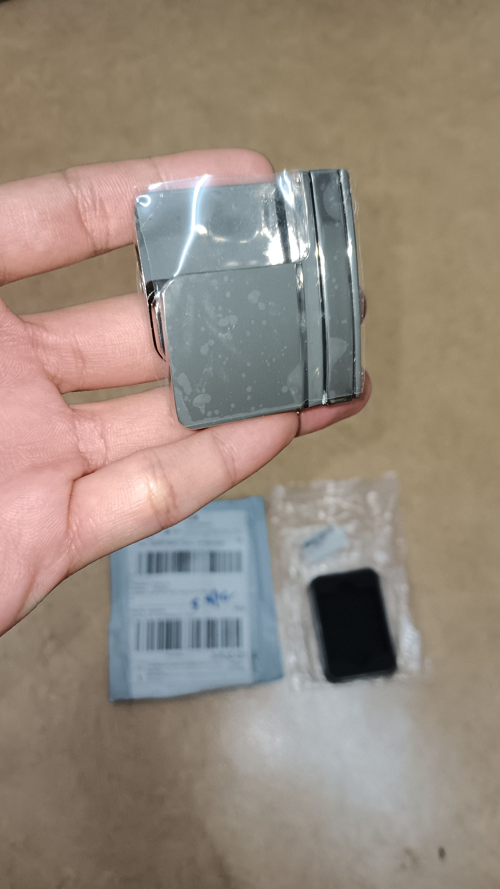
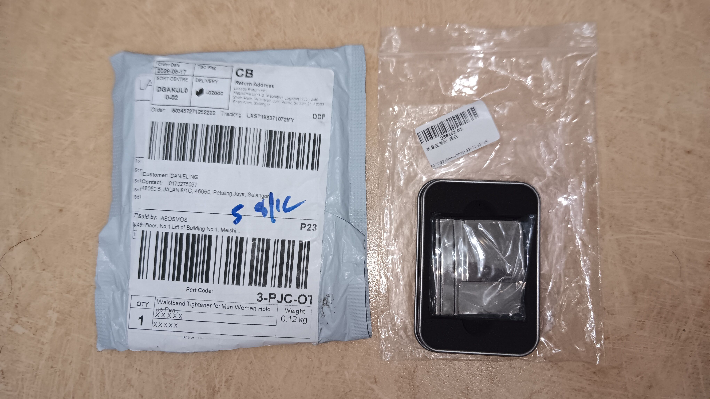
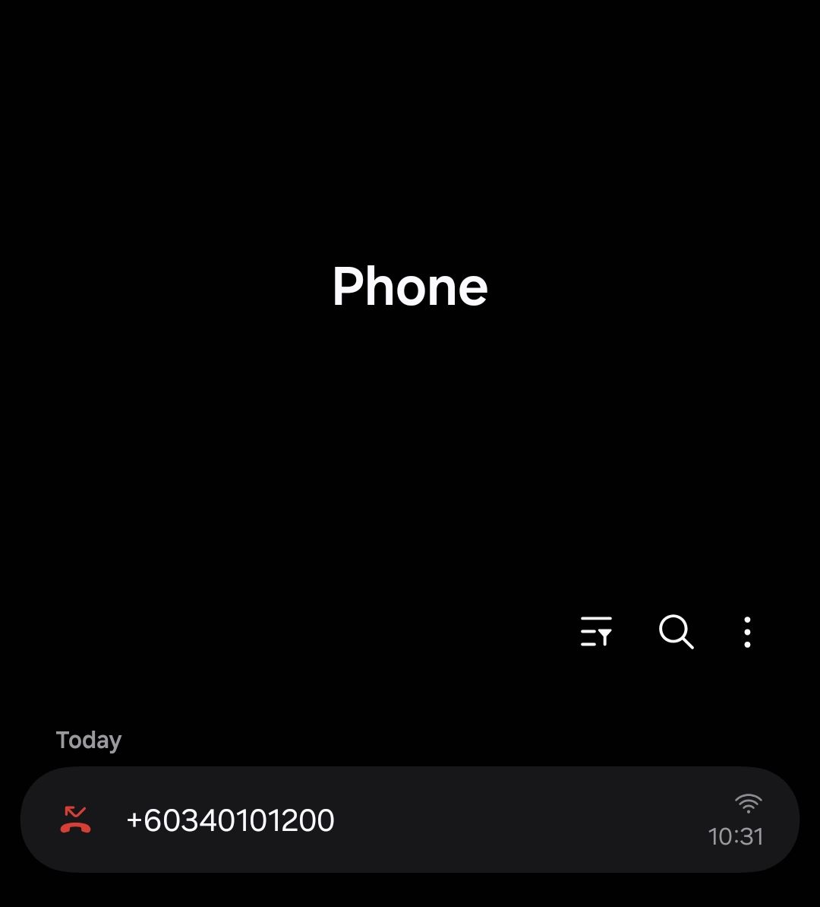
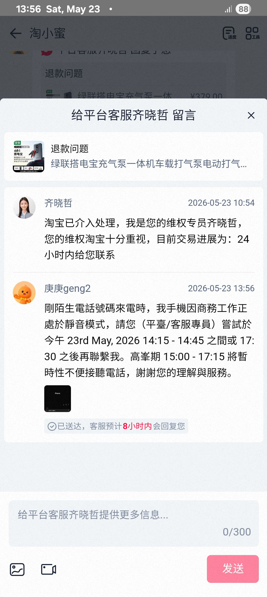

- 01:41 [[攝取精神藥物]]，走動，離子化飲用水，喝水
- 01:51 啓動車引擎，處理垃圾
- 02:01 開車出門，到油站，打風，檢查水槽夠水
- 02:23 待在車內，藉助[[豆包 AI 打電話]] 了解 [[618 網購策略]]
- 05:30 到家
- 05:46 睡覺
- 12:58 因室內悶熱醒來，走動，起床，喝水，時間帳
- 13:05 拆封包裹 ── [[metal adjustable waist band]]，測試商品，強迫性做事，覺察好奇
  collapsed:: true
	- 
	- 
- 13:46 查看信箱，回信客服
  collapsed:: true
	- 
	- 
- 13:56 時間帳
- 14:08 盥洗，摘下牙套，覺察猶豫而決
- 14:22 蹲廁所
- 14:35 沖涼
- 14:44 換衣
- 15:25 安全抵達目的地
- 15:31 諮商開始
- 17:27 諮商結束，離開停車場
- 17:31 車停在路邊，強迫性做事，藉助[[豆包 AI 打電話]]處理[[延長收貨請求]]，覺察緊張，咬嘴皮，無風狀態，忍尿
- 20:53 開車回家
- 21:04 到家，頭兩側太陽穴覺緊繃
- 21:10 晚餐，弄熱食物，[[攝取精神藥物]]，吃小食，沖泡熱飲，主動打開冷氣，清洗廚具
- 22:22 [[quick capture]]: #voice-memo
	- **起床 DEMO**
		- 
- 22:24 [[quick capture]]: #voice-memo
	- **起床 DEMO 2**
		- 
- 22:26 清洗廚具
- 22:32 [[quick capture]]: #voice-memo
	- **你是我的女兒 也是我的靚仔 Hook**
		- 
- 22:35 排便，刷社媒
-