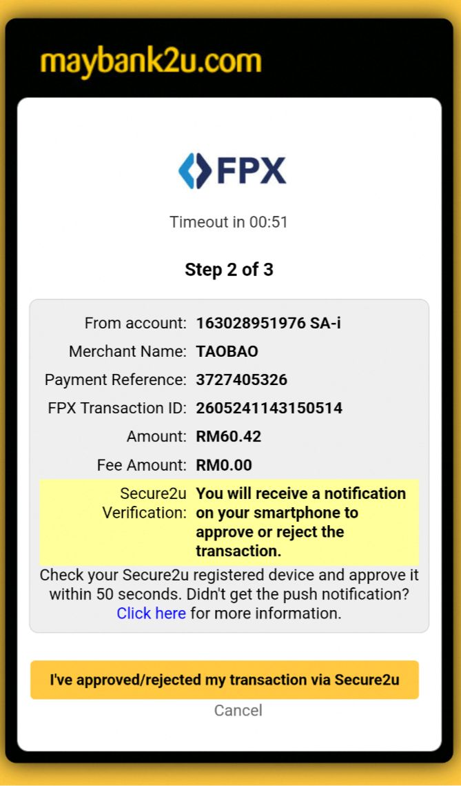
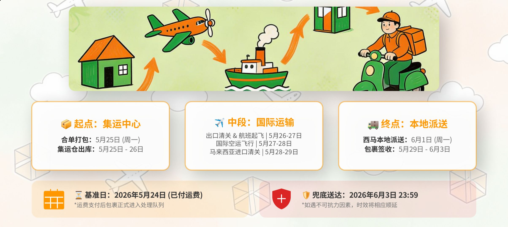
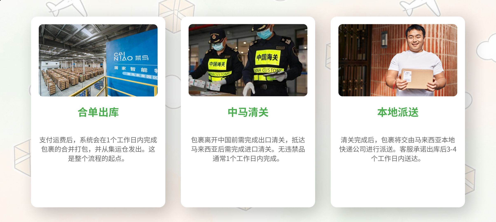
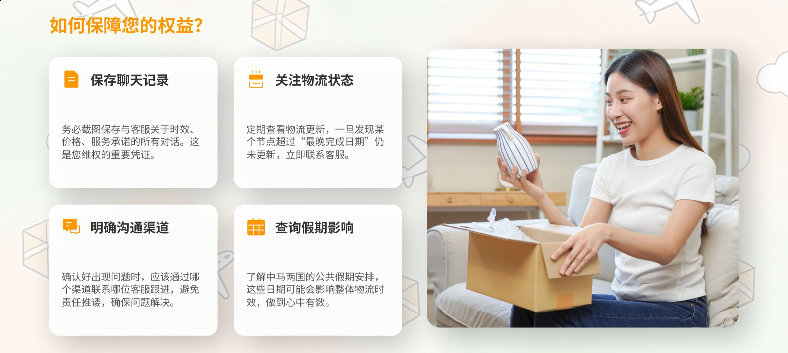

- 00:18 量房間的平方米寬度，藉助[[豆包 AI 打電話]]
- 02:00 重啓手機，排尿
- 02:09 繼續藉助[[豆包 AI 打電話]]逛櫥窗
- 04:35 排尿，走動
- 04:39 繼續逛櫥窗，躺着，強忍睡意，不小心睡着
- 05:56 睡覺
- 09:30 因外部聲音醒來
- 09:45 解除鬧鐘，賴床
- 10:03 賴床，查看信箱
- 10:07 [[接聽客服電話]] ── [[確認清楚中轉站簽收、入庫狀態、延長收貨功能、入庫後自動倒數存貨期限]] ── [[包裹單號作爲一切可追溯的憑證]] + [[淘寶 App 之 UX 不夠完善]]
- 11:09 時間帳，[[紀錄新學]]，覺察如釋重負
- 11:14 藉助[[豆包 AI 打電話]] 覆盤[[淘寶跨境物流客服專員提供和糾正的屬實信息]]
  collapsed:: true
	- 請求淘寶物（ 非跨境 ）客服備注：
	  logseq.order-list-type:: number
		- 13个包裹以包裹号为唯一识别依据，需同步告知每票入库时间及剩余仓存天数
		  logseq.order-list-type:: number
		- 入库后第50天主动短信/站内信提醒发货，避免超期
		  logseq.order-list-type:: number
- 11:44 [[合包/合單]]支付[[菜鳥集運跨境運費]] [[RM 60.42]]
  collapsed:: true
	- 
	-
- 11:51 藉助[[豆包 AI 打電話]]總結 [[quick capture]]: 
  collapsed:: true
	- https://feishu.doubao.com/slides/XEKisnLrClFsIpdBEpnci8uWn1d
	- 
	- 
	- 
	- 
- 12:33 整理筆記
- 12:42 藉助[[豆包 AI 打電話]]處理[[帶電過集運安檢規則]]
- 13:50 走動，查實所聽所見，主動找嬤嬤教用 [[Gemini Live-Mode]]發現結果不理想時泄憤，覺察挫敗， 備用水，沖涼
- 15:56 時間帳，喝水
- 15:59 繼續教會嬤嬤使用 [[Gemini Live-Mode]]
- 18:22 主動回應對方的請求 ── 修腳甲，覺察好奇
- 18:44 喝水，半躺半坐，咬嘴皮，逛櫥窗
- 20:28 走動，喝水，晚餐，清洗廚具，中途遇到家人干預， [[hey, we've made it checklist]] ── 暫停手洗一半的碗碟 + 溫和堅定拒絕對方請求我幫忙線上續駕照
- 21:42 [[quick capture]]: #voice-memo 
  collapsed:: true
	- **that's okay DEMO**
		- 
- 21:43 清洗廚具，熱水澡，排尿，盥洗，戴上牙套
- 22:30 測試剛新買的 [[shirt stay strap]] + [[metal adjustable waist band]]
- 23:11 睡覺
	- 醒來於 [[Mon, 25-05-2026]] 13:16