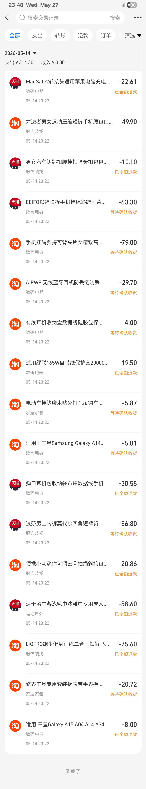
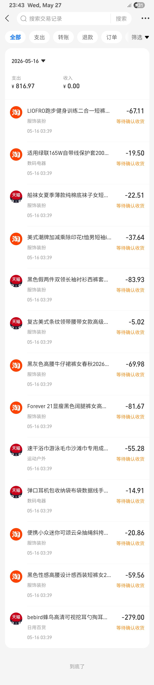

- 00:21 清洗厨具，热水澡，排尿，盥洗，戴上牙套，強忍睡意
- 01:14 主動關不冷氣
- 01:15  睡覺
- 14:30 因外部聲音醒來，賴床
- 17:41 已向[[菜鳥]]海外物流小蜜[[請求本地物流二次派送]]
- [[我的 TIN：IG27305655070]]
- 21:38 藉助 [[豆包 AI 打電話]]，學習理性看待 [[Tue, 05-05-2026]]、[[Wed, 06-05-2026]]、 [[Thu, 07-05-2026]]、 [[Thu, 14-05-2026]] 、 [[Sat, 16-05-2026]] 於 [[Maybank]] vs [[Alipay 支付寶]] 的 [[消費流水對比]]
	- [[Tue, 26-05-2026]] 收到多一筆入賬的錢 [[RM 232.94]] 據 [[Thu, 14-05-2026]] 匯率相等於[[總退款金額 total refund]] ：[[CNY 317.82]]（ 8+75.6+58.6+20.86+30.55+19.5+10.1+22.61 ）
	  collapsed:: true
		- 
			- 8元：适用三星Galaxy A15 A04 A14A... [[A14 phone case]]
			- 75.6元：LIOFRO跑步健身训练二合一短... [[running short pants]]
			- 58.6元：速干浴巾游泳毛巾沙滩巾专用成... [[swimming quick dry towel]]
			- 20.86元：便携小众迷你可颂云朵抽绳斜挎... [[mini croissant earphones sling bag]]
			- 30.55元：弹口耳机包收纳布袋数据线手... [[spring loaded earphones pouch]]
			- 19.5元：适用绿联165W自带线保护套200... [[silicone powerbank case]]
			- 10.1元：男女汽车钥匙扣腰挂扣弹簧扣包... [[keys spring clip pouch]]
			- 22.61元：MagSafe2转接头适用苹果电脑... [[MacBook Pro 轉 type C adaptor]]
	- [[Sat, 16-05-2026]] [[Maybank]] 被扣除的 [[actual amount 實際扣款額]] [[RM540.97]] = [[Alipay 支付寶]] [[ total daily payment 當日支付總金額]] [[CNY816.97]]（ 按支付當日 1 人民币 = 0.662 马币的[[購匯匯率]]计算，而非[[實時結匯匯率]]如 1:1.71 ）
		- 5月16日當天 1馬幣≈1.51人民币，现在 1馬幣≈1.71是十几天涨的，當天扣款用的是[[反向購匯價]]，别和現在的 1.71 直接套
		- 
	- 暫停於 [[Thu, 28-05-2026]] 01:14