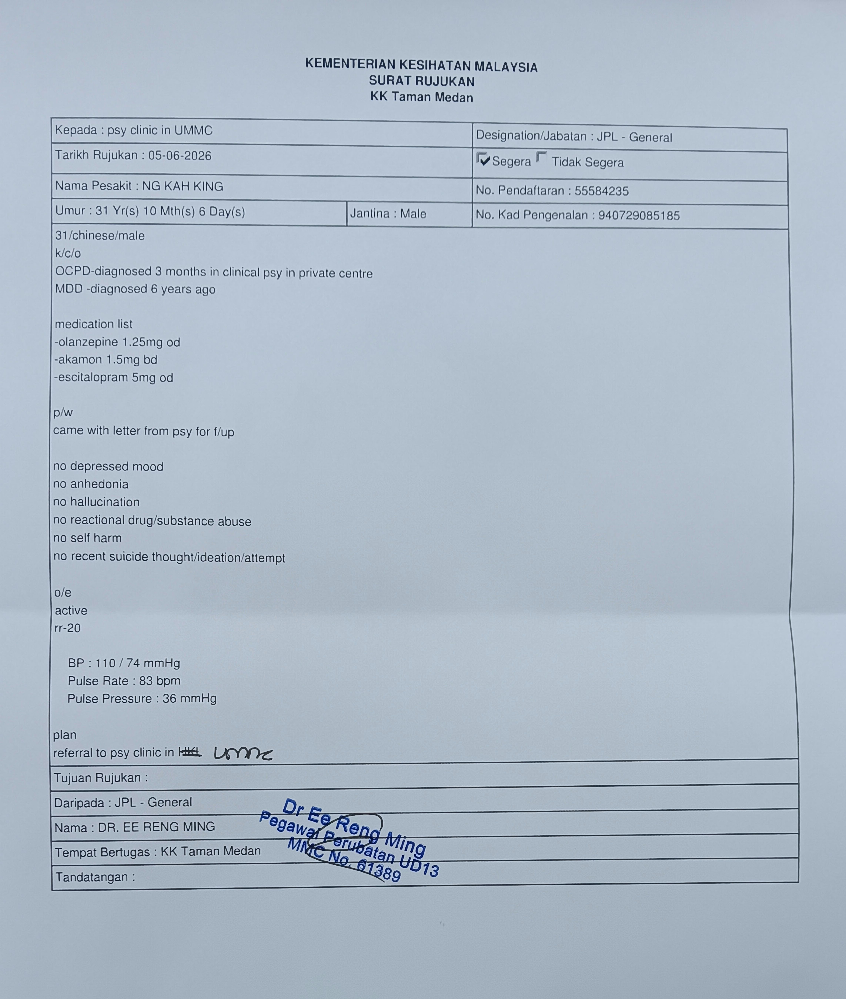
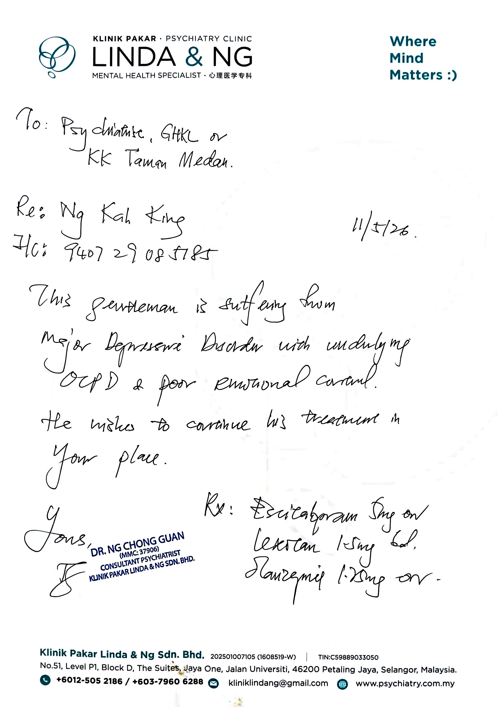

- 02:49 夢醒，因[[穿戴開放式耳機]]播放的音樂斷斷續續而醒來，賴床，睡睡醒醒
- 03:50 因外部聲音醒來 ── 手機跌進了床邊和牆的縫隙，覺察疲勞，近乎動不了身體，腎臟和肝臟都感覺到不適，時間賬 ，賴床
- 04:01 喝水，排尿，走動，起床
- 04:16 逛櫥窗
- [[10]]:31 沖涼，盥洗
- [[10]]:43 換衣
- 10:50 開車出門，[[穿戴開放式耳機]]
- 11:13 到了 [[Klinik Kesihatan Taman Medan]]，挂号
- 11:24 等待，[[穿戴開放式耳機]]，聽 ambience + 音樂， [[4-2-6 Deep Breathing]]，
	- 11:40 吃小食
- 11:51 看診，因應交待病例和近況
	- 12:01 暫停，覺察到自己的憤怒，源自不安跟害怕
- 12:16 結束諮詢，從 [[Dr Ee Reng Ming]] 確認各大政府醫院[[Klinik Kesihatan Taman Medan]] 均沒有 [[Fluoxetine]] 等 [[Hi-5]] 精神控制藥物，於是給我寫轉到 [[馬來亞大學醫院 UMMC ( PPUM )]] 的  [[referral letter]]
  collapsed:: true
	- 
	- 
- 12:27 藉助[[豆包 AI 打電話]]確認藥物名稱
- 12:33  走路回到車上
- 12:35 到了車上
- 12:42 開車出發，藉助[[豆包 AI 打電話]] [[分析公立醫院精神科 vs 私立精神科診所之間的藥物費用]]
- 13:05 打風
- 13:23 到家，沖涼，喝水，手洗衣物，午餐，晾乾衣物
- 14:49 修甲
- 15:05 逛櫥窗，不小心睡着，
- 23:47 因室內闷热醒來，因疲倦起不了身 ，汗湿床褥，借助 Wispr Flow 記錄夢境
  collapsed:: true
	- 夢見自己躲自己的朋友，繞了整個廣場幾圈
	- 到時，彷彿感覺到有人在跟蹤自己，於是步調越走越快，連配偶都來不及望一眼，只管不斷向前走。
	- 最後發現是自己的朋友，對方還曾怪罪自己爲什麼一直越走越遠。後來我的鐵絲死，對方爲什麼沒有告訴我，因爲害怕自己被怪罪，反而先質疑對方。
	- 結果，對方從一組照片裏面發現了一起命案，开始尖叫，而当时的我却还迟钝地看不清真相，覺察害怕、恐懼。
- 23:52 赖床