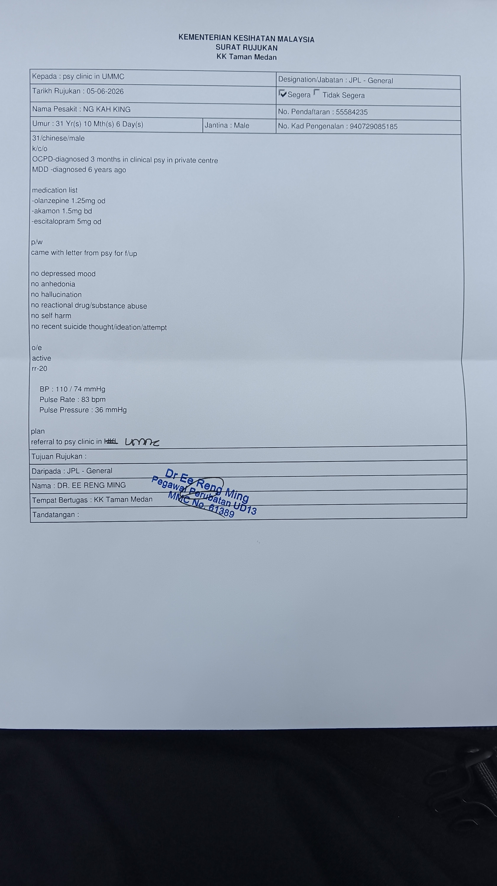

- 02:49 夢醒，因[[穿戴開放式耳機]]播放的音樂斷斷續續而醒來，賴床，睡睡醒醒
- 03:50 因外部聲音醒來 ── 手機跌進了床邊和牆的縫隙，覺察疲勞，近乎動不了身體，腎臟和肝臟都感覺到不適，時間賬 ，賴床
- 04:01 喝水，排尿，走動，起床
- 04:16 逛櫥窗
- [[10]]:31 沖涼，盥洗
- [[10]]:43 換衣
- 10:50 開車出門，[[穿戴開放式耳機]]
- 11:13 到了 [[Klinik Kesihatan Taman Medan]]，挂号
- 11:24 等待，[[穿戴開放式耳機]]，聽 ambience + 音樂， [[4-2-6 Deep Breathing]]，
	- 11:40 吃小食
- 11:51 看診，因應交待病例和近況
	- 12:01 暫停，覺察到自己的憤怒，源自不安跟害怕
- 12:16 結束諮詢，從 [[Dr Ee Reng Ming]] 確認各大政府醫院[[Klinik Kesihatan Taman Medan]] 均沒有 [[Diazapem]] 等 [[Hi-5]] 精神控制藥物，於是給我寫轉到 [[馬來亞大學醫院 UMMC ( PPUM )]] 的  [[referral letter]]
	- 
	-
-