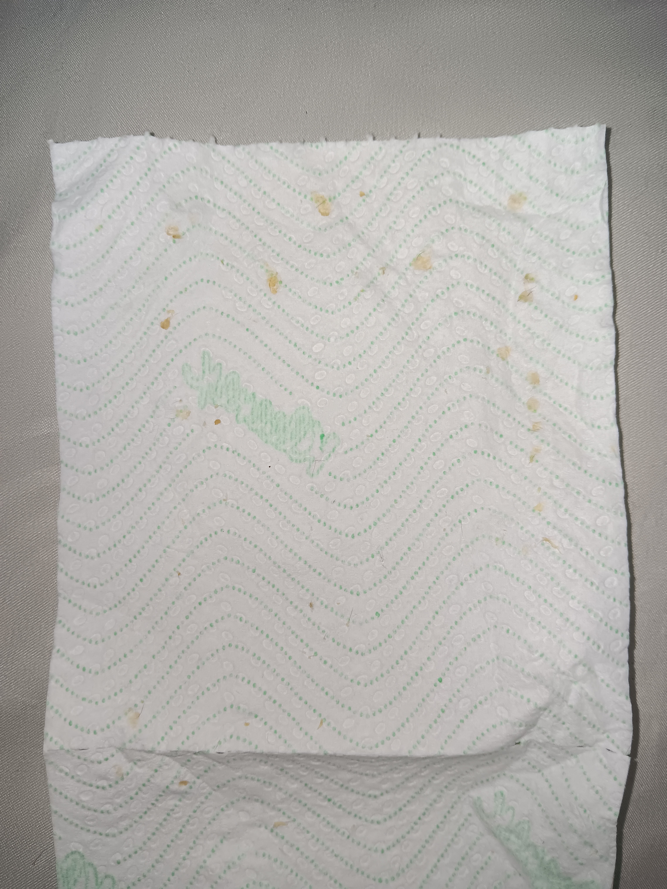
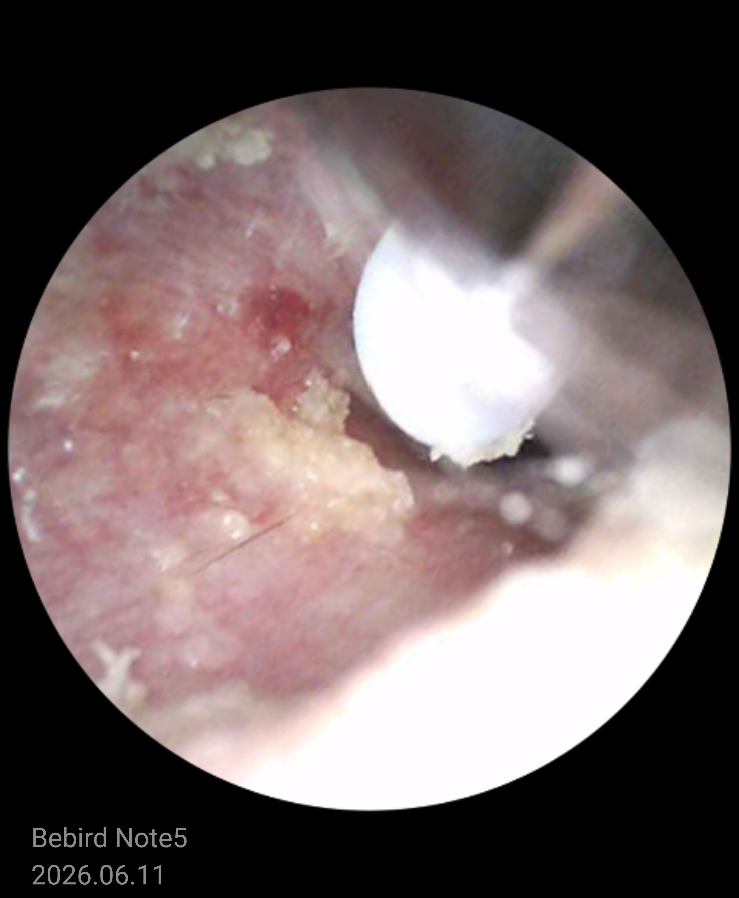
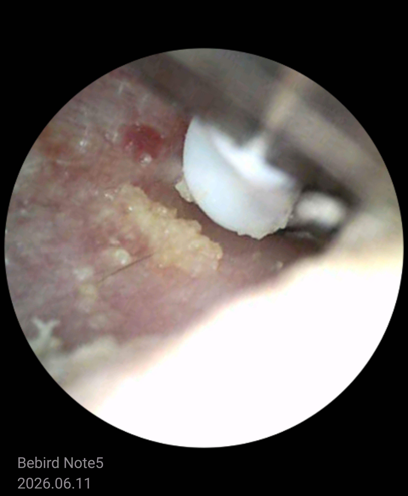

-
- 00:49 吹冷氣，挑選曲目，暗室直視 3C藍光
- 00:56 睡覺，喝水，[[穿戴開放式耳機]]，聽音樂，預計倒計時，睡睡醒醒，因冷痹醒來，夢醒
- 07:17 因身体不适醒来，冷氣自動關閉，賴床
- 07:32 赖床，時間帳
- 09:16 起床，喝水，[[摘下開放式耳機]]，半躺半坐，查看物流，逛櫥窗
- 10:03 [[咬自己的皮肉]]，覺察如釋重負，走動，喝水，盥洗，摘下牙套，沖涼，排尿
- 10:54 [[bebird Note5 Pro 可視采耳儀]]
- 11:31 簽收包裹，緩衝，覺察猶豫而決 ── 先繼續掏耳，後拆包裹
- 11:38 [[bebird Note5 Pro 可視采耳儀]]
	- 
	- 
	- 
- 12:01 拆自[[京東]]寄來的包裹