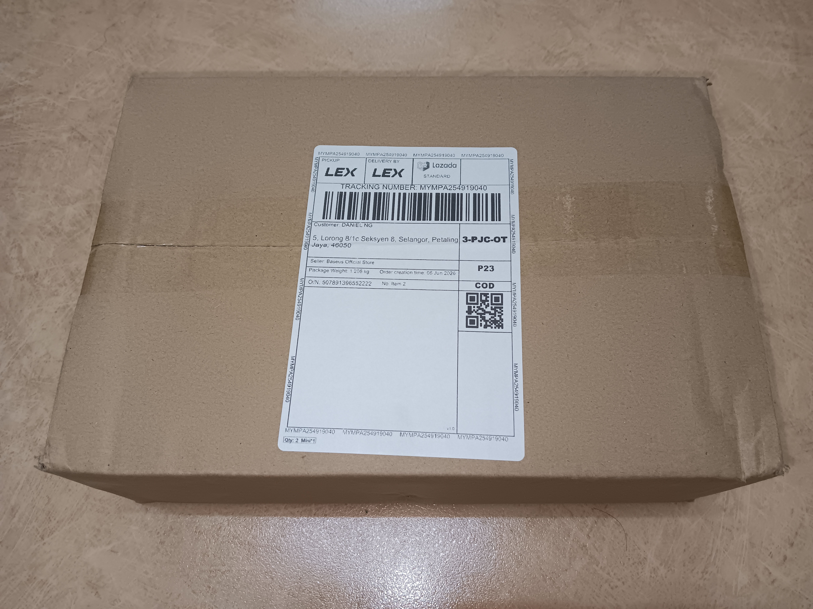
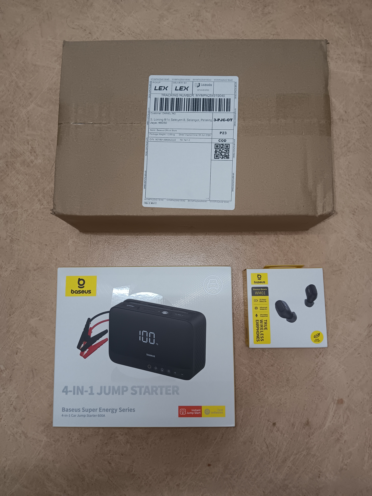
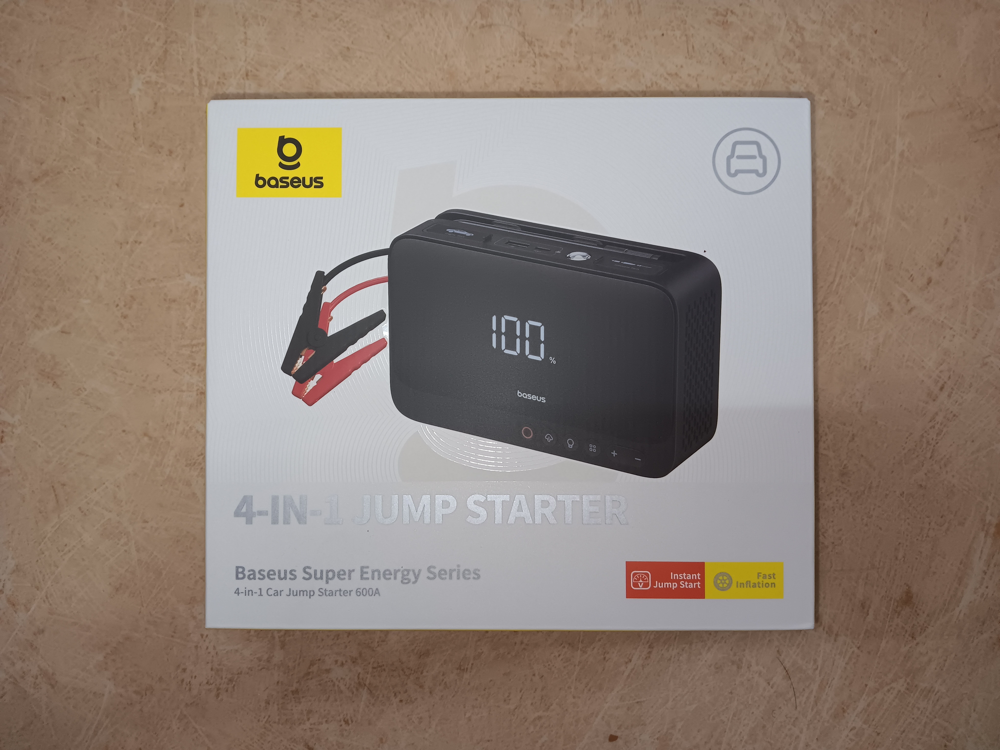
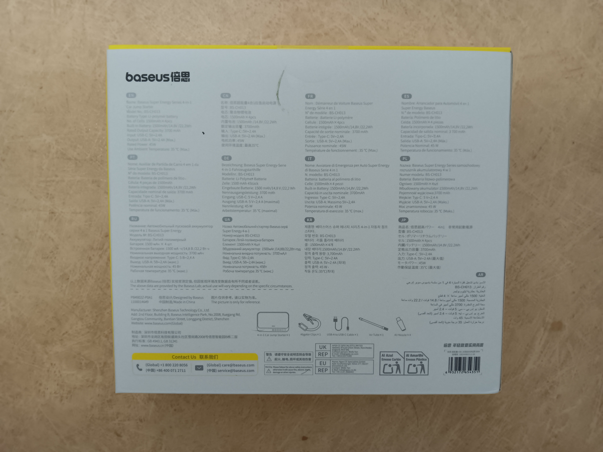

-
- 02:34 量自己[[高腰起算的腿長]]，排尿，主動關閉冷氣，走動
- 02:41 喝水，緩衝，時間帳
- 02:45 逛櫥窗
- 03:01 不小心睡着，[[穿戴開放式耳機]]，聽輕音樂
- 08:26 因身體皮膚癢醒來，主動打開風扇，關燈，時間帳，走動，喝水，半躺半坐
- 10:49 排尿，走動，盥洗，摘下牙套，[[穿戴開放式耳機]]，追蹤物流
- 11:20 喝水，吃蔬果，午餐，吃甜食，走動，清洗廚具，[[穿戴開放式耳機]]，聽歌
- 12:09 接聽到自 [[alibaba cloud]] 的營銷來電，覺察疑惑，block 對方
- 12:13 追蹤物流，聽歌
- 12:20 沖涼，喝水，強忍睡意，
- 13:09 覺察焦慮，查看所聽所見 ── [[淘寶 App 即將過期的優惠券]]
- 13:18 逛櫥窗
- 15:57 拆包裹 ── [[Baseus Super Energy Series 4-in-1 Car Jumper 600A]]
  collapsed:: true
	- 
	- 
	- 
	- 
- 16:54 排尿，主動關閉冷氣
- 17:06 [[穿戴開放式耳機]]，聽歌，試用 [[Baseus Super Energy Series 4-in-1 Car Jumper 600A]]
- 18:[[10]] 到家，拆包裹 ──[[拼多多 App 下的訂單]]、向[[拼多多客服]] [[投訴快遞員未獲得我同意下將包裹扔在地上]]，[[穿戴開放式耳機]]，聽歌，手舞足蹈，向
	- 結束於 [[Sat, 13-06-2026]] 01:22