- 04:00 [[摘下開放式耳機]]，走動，晚餐，喝牛奶，吃甜食，清洗廚具，排尿，盥洗，戴上牙套，走動，強忍睡意
- 04:29 睡覺，聽輕音樂，強忍睡意，調整 [[REDMI 紅米 Watchb 6]] 的[[表盤]]
-
- 08:24 因身體不適醒來，因疲倦起不了身，
- 08:52 起床，喝水，調整 [[小湃 P6 投影儀]] 的 [[UI]]
- 13:13 拆包裹 ── 試穿刚收到的 [[Hualun Design 墨綠免燙外褂領休閑襯衫]] ，儀容裝扮，聽歌
  collapsed:: true
	- 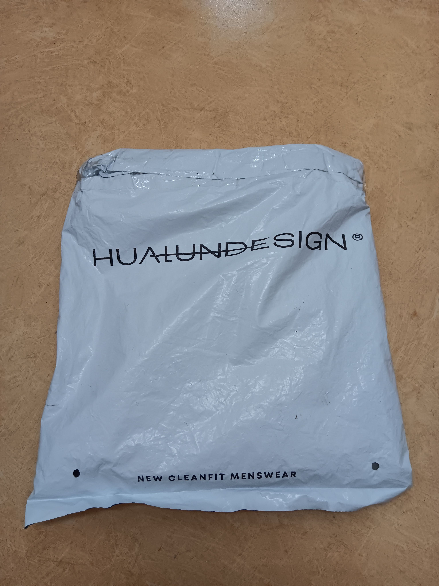
	- 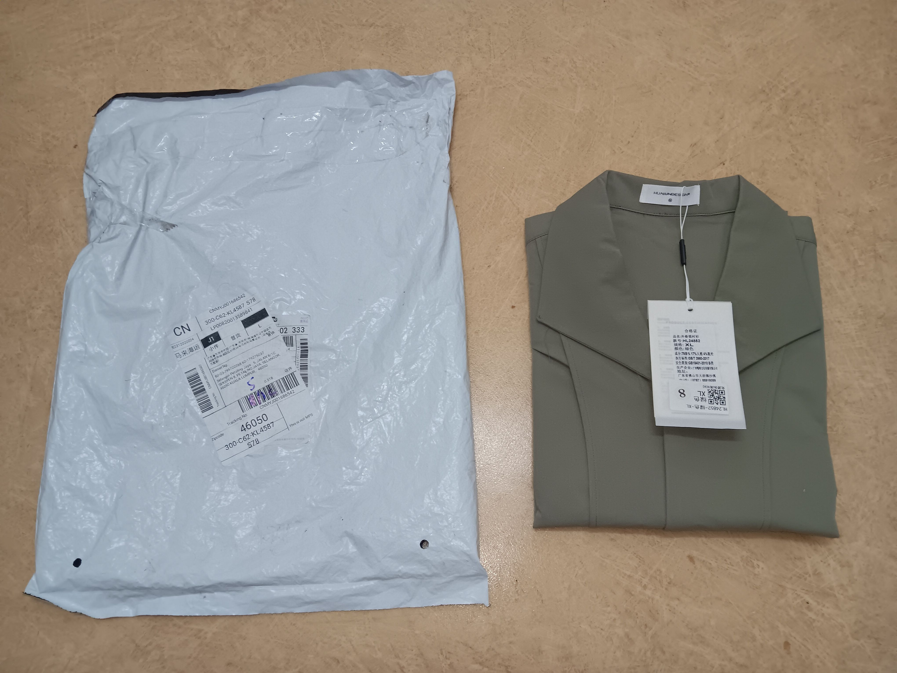
	- 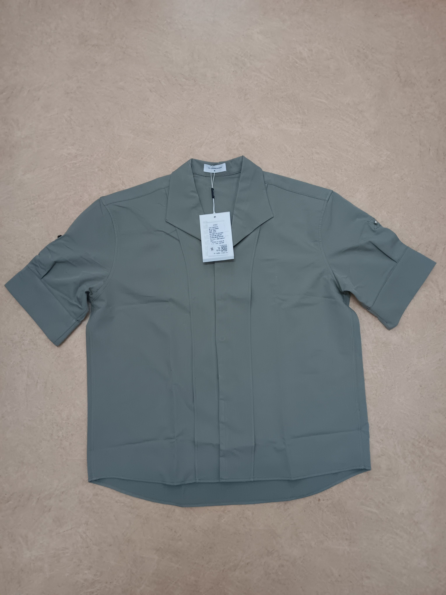
	- 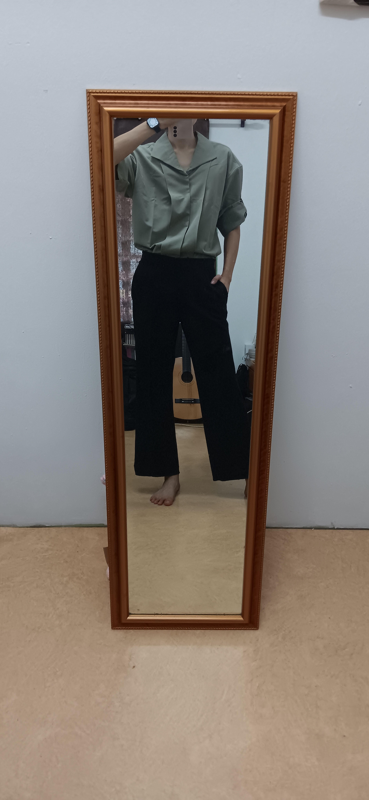
	- 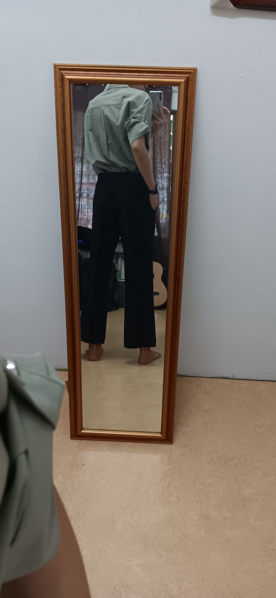
	- 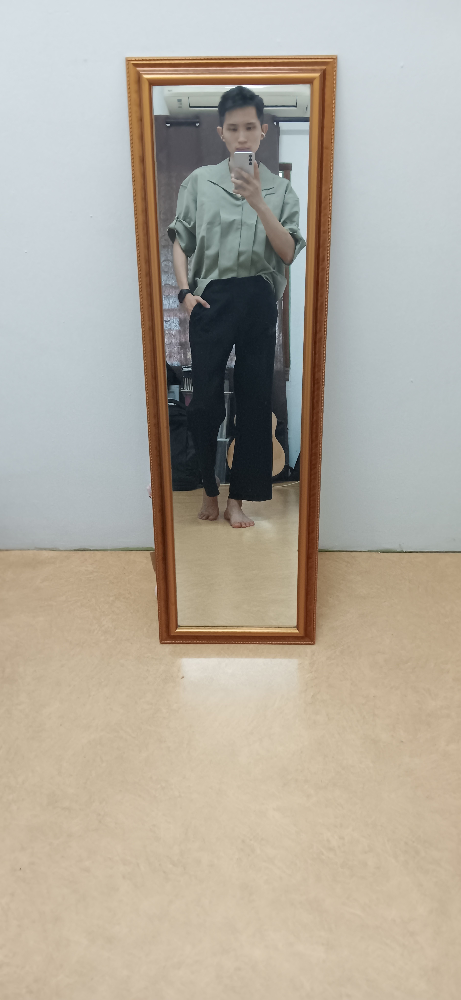
	- 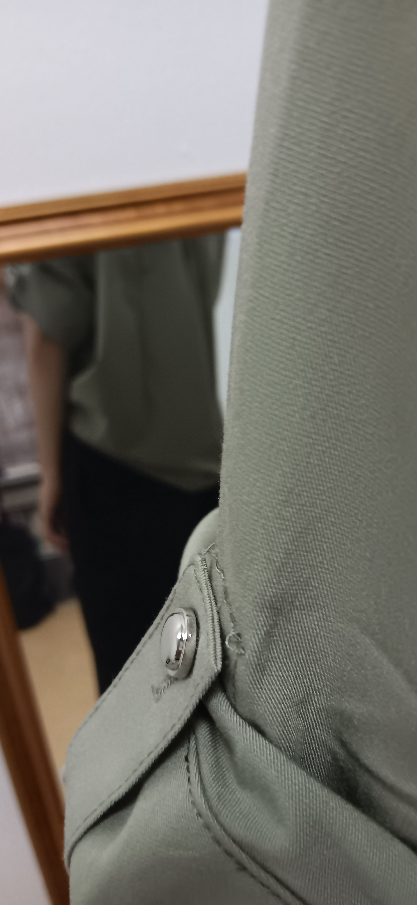
	- 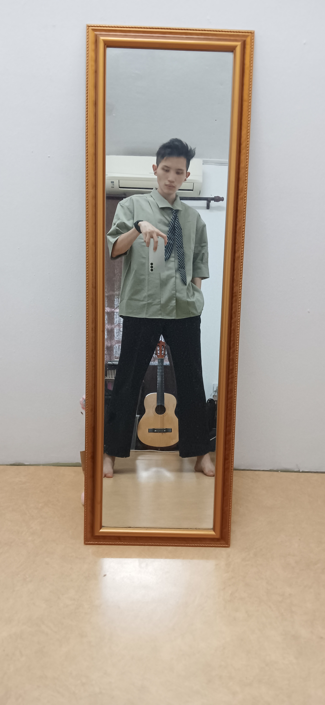
	- 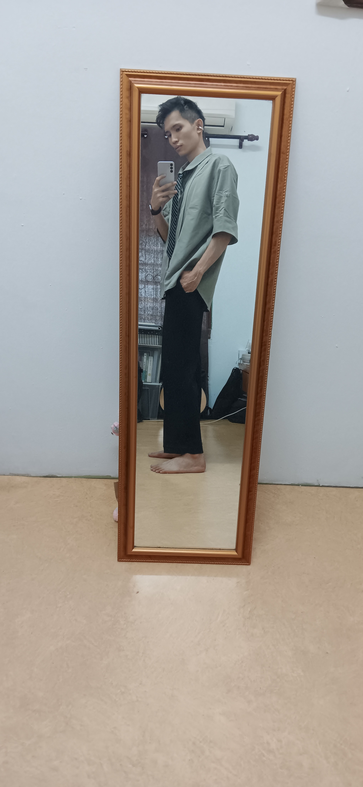
	- 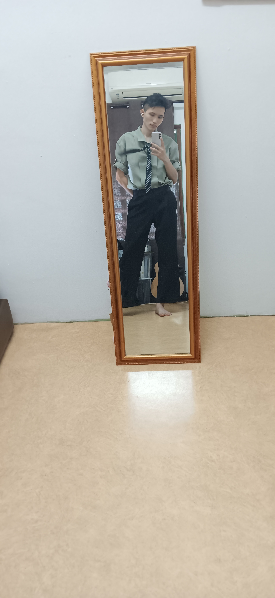
	- 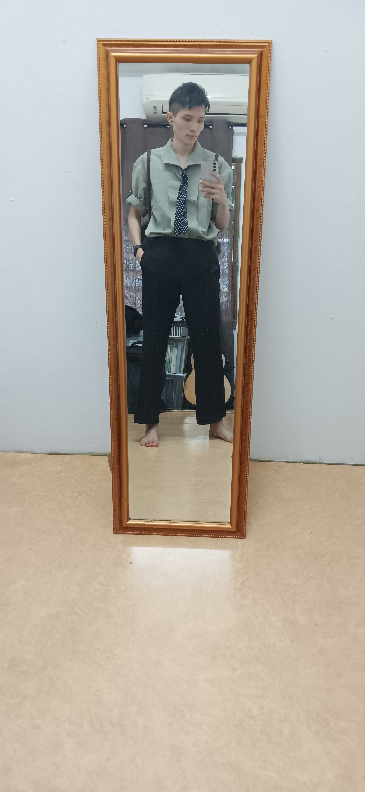
	- 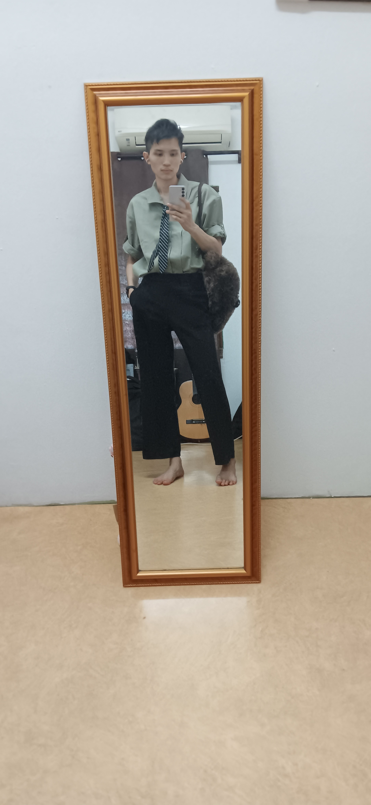
	- 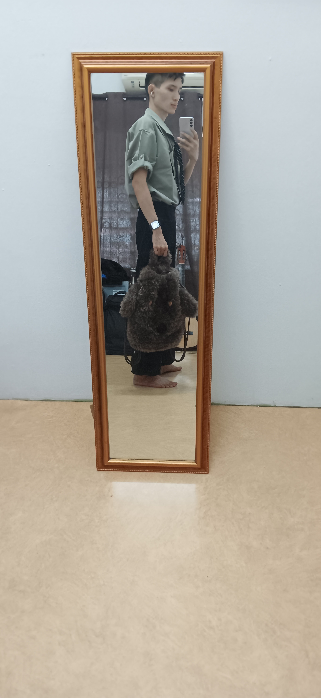
	- 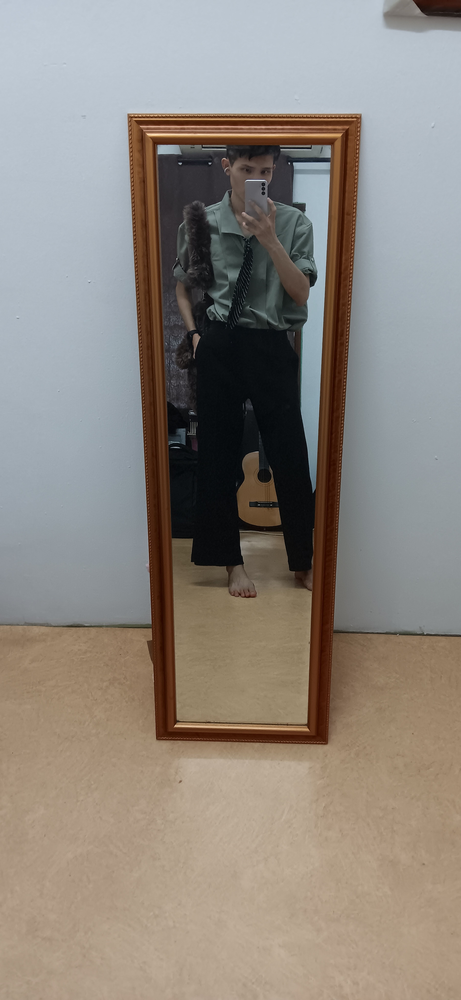
	- 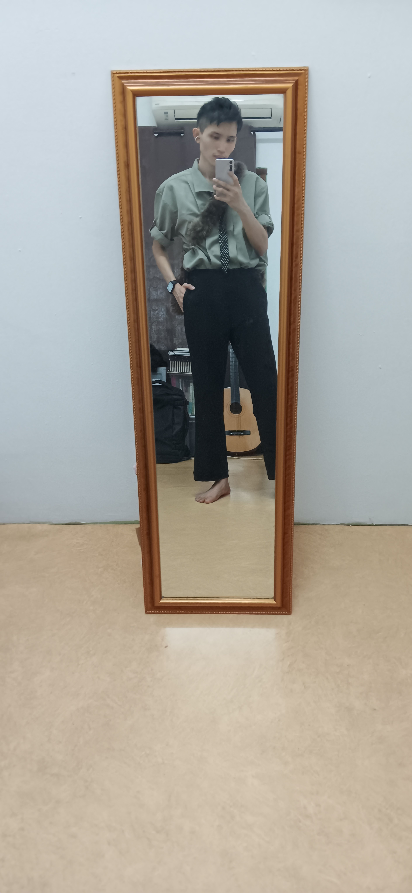
	- 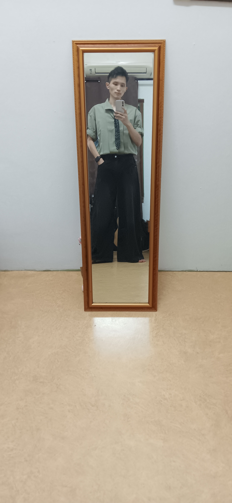
	- 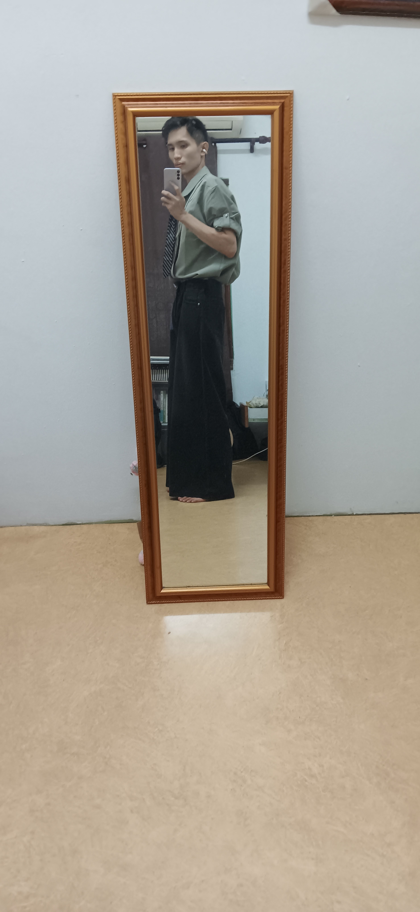
	- 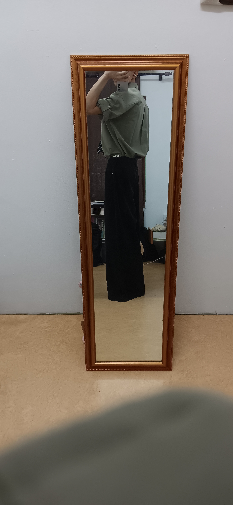
	- 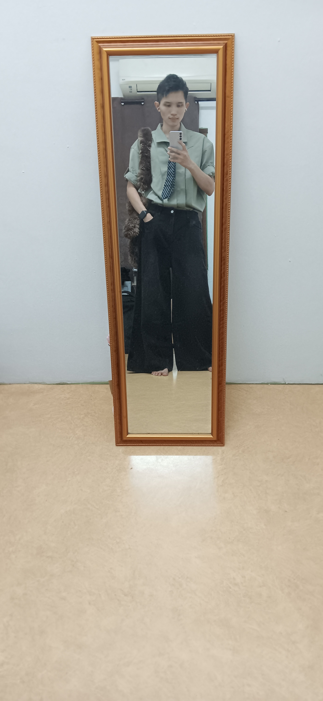
	- 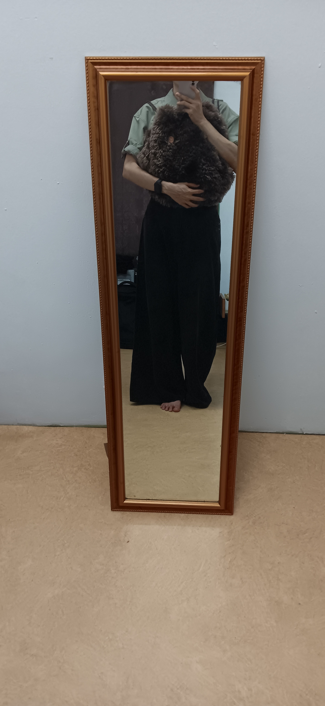
	-
- 15:21 處理自己的手尾，緩衝，覺察疲勞
- 16:29 摘下牙套，晚餐，沖涼
- 18:00 主動打開冷氣，試用 [[小湃 P6 投影儀]]，糾結無法透過藍牙配對 [[小米智能音箱 Pro]] 播放聲音
- 18:47 排便，下載軟件，聽歌
- 19:07 熱水澡，喝冷飲，喝牛奶，吃小食
- 19:42 離子化飲用水，走動
- 19:52 吹冷氣，聽輕音樂， 測試軟件功能 ── [[REDMI 紅米 Watchb 6]]
- 20:33 主動關閉冷氣，覺察疲勞，躺着，[[4-2-6 Deep Breathing]]
- 21:01 糾結 [[更新 driving.license]] 的年數和價格
- 21:23 針對從[[拼多多 App 下的訂單]] ── [[顧家聲控三色氛圍燈]]和商家和[[拼多多客服]]確認若發生[[質量問題]]該[[承擔運費的責任]]歸誰：歸商家且我方無需承擔任何費用
- 23:08 主動打開冷氣
-