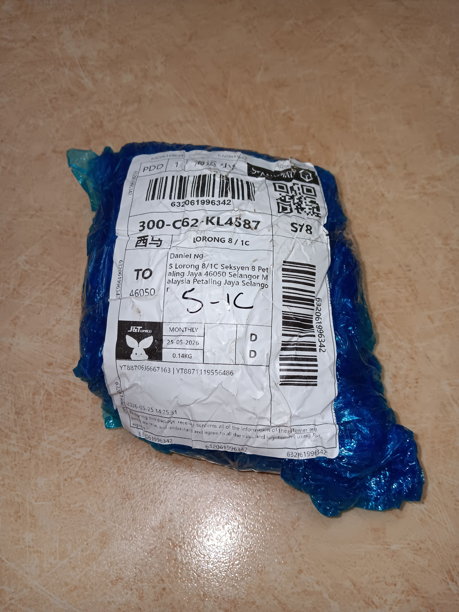
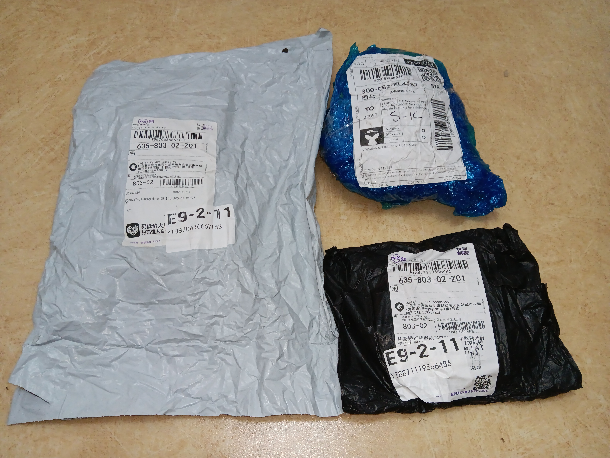
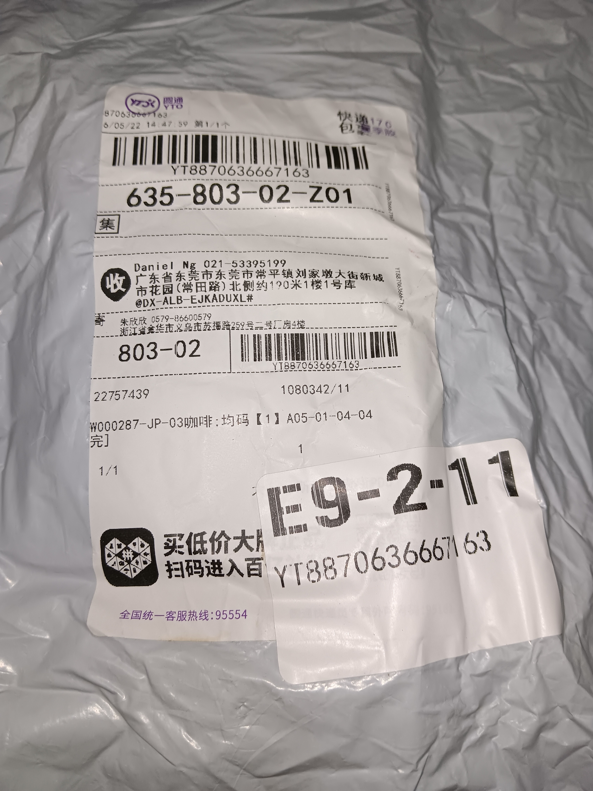
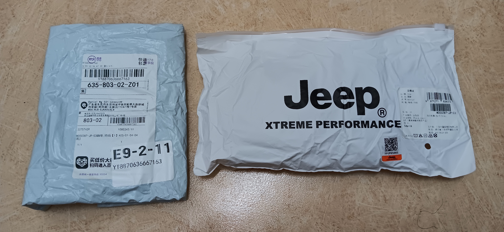
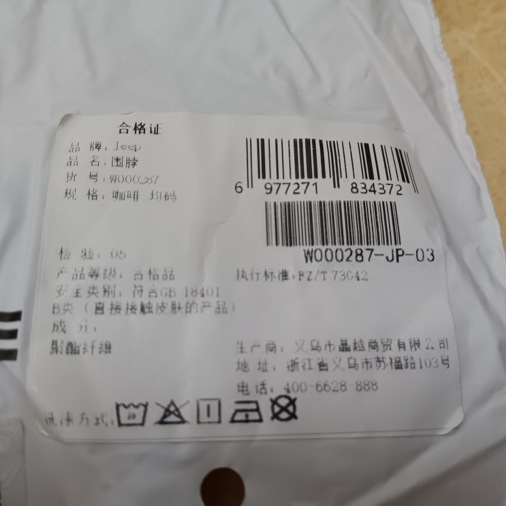
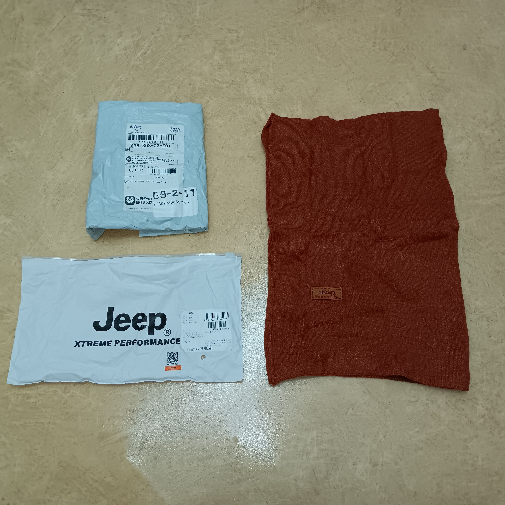
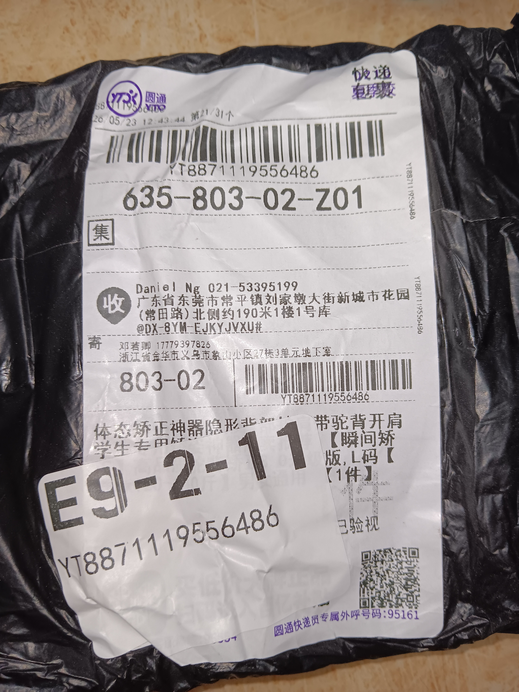
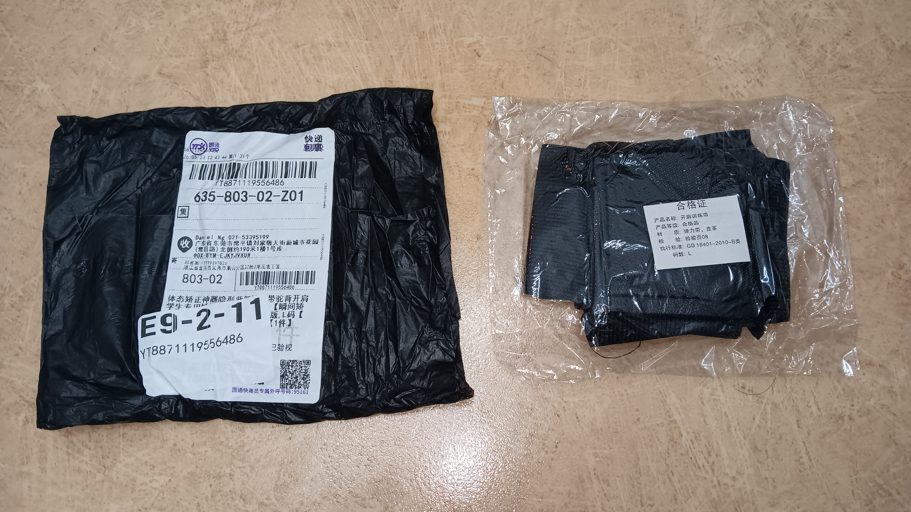
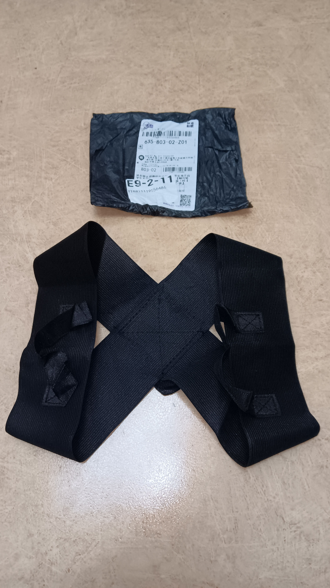

- 02:[[10]] 排尿，換穿長褲
- 02:19 逛櫥窗
- 05:45 [[穿戴開放式耳機]]，煲劇馬拉松，強忍睡意
- 08:48 排尿
- 09:01 主動關閉冷氣，換衣，睡覺，睡睡醒醒
- 16:27  因身體不適醒來，賴床
- 16:49 時間帳，起床
- 16:52 走動，喝水，盥洗，摘下牙套，沖泡熱飲，清洗廚具，沖涼
- 17:50 時間帳，半躺半坐，覺察疲勞，手動調節[[米家床頭燈第 1 代]]
- 18:00 [[RM 1,000]] 內決策下單結算[[淘寶 App 購物車]]裏的[[剛需品]]
- 18:24 簽收包裹，拆包裹 ── [[Jeep（ 咖啡色 ）聚酯纖維圍脖]] + [[體態矯正駝背開肩隱形背帶（ L ）]]，聽 podcast
  collapsed:: true
	- 
	- 
	- 
	- 
	- 
	- 
	- 
	- 
	- 
	-
- 19:00 時間帳，使用 [[體態矯正駝背開肩隱形背帶（ L ）]]
	- 19:24 覺察頸肩酸，拆卸
- 19:10 緩衝，時間帳
- 19:24 在 [[REDMI 紅米 Watchb 6]] 設置和綁定 [[Alipay 支付寶]]
- 19:43 逛櫥窗，覺察猶豫而決
- 20:34 晚餐，走動
- 22:28 冰敷脸部
-
-