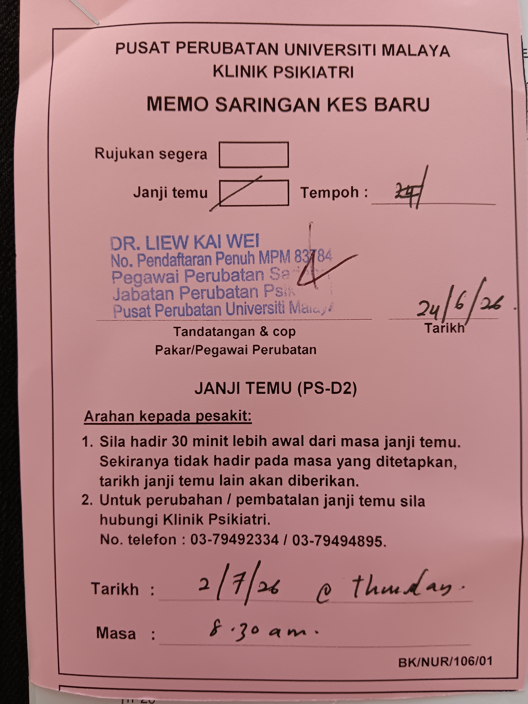
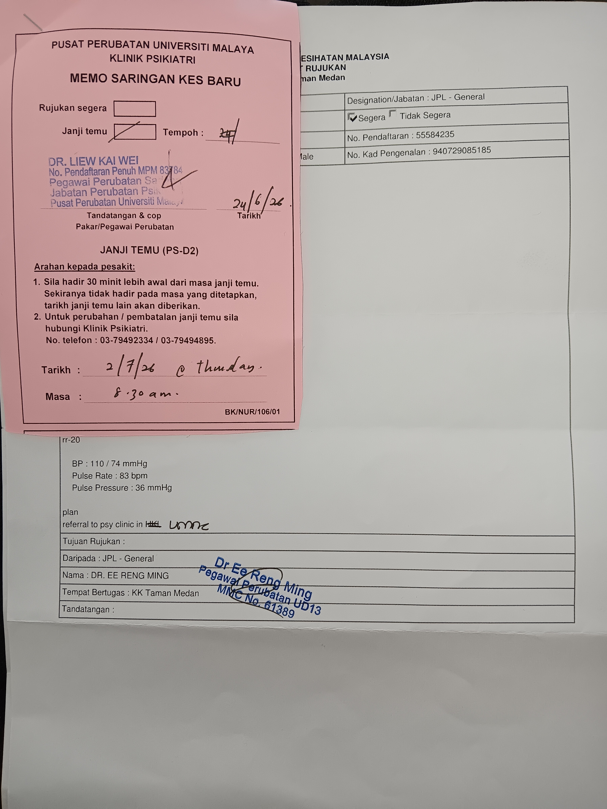
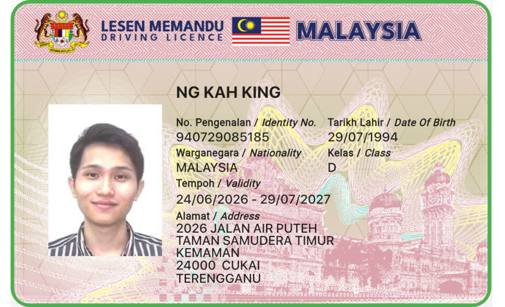
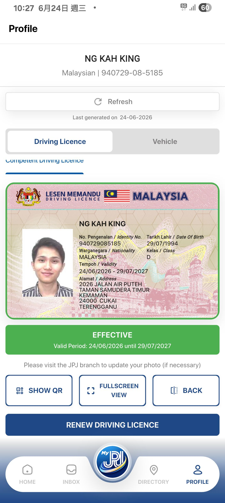
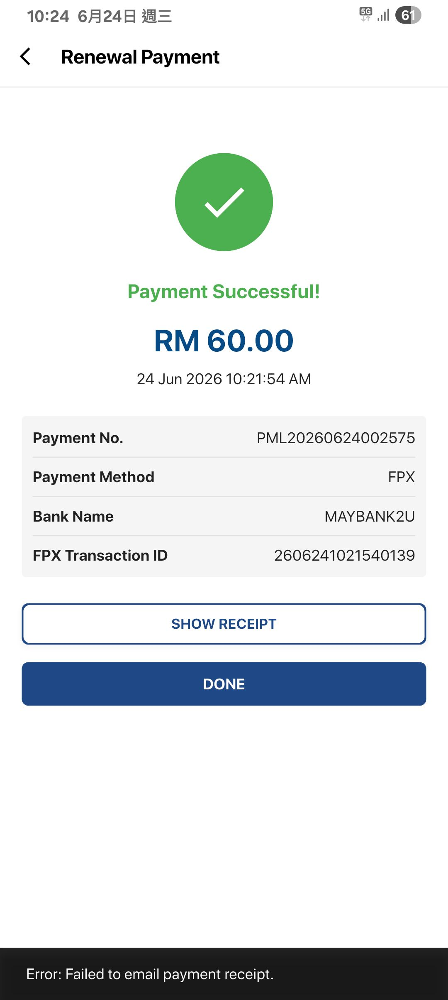

- 00:00 時間帳，確認[[小米智能音箱 Pro]]預設指令如期自動運行 ── 關閉冷氣
- 00:02 整理背包，換衣，強迫性做事 ── 切各種裝備和配件的搭配，排尿
- 02:22 [[4-2-6 Deep Breathing]]，躺着，覺察難過、觸動、感謝
- 02:52 睡覺，聽 ambience
- 07:30 因鬧鐘醒來，解除鬧鐘，賴床
- 07:48 測試 [[小米智能音箱 Pro]] 之 [[鬧鐘]]
- 07:50 聽歌，時間帳，喝水
- 07:59 起床，盥洗，摘下牙套，熱水澡，喝牛奶，吃甜食，服用 [[Tumecap]] x2
- 08:50 換衣，儀容裝扮，[[穿戴開放式耳機]]，聽歌
- 09:14 趕着出門，快到巴士站前看見巴士 [[PJ01]] 經過，趕不上且猶豫而決等下一趟，即便當前巴士剛好在紅綠燈前暫停
- 09:17 覺察後悔、羞愧沒有提早出門，同在冥想 ──看見自己已經努力趁早起床和需要更多時間預備自己，下載 [[Moovit App]] 確認下一趟 [[PJ01]] 將在 09:41 抵達，覺察自己有時間，允許自己錯過當前這趟巴士
- 09:29 覺察坐得屁股特別痛，暫時卸下背包，時間帳，耳機剛好聽見 [[What Goes Up]] by [[Lenka]] 和歌詞安撫了自己的焦慮
- 09:31 相比 [[Moovit App]] 的 [[schedule]]， 看見下一趟巴士 [[PJ01]] 提前到了
- 09:34 安全上了巴士 [[PJ01]]，時間帳
- 09:50 安全到了 [[馬來亞大學醫院 UMMC ( PPUM )]]
- 09:53 [[RUKA ( appointment-based clinic )]] 登記處掛號，等待 [[B166]]
- 10:00 到了櫃檯確定需要到 [[PPUM Klinik Psikiatri]] 部門
- 10:15 確認 [[PPUM Klinik Psikiatri]] 今天已滿人，改爲預約 [[Thu, 02-07-2026]] 08:30AM 及主動請求安排說華語/英語的精神科醫師，到時將見上 [[Dr. Liew Kai Wei]]
	- 
	- 
	-
- 10:20 緩衝，再次測試 [[myJPJ APP]] 網銀付款能否通過
- 10:28 成功 [[更新 driving license]]
	- 
	- 
	- 
	- 
	- **10:47** [[quick capture]]: %20Exp.%2029%20Jul%202027_26062401161030028371.pdf)
- 10:36 更新日曆，哼唱
- 10:48 查看 [[馬來亞大學醫院 UMMC ( PPUM )]] ── [[Jaya One Mall]] 之巴士路線，強迫性做事 ── 更新日曆 + 哼唱
- 11:12 走動
- 11:23 等候巴士
- 11:36 安全上了巴士 [[PJ01]]
-