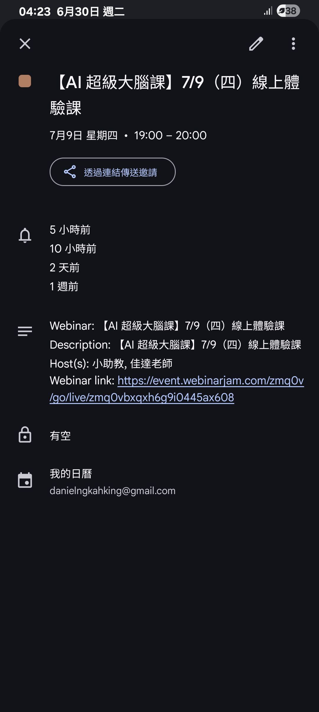

- 01:24 排尿
- 01:28 繼續聽 [[文森說書]] 之 [[正向思考的結果是自我損耗]] feat. [[蘇予昕諮商心理師]]
- **03:28** [[quick capture]]: 從 37:48 開始播放 https://open.spotify.com/episode/0Qa7laGHxl9LOmZOPoKaAz?si=CpgBTvSQQF-7TDMcXkwxBQ&t=2268&pi=YjaTirfmTTSSA
  collapsed:: true
	- [[創作靈感]] 一個許願人，一個神燈藍精靈，當許願者期待說出願望直接應驗，結果神燈只往下[[問對問題]]，直到最後才得知 [[token 用完了]]
- 03:45 報名[[線上課程]] ── [[李佳達【 AI 超級大腦課 】]]，更新日曆
  collapsed:: true
	- https://calendar.google.com/calendar/event?action=TEMPLATE&tmeid=NHFwMmQ1aDJxcGpxc2xocmFkZW8xb201aWsgZGFuaWVsbmdrYWhraW5nQG0&tmsrc=danielngkahking%40gmail.com
	- 
- 04:25 睡覺
- 09:13 因手機來電醒來，查看信箱，逛櫥窗，半躺半坐
- 11:16 賴床
- 11:47 補眠
- 14:15 因外部聲音醒來，賴床
- 14:21 起床