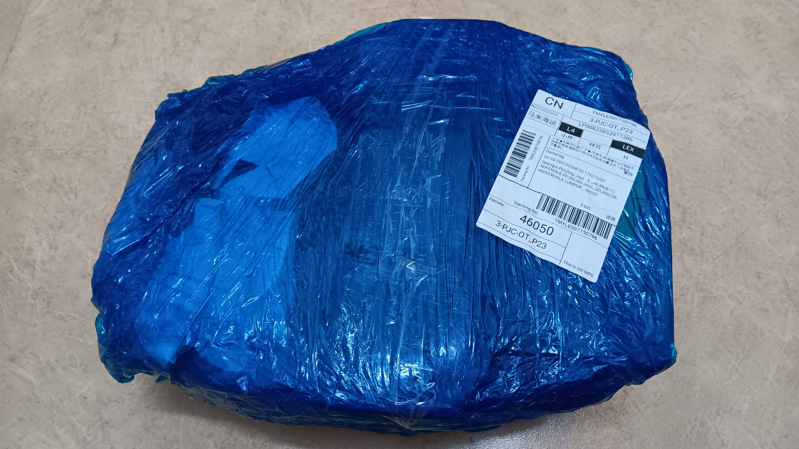
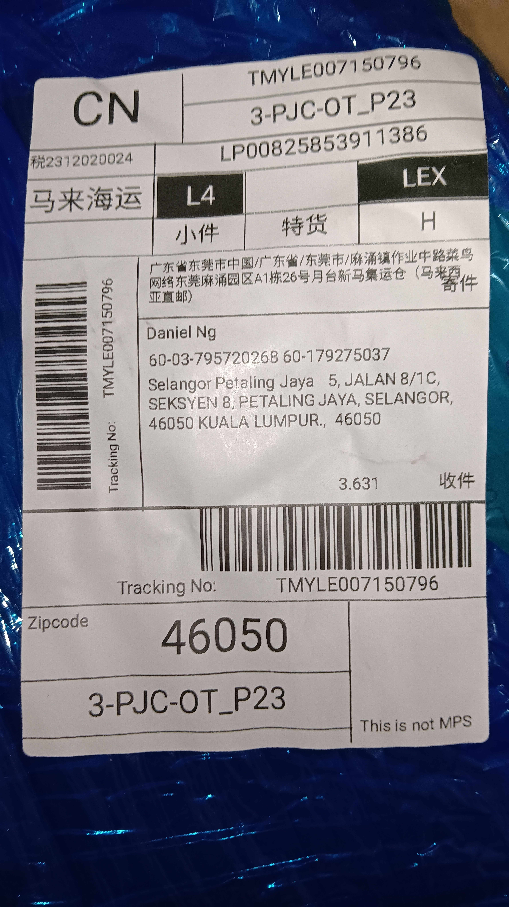
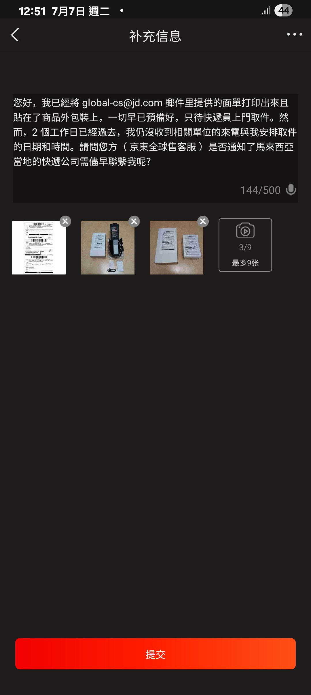

- 00:37排尿
- 00:44 躺着，比較難入睡
- 01:36 [[穿戴開放式耳機]]， [[聽 podcast]] ── [[[[《 歡樂三國志 》]]【[[030]]】 [[那一夜，張飛喝醉了酒（上）]]]]
- 03:10 睡覺
- 09:00 因鬧鐘醒來，解除鬧鐘，回籠覺
- 12:15 因冷痹醒來
- 12:22 起床，查看物流
- 12:31 簽收包裹，向[[京東全球售客服]]之[[預約上門取件之退貨退款包裹]]追問[[快遞員]]什麼時候聯繫自己[[安排上門取件的日期和時間]]
	- 
	- 
	- 
	-
- 12:53 拆包裹
-