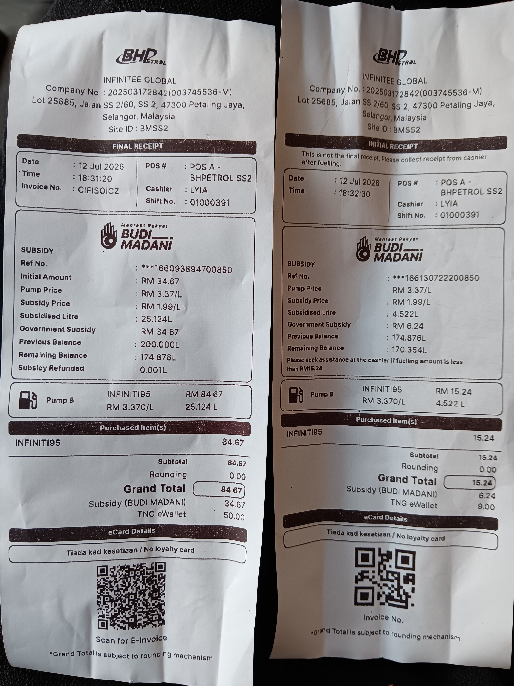
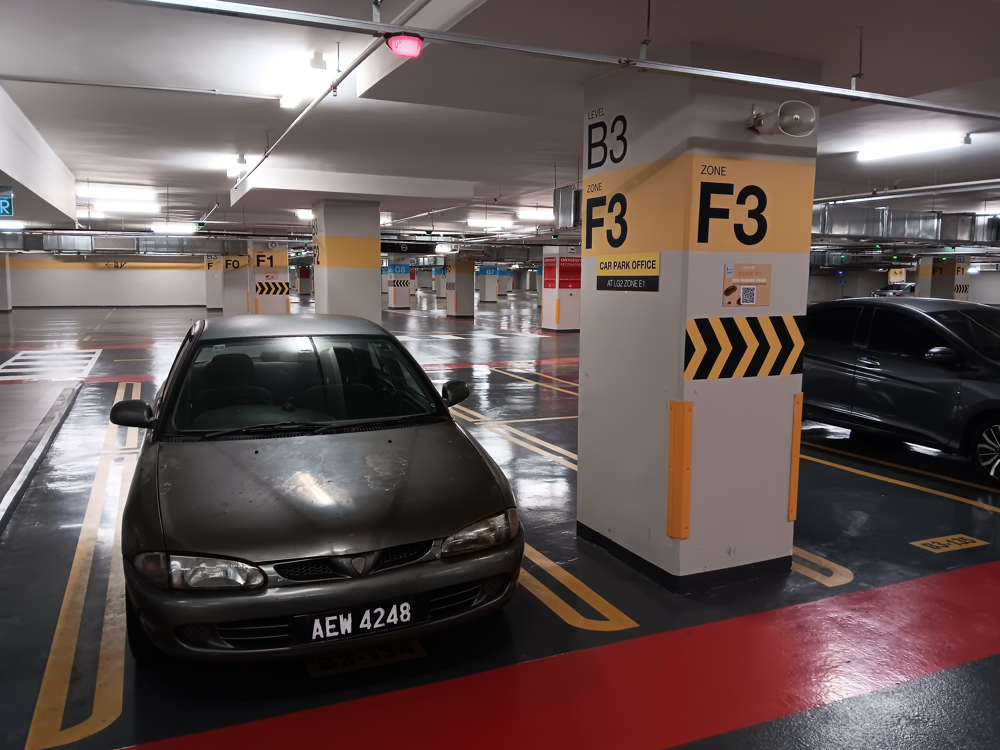
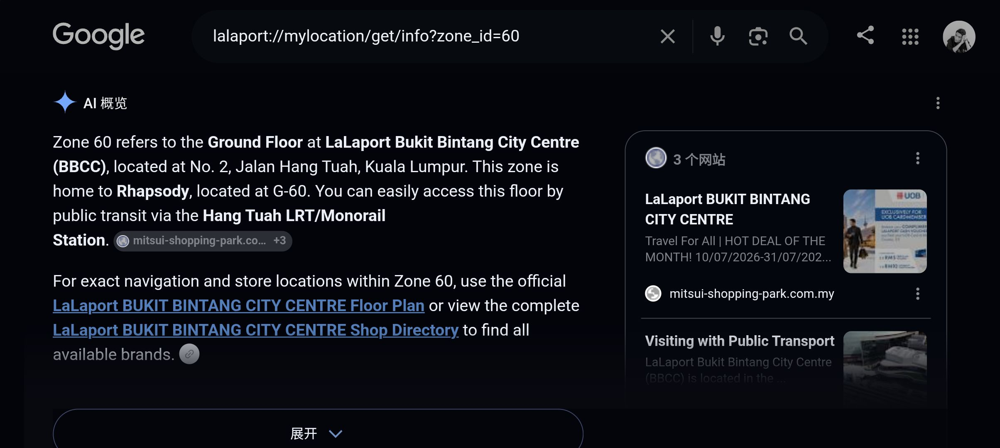
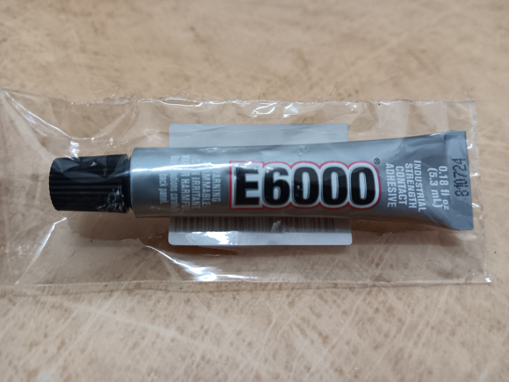
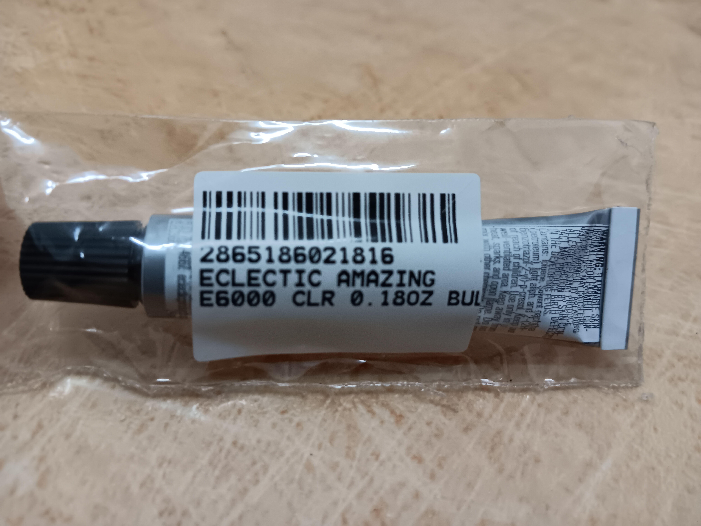

- 10:33 因鬧鐘醒來，解除鬧鐘，排尿，強迫性做事 ── 針對[[因京東客服失誤延遲上門取件服務]]補充新信息，被從C， 盥洗，摘下牙套，覺察着急、失望、不耐煩，[[攝取精神藥物]] [[LORANS 1mg tablets Lorazepam MEDOCHEMIE LTD]] x [[half tablet]]，曬太陽，走動
- 11:48 早餐，吃蔬果，逛櫥窗，哼唱
- 12:34 時間帳，哼唱，喝熱水
- 12:40 熱水澡，就[[因京東客服失誤延遲上門取件服務]]，接聽自[[京東全球售客服]]的電話
- 13:32 換衣，吹冷氣，儀容裝扮
- 16:28 開車出門
- 16:31 強迫性做事 ── 停在路邊安裝 [[不發燙的Qi2｜Qi2.2 半導體磁吸無限充真 25W 快充 Magsafe 雙面磁吸桌面支架版]]，中途接聽自[[京東全球售客服]]關於[[小湃 P6 投影儀]]的質量問題
- 16:58 出發到 [[Ninja Z, SS2]]，[[穿戴開放式耳機]]，聽音樂
- 17:21 下車到 [[Ninja Z, SS2]] 找鐵環
- 18:03 駕車環繞 SS2 兜了 2 圈找不到 [[stationery shop]] ，把車暫停在路邊，吃晚餐，[[影響駕車時的注意力和安全]]，重新調整 [[不發燙的Qi2｜Qi2.2 半導體磁吸無限充真 25W 快充 Magsafe 雙面磁吸桌面支架版]]的位置
- 18:21 前往油站加油
- 18:25 到了油站添汽油 [[BUDI95]] @ [[RM 59]]
  collapsed:: true
	- 
- 18:39 排尿，儀容裝扮
- 18:51 前往 [[BBCC Lalaport]]
- 19:20 安全抵達 [[BBCC Lalaport]]
  collapsed:: true
	- 
	- 
- 19:31 逛櫥窗
- 21:16 在 [[Art Friend 畫友,  [[Pavillion Elite]]]]買到 [[Very High Bond (VHB) adhesive]] 的 [[Eclectic Amazing E6000 (clear) 0.18 fl oz (5.3 mL)]] 膠水
	- 
	- 
- 21:18 逛櫥窗
- 22:41 回到了車上，離開停車場
- 23:00 開車前往 [[Mid Valley Megamall]]
- 23:15 影院觀賞電影 ── [[《 The Disclosure Day 》]]@ [[GSC]]
	- 結束於 [[Mon, 13-07-2026]] 02:08