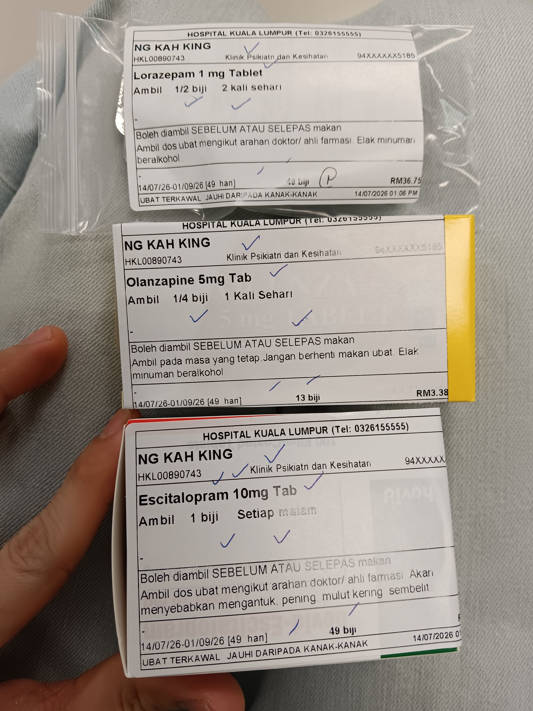

- 01:06 因三急醒來，排尿，覺察左手接觸錶帶的手腕紅腫，手洗錶帶且改戴在右手
- 01:16 看見日曆上今天 11:00 @ [[Hospital Kuala Lumpur]] 見 [[Dr Ong]]，覺察錯愕，時間帳
- 01:23 預設鬧鐘，規劃路線
	- 前往 HKL (Hospital Kuala Lumpur)
	  7月14日  •  08:30 – 09:15  •  Kompleks Pakar and Rawatan Harian Hospital (SCACC), Kuala Lumpur Hospital  •  查看詳細資料並回覆 https://calendar.app.google/zsRtSFuCLfRUgj7b7
	-
- 01:59 打哈欠，回籠覺
- 03:33 回籠覺
- 07:10 因鬧鐘醒來，解除鬧鐘，起床，喝溫水
- 07:18 走動，盥洗，熱水澡
- 08:06 換衣
- 09:22 到了車上
- 10:09 安全抵達 [[Hospital Kuala Lumpur]] 的 [[B3 Carpark]]
- 10:20 步行走到 [[SCACC]]
- 10:28 在登記處遇到守門人追問 [[appointment card]] 且糾纏許久，直到釋出 [[Dr. Ng Chong Guan]] 手寫的 [[referral letter]] 才願意讓我領號碼牌，覺察害怕、焦慮、憤怒
- 10:37 等候， [[4-2-6 Deep Breathing]]
- 10:52 緩衝，測試 [[REDMI 紅米 Watchb 6]] 的 [[Audio Recording]] 功能，確認從[[Mi Fitness 小米運動健康 App]] 導出手機才能聽得見
- 11:05 [[4-2-6 Deep Breathing]]
- 11:25 預備即將輪到我領的號碼牌 [[4011]]
- 11:42 量體重確認 [[61.7 KG]]，等候 [[Dr. Hafiz]]
- 12:41 剛見完 [[Dr. Hafiz]]，在 [[Farmasi Satelit 1]]掛號拿藥
- 13:20 取得藥了，卻無需付錢，覺察意外、錯愕、欣慰
  collapsed:: true
	- 
- 13:22 回到車上
- 13:52 到了車上，吃午餐，喝水
- 14:13 離開停車場
- 14:20 藉助 Gamma Nine Live Mode 商量下一個目的地，距離 Hospital Kuala Lumpur 最靠近且新穎的 Aeon Mall
- 14:28 開車出發到 [[AEON Mall AU2 Setiawangsa]]
-