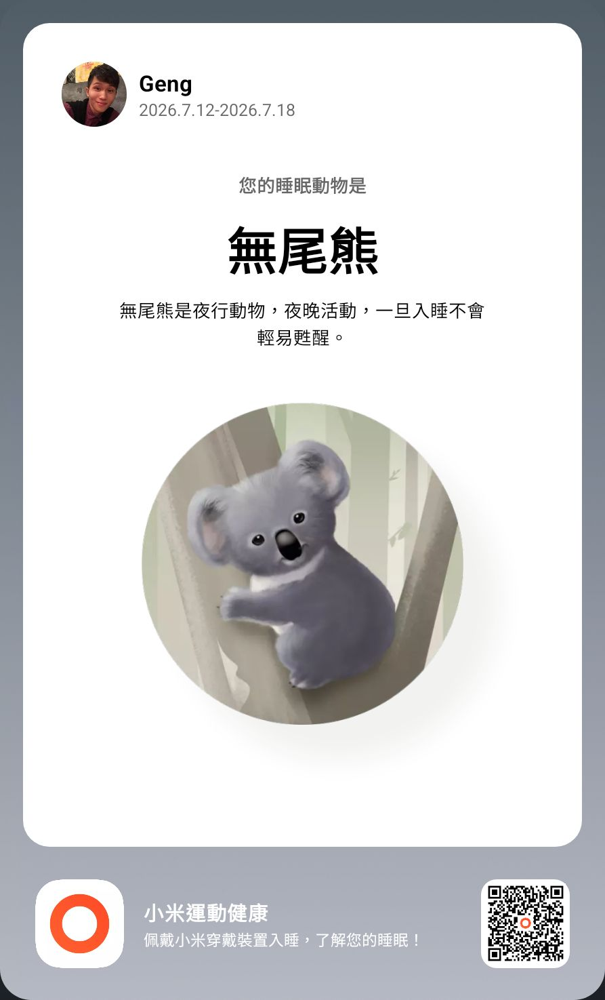

- 00:24 因冷斃醒來，雙腿覺得冷，因 [[米家床頭燈第 1 代]] [[莫名地亮著]] 醒來
- 00:29 起床，時間賬，打哈欠
- 00:34 喝熱水，排尿
- 00:46 換長褲，查看物流
- 00:55 躺着，閉目養神，比较难入睡
- 03:54 睡覺
- 06:50 因鬧鐘醒來，解除鬧鐘，賴床
- 07:35 回籠覺
- 08:34 睡睡醒醒，夢醒，因冷痹醒來，因疲倦起不了身
- 09:21 回籠覺
- 12:25 打哈欠，時間帳，賴床，查看物流，因眼前事物分心 ── 逛櫥窗
- 13:14 起床，喝水，排尿，摘下牙套，覺察疲勞，頭部兩側緊繃，追問 [[YOOSE 有色 NANO 女士多功能剃毛器]] [[爲了補發梳齒蓋而重新下新訂單且商家承諾退款的全額+直郵海運運費 ￥28.35]] 的進度，查實所聽所見 ── 得到商家坦誠生產線確實出現部分[[梳齒蓋易從三合一刀頭脫落]]，哼唱
- 13:56 躺着
- **15:04** [[quick capture]]: 
- 15:11 爲向 [[YKL Mac Fix]] 索賠 [[hls__MBP_Batt._A1398_Repl._｜_Warr._Exp._01-AUG-2026_@YKL_1770168041722_0]]， 藉助 [[Gemini Live-Mode]]，演練 [[高敏人如何溫和且堅定地爭取[[消費者]]的[[權益]]]]
- 15:50 [[因打雷居家跳電]]，即刻安排[[備用手電筒]]，哼唱
- 16:12 時間帳，暗室直視 3C 產品
- 16:17 走動，排尿
- 16:47 [[穿戴開放式耳機]]，聽歌，走動，覺察亢奮、喜悅、如釋重負、滿足
- 17:10 [[主動打開電閥恢復居家供電]]
- 17:23 時間帳，喝水，離子化飲用水，覺察焦慮，哼唱
- 18:11 晚餐，[[攝取精神藥物]]，喝熱水
- 18:20 記錄閃念 ── 剛晚餐嚐到[[茄子 🍆]]非常天然的甜味
- 18:34 躺着，覺察頭部兩側緊繃， [[4-2-6 Deep Breathing]]
- 18:59 走動，喝水