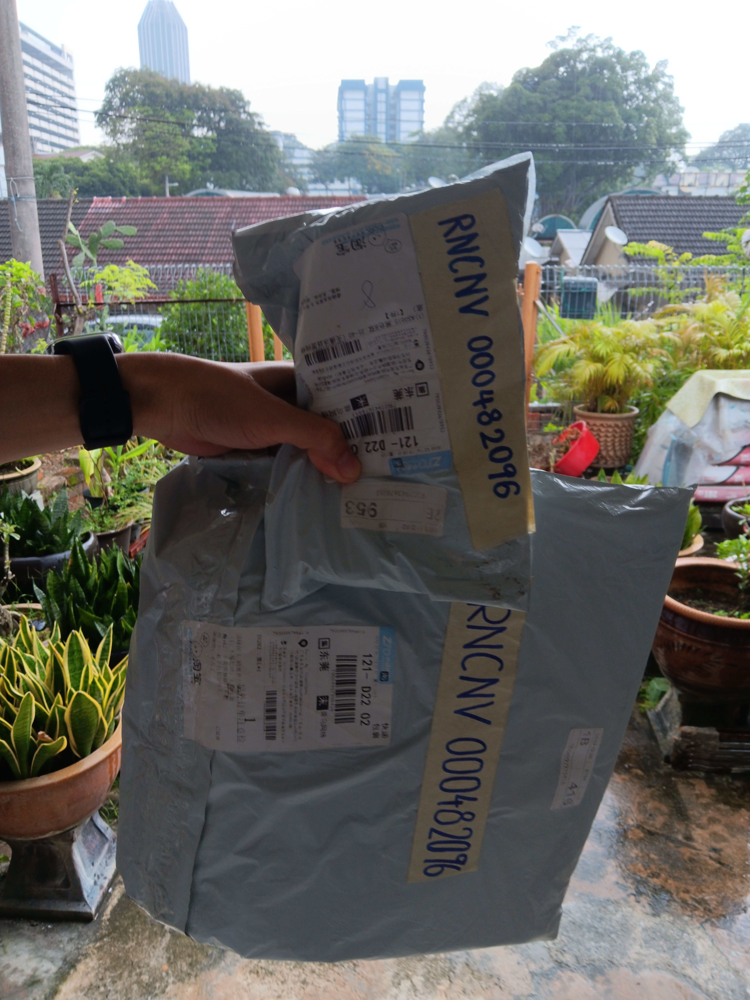
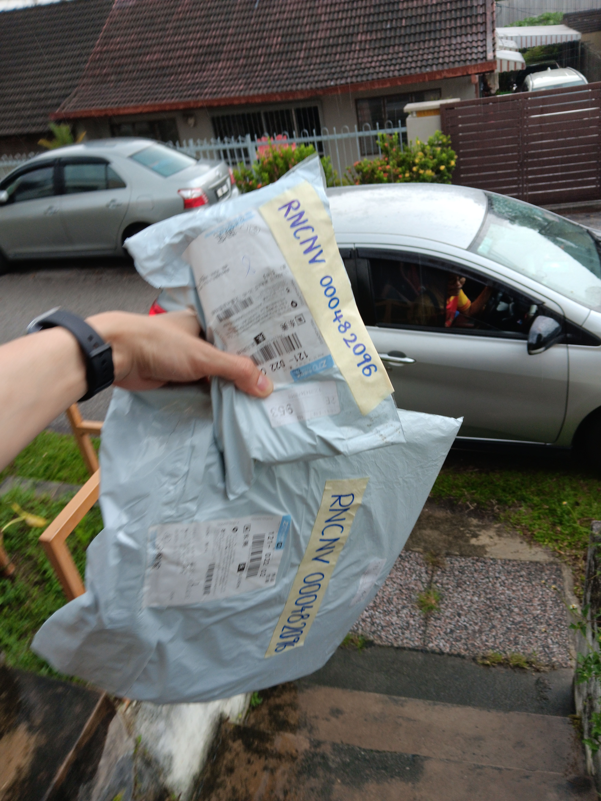

- 01:07 時間帳
- 01:09 強迫性做事 ── 反覆來回浴室洗腳
- 01:27 使用 [[LORICA 駱易家暖手寶 aka 暖憶柔性電暖袋 + 玫瑰艾絨內膽/艾墊-陳艾紅花墊（ 花色；15*20 ）]]， [[4-2-6 Deep Breathing]]， [[聽冥想音頻 by Jessica Kay Lee]]
- 01:55 [[穿戴開放式耳機]]，聽[[《三體》有聲廣播劇]]
- 02:56 睡覺
- 08:30 因冷痹醒來，聲控關閉冷氣，因鬧鐘醒來，解除鬧鐘，回籠覺
- 11:26 起床，覺察疲勞
- 11:33 排尿，盥洗，摘下牙套，折疊衣物，覺察疲勞，爲 [[預約上門取件之退貨退款包裹]] 仍還沒被取走，諮詢 [[淘寶全球客服]]
- 13:07 喝水，午餐，清洗廚具，離子化飲用水
- 14:34 時間帳，查看信箱，回信，中途遇到家人干預，因對方說的跟當前的事實衝突而以命令口吻結束對話
- 14:50 [[CERO 希鹿收納製冷掛脖風扇]]，喝水， [[hey, we've made it checklist]] ── 轉移視角
- 15:29 [[預約上門取件之退貨退款包裹]] 快遞員成功取走
  collapsed:: true
	- 
	- 
- 15:31 排尿，喝水
- 15:37 繼續過程因下意識爲對方言語負責和糾正而[[惱羞成怒]]，對話中斷時呵斥對方
- 16:57 對話中斷時僵持，時間帳，中途遇到家人干預 ── 確認因對方覺委屈和需求見我的諮商師而主動開啓對話
- 18:45 排尿，[[攝取精神藥物]]
- 18:51 時間帳， [[4-2-6 Deep Breathing]]，同在冥想
- 19:17 晚餐，主動向對方確認無果時，失望和怒斥對方混淆議題
- 19:59 遠離到安全的地方