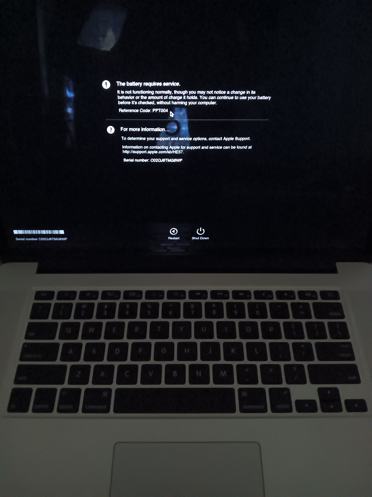

- 00:[[12]] 覺察疲勞，排尿
- 00:33 [[《三體》多人有聲劇]] [[EP17]]
- 02:19 睡觉
- 05:15 因外部声音醒来
- 05:17 回回籠覺
- 11:38 因冷痹醒來， [[4-2-6 Deep Breathing]]
- 11:52 起床，排便
- 13:06 沖涼，手洗 [[[[UMAY]] 速干浴巾游泳毛巾沙滩巾专用 swimming quick dry towel]]，換浴巾
- 13:50 喝水，預備
- [[14]]:00 覺察疲勞，躺著， [[4-2-6 Deep Breathing]]，中途为了刻意重现 [[[[MacBook Pro (MBP)]]  [[model no. A1398]] 電池 [[Serial: C01514309YEF90MA4]] 即便電量充足也隨意進入[[死機]]狀態無法使用，除非刻意充電]]，查實所聽所見 ── 確認 [[將錄音的行動儘量口語化且上下文與雙方共同的利益無縫銜接]] 的 [[對話紀錄]] 收錄在 [[豆包 AI]] 里 + [[核心關鍵詞]]：[[我做個紀錄]] @ [[Sat, 30-05-2026]] 的日誌
- 14:22 時間帳，咬嘴皮
- 14:31 [[4-2-6 Deep Breathing]]，回顾
- 15:[[11]] 成功重現 [[[[MacBook Pro (MBP)]]  [[model no. A1398]] 電池 [[Serial: C01514309YEF90MA4]] 即便電量充足也隨意進入[[死機]]狀態無法使用，除非刻意充電]]
  collapsed:: true
	- 
	-
- 15:22 上車
- 15:40 開車出門
- 15:48 到了 [[YKL Mac Fix]] 附近的公園停車，時間帳，沙盘推演一下
- 16:19 走过去 [[YKL Mac Fix]]
- 16:25 到了 [[YKL Mac Fix]]
- 16:56 离开 [[YKL Mac Fix]]，路上驚覺 [[REDMI 紅米 Watchb 6]] [[只錄到 8 mins 就無預警自動停止錄音]]，覺察失望、失落，[[回放音檔]]
- 17:02 時間帳，記錄閃念，覺察難過
- 17:12 開車離開，覺察羞愧、後悔，同在冥想， [[4-2-6 Deep Breathing]]
- 17:25 到了 [[Taman Jaya Park]]
- 17:26 暫停腳步在 [[人工湖畔旁]][[4-2-6 Deep Breathing]]，走動，觀賞風景
- 17:38 適當坐一下，[[和 [[豆包 AI 打電話]] 一起 [[覆盤]] 當天 [[Wed, 22-07-2026]] 16:30 - 16:50 於 [[YKL Mac Fix]] 針對 [[[[MacBook Pro (MBP)]]  [[model no. A1398]] 電池 [[Serial: C01514309YEF90MA4]] 即便電量充足也隨意進入[[死機]]狀態無法使用，除非刻意充電]]  claiming[[180 Days limited warranty]] 時的狀況]]
- 18:19 再去趟