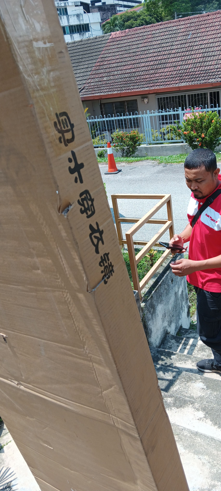
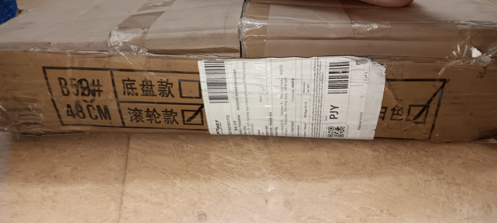
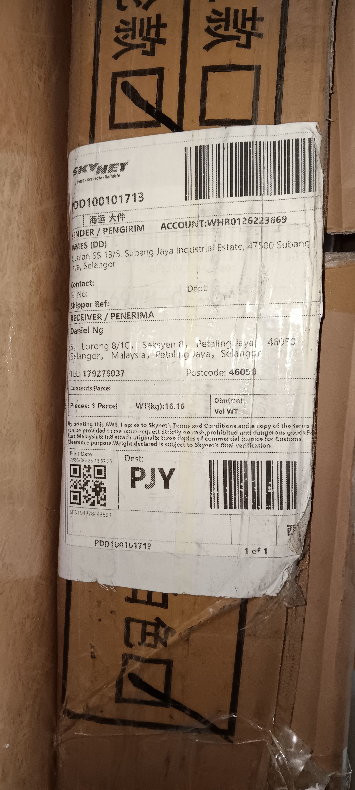
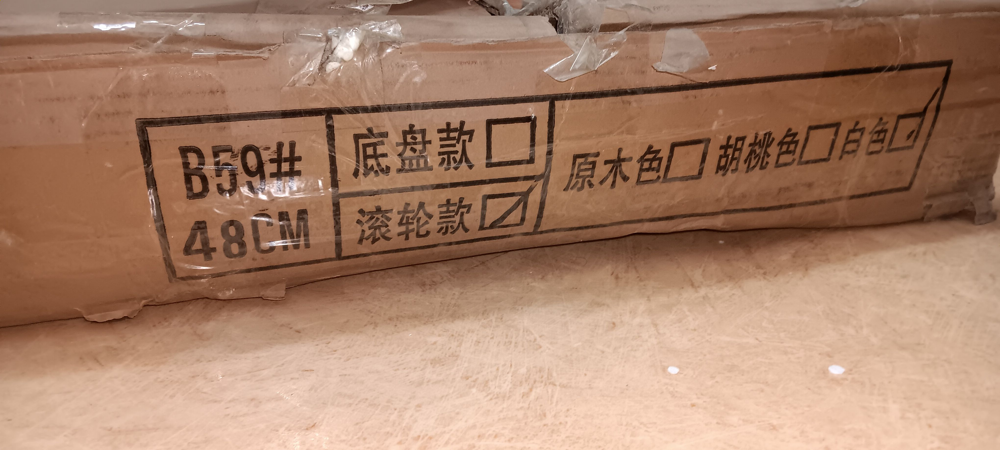
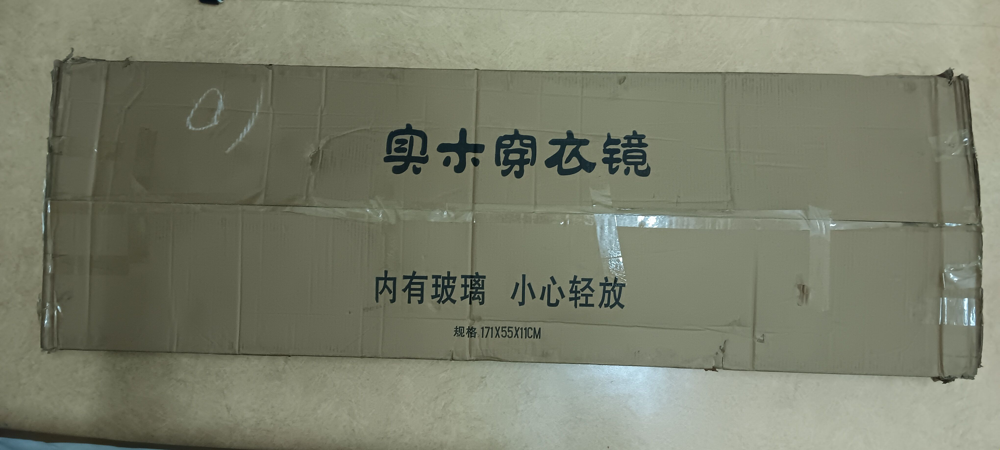
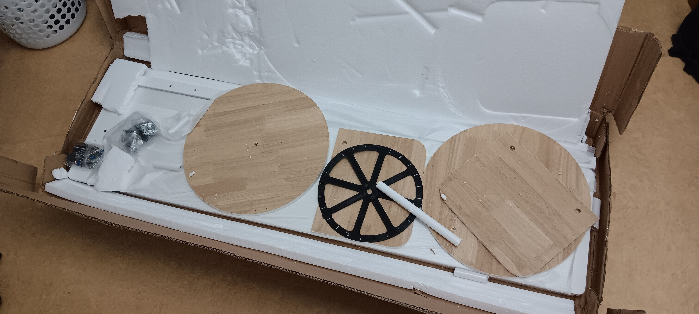
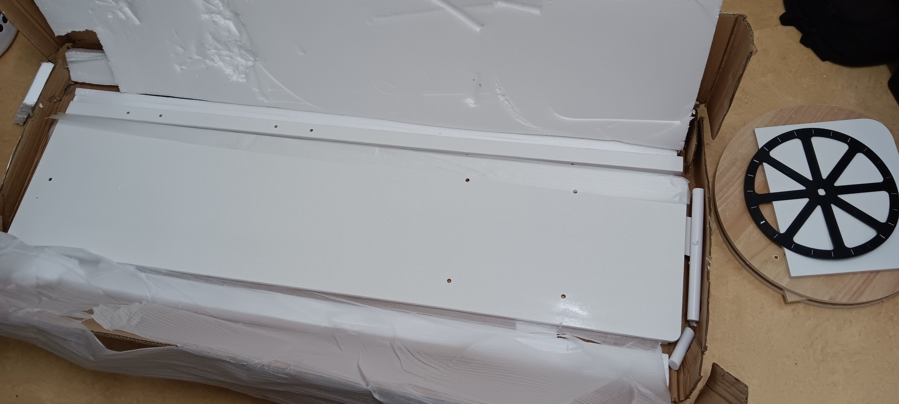
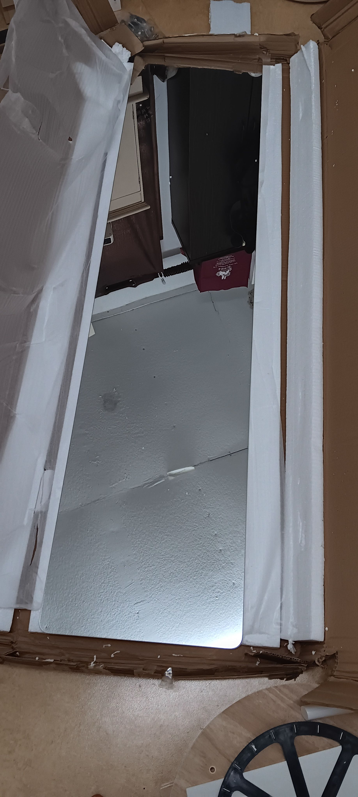
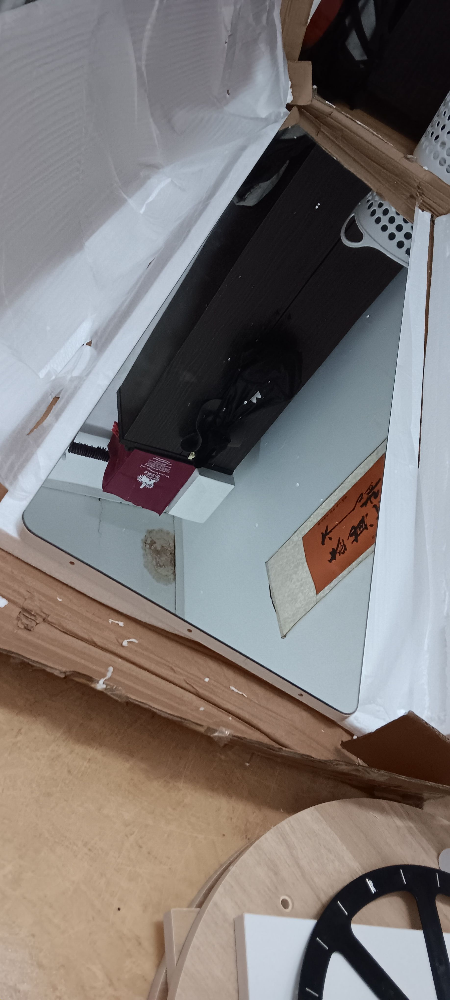

- 00:59 換衣，喝熱水，逛櫥窗
- 01:13 藉助 [[Gemini Live-Mode]] 商量使用 7 月 [[大馬本地退每月 5 次限額（ 可按優先次序重新佔額 ） & 延後自動收穫策略 vs  集運包裹上限 10 件（ 1 大包裝下最多 10 小包 ）]] 將  [[2 Pin 中規]] 的 [[[[Ugreen 綠聯｜100W 伸縮線氮化鎵充電器多口 [[PD ( Power Delivery ) 快充頭]] 【 星夜黑 】]] + [[1.5 m]] 100W Dual Type-C Cable]] [[申請退貨退款]] + [[安排上門取件的日期和時間]]： [[Wed, 29-07-2026]] 09:00 ~ 18:00 ，改爲在 [[Lazada]] 或 [[Shopee]] 下單 [[3 Pin 英規]] 的 [[Ugreen 綠聯｜100W 伸縮線氮化鎵充電器多口 [[PD ( Power Delivery ) 快充頭]] 【 星夜黑 】]]
- 02:25 喝熱水，覆盤
- 04:22 睡著，聲控關閉冷氣，[[為測試 Macbook Pro 電池是否嚴重漏電]]：關機之前 ── 82%
- 11:37 起床，[[為測試 Macbook Pro 電池是否嚴重漏電]] ── 開機時 ── 80%，回顧 Gallery，刪除照片
- 11:54 換衣
- 11:59 排便， [[主動 Call]] [[Skynet 客服]][[0386029266]] [[訴求貨到前提早給我打電話或發送信息]]
- 12:13 熱水澡
- 12:44 聲控打開冷氣，接聽自 [[Skynet 快遞員]] 的[[電話來電]] 確認 [[拼多多 App 下的訂單]] ── [[華木苒家具旗艦店｜實木生態板工藝（ 白色 ）萬向輪可旋轉掛衣架試衣鏡]] 於 [[15 Mins]] 即將送達
- [[12]]:58 預備將門打開，等候，時間帳
- 13:05 貨到了，查實所聽所見，覺察緊張
  collapsed:: true
	- 
	- 
	- 
	- 
	- 
	- 
	- 
	- 
	- 
	- <<<<<<< HEAD
- 13:37 檢查完畢，走動
- 13:42 [[4-2-6 Deep Breathing]]
  14:09 走動，排尿，緩衝
- [[14]]:23 換衣，緩衝， [[4-2-6 Deep Breathing]]
- [[14]]:45 [[穿戴開放式耳機]]，覆盤，午餐，盥洗，覆盤
- 15:33 吹冷氣，做最後預備和[[演練]]
- 15:54 預備出門，排尿，覺察緊張
- 16:15 到車上
- 16:23 開車出門， [[4-2-6 Deep Breathing]]