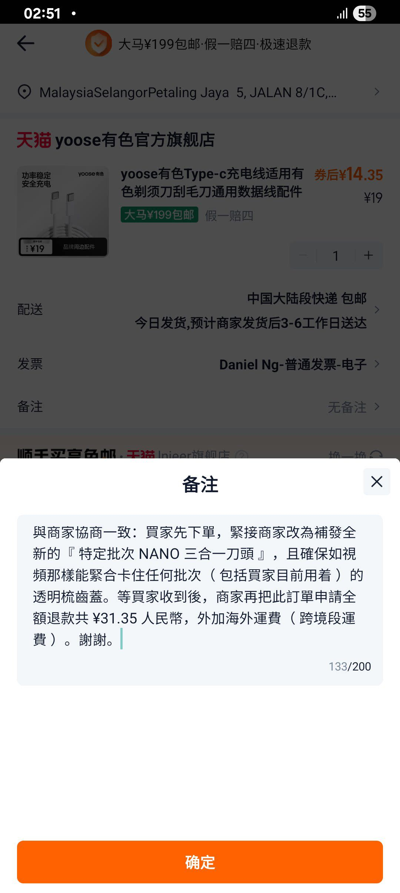
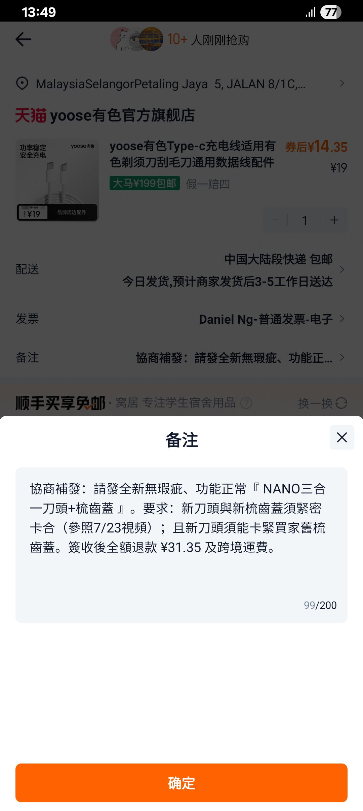
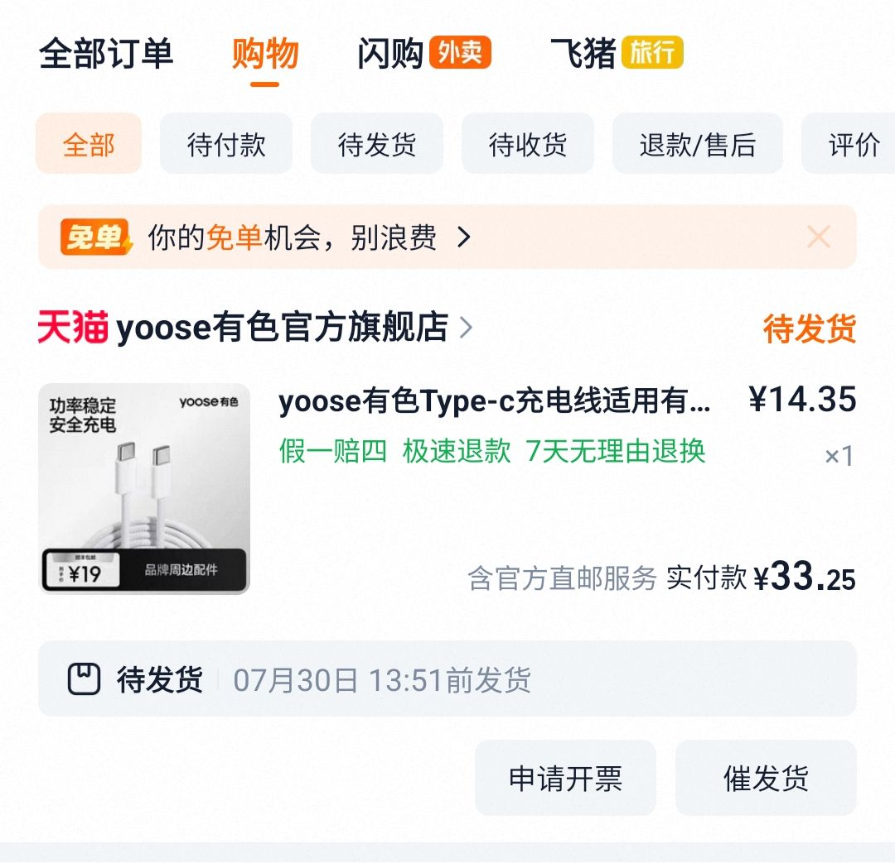

- 03:[[10]] 處理自己的手尾，因眼前事物分心 ── 整理舊物，覺察懷念，哼唱
- 03:53 夜宵，暴食，吃甜食，清洗廚具，手洗衣物，熱水澡，盥洗，戴上牙套，排尿
- 04:20 摺疊衣物，整理舊物，[[清潔鏡子]]
- 06:23 覺察疲憊，強忍睡意，在 [[華木苒家具旗艦店｜實木生態板工藝（ 白色 ）萬向輪可旋轉掛衣架試衣鏡]] 試穿衣物，儀容裝扮
- 07:18 聲控關閉冷氣，走動，喝熱水
- 07:26 緩衝
- 07:28 躺着，闭目养神， [[4-2-6 Deep Breathing]]
- 08:03 睡着
- 12:46 因身體不適醒來，覺察心臟不適，賴床，哼唱，爲[[[[梳齒蓋易從三合一刀頭脫落]] 因目前批次的刀頭弧面瑕疵所致，願意補發之前批次的新刀頭]] + [[免費讓商家補發新且無瑕疵的商品零件]]，藉助 [[Gemini]] 潤溼[[商品備注]]和[[調整表達邏輯]]
  collapsed:: true
	- 
	- 
	- 
- 14:08 時間帳
- 14:12 起床，先確認回應嬤嬤的需求後才回應，午餐，覺察如釋重負，沖涼
- 16:37 時間帳，喝水，覺察疲勞
- 16:46 躺着，爲 [[華木苒家具旗艦店｜實木生態板工藝（ 白色 ）萬向輪可旋轉掛衣架試衣鏡]] [[安裝視頻]] 完整性不足，進行[[即時反饋]]和[[詢問]]關於未展示的[[部件]]其[[用途]]，因眼前事物分心 ── 逛櫥窗，暗室直視 3C 藍光
- 18:53 走動，喝水
- 19:25 晚餐，[[攝取精神藥物]]， [[hey, we've made it checklist]] ── 覺察自己為了糾正對方且對方開始趁機躲避時[[允許話題中斷/沒有下文]] 
  20:32 時間賬，查實所聽所見 ── [[Insomniacks]] 是 [[Malaysia Pop-Rock Band]]，因眼前事物分心 ── 在 [[YouTube]] 看 [[The Odyseeus]] 導演和演員的採訪
- 21:32 為明天 [[Wed, 29-07-2026]] [[預約上門取件之退貨退款包裹]] ： [[[[Ugreen 綠聯｜100W 伸縮線氮化鎵充電器多口 [[PD ( Power Delivery ) 快充頭]] 【 星夜黑 】]] + [[1.5 m]] 100W Dual Type-C Cable]] 重新