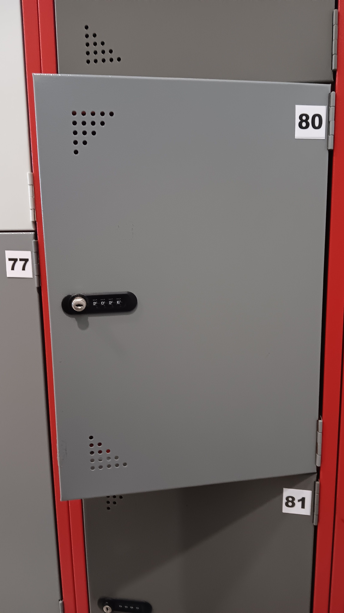

- 00:01 換衣，整理背包
- 00:29 哼唱，[[即興作曲]]
- 00:31 [[quick capture]]: #voice-memo
	- **如果可以（ 原來還在夢裏 ） DEMO**
	  collapsed:: true
		- 
- 01:01 聲控打開冷氣，閉目養神，[[[[《三體》多人有聲劇]]｜[[S3]]: [[死神永生]]]]
- 07:57 聲控關閉冷氣，起床，喝熱飲，排尿
- 08:19 [[聽冥想音頻 by Jessica Kay Lee]]，流淚
- 08:40 [[Tumecap]] + [[Vitamin B]]，早餐，清洗廚具，煮
- 10:12 盥洗，沖涼，覺察猶豫而決
- 10:56 換衣，儀容裝扮
- 11:58 緩衝，適當地坐一下，[[[[《三體》多人有聲劇]]｜[[S3]]: [[死神永生]]]]， [[reload]] [[RM 10]] @ [[Touch 'n Go eWallet]]
- 12:55 出門到車上檢查 [[Touch 'n Go NFC Card]]
- 13:02 走路到 [[LRT - Asia Jaya]]
- 13:13 [[Touch 'n Go eWallet]] 即便 [[reload]] [[RM 10]] 後， [[Touch 'n Go NFC Card]] 出示仍需要再次 [[reload]]， 覺察猶豫而決、焦慮、緊張，決定只爲[[[[Touch 'n Go]] @[[myKad]] /[[NRIC]]]]
- 13:43 上了 [[LRT - Asia Jaya]] 前往 [[LRT - Masijid Jamek]]
- 14:05 抵達 [[LRT - Masijid Jamek]]
- 14:21 到了 [[Perpustakaan KL (Kuala Lumpur)]]，卸載隨身物件收在
  collapsed:: true
	- 
- 14:45 午餐[[[[Cafe]]@ [[Perpustakaan KL (Kuala Lumpur)]]]]，時間帳
- 15:27 找到理想的座位安頓下來，不久轉移到 [[[[Internet Zone]] @ [[Perpustakaan KL (Kuala Lumpur)]]]]
- 16:03 再次安頓下來，看視頻
- [[16]]:26 走動
- [[16]]:35 看視頻
- 16:54 覺得很悶熱，開始收拾隨身物件
- 17:[[10]] 發現問題，為 [[Ugreen 綠聯｜85W Type-C to MagSafe2 T 型磁吸閃充充電線]] 向 [[綠聯官方客服]] 尋求方案
- 19:00 到了 [[Locker area]] 被保安催趕時，感到害怕、着急、憤怒
- 19:17 離開 [[Perpustakaan KL (Kuala Lumpur)]]， [[4-2-6 Deep Breathing]]，觀賞風景 [[[[Dataran Merdeka]]@[[Masjid Jamek]]]]
- 20:33 搭 [[LRT - Masijid Jamek]] ── [[LRT - Asia Jaya]]， [[4-2-6 Deep Breathing]]
- 20:57 從 [[LRT - Asia Jaya]] 走路回家
- 21:23 到家