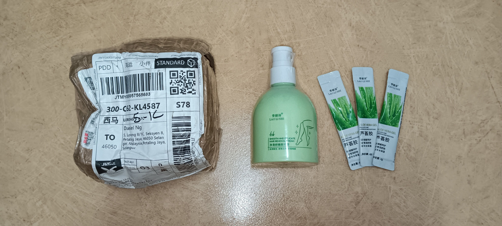

- 01:04 熱水澡， [[OGC]]，手洗衣物，晾乾衣物，清洗廚具，吃甜食，喝冷飲，強迫性做事，因眼前事物分心 ── 深度清潔廚房洗臉盆旁放洗漱用品的架子
- 03:33 吹冷氣，[[穿戴開放式耳機]]，因眼前事物分心 ── 預熱 [[LORICA 駱易家暖手寶 aka 暖憶柔性電暖袋 + 玫瑰艾絨內膽/艾墊-陳艾紅花墊（ 花色；15*20 ）]]
- 03:40 排便，[[[[《三體》多人有聲劇]]｜[[S3]]: [[死神永生]]]]
-
- 04:12 強忍睡意，半躺半坐，逛櫥窗，咬牙，覺察焦慮
- 08:08 聲控關閉冷氣，排尿，走動，沈默應對家人的提問，覺察厭惡
- 08:27 睡覺，睡睡醒醒，因疲倦起不了身
- 18:39 赖床，查看信箱，觉察焦虑
- 18:49 起床，[[攝取精神藥物]]，走動，排尿
- 19:15 拆包裹 ── [[勞麗詩｜淨滑嬌嫩脫毛膏]]
  collapsed:: true
	- 
	- 
- 19:17 換衣
- 19:52 [[基礎慢跑跑步課程]]，
- 21:31 吃甜食 [[RM 2]] @ [[米雪 MIXUE]]
- 22:32 到家，晚餐
- 23:04 [[quick capture]]: #voice-memo
	- **random humming DEMO**
		- 
- 23:06 清洗廚具，強忍睡意，[[[[《三體》多人有聲劇]]｜[[S3]]: [[死神永生]]]]
	- 結束於 [[Sun, 09-08-2026]] 00:03