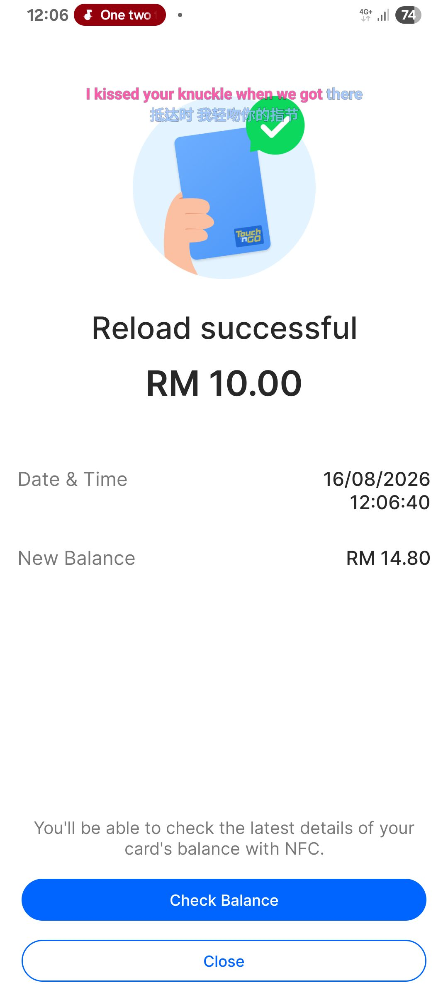
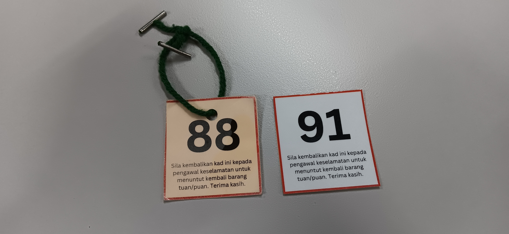

- 01:41 時間帳，喝冷飲，起床，走動，排尿，覺察反芻思維
- 02:02 發呆
- 02:03 躺着，閉目養神，聽音樂，覺察焦慮
- 02:50 讀 [[《 托爾斯泰：凝視 “人生的大道” 》 by 池田大作]]，半躺半坐，覺察如釋重負
- 03:47 排尿，喝熱飲，吃甜食
- 04:00 刷社媒，半躺半坐
- 06:58 蹲廁所，熱水澡， [[3rd attempt]] 使用 [[YOOSE 有色 NANO 女士多功能剃毛器]] [[剃下體的毛髮]]
- 07:54 時間帳
- 07:55 煮早餐 + 午餐，喝牛奶，盥洗
- 09:06 因眼前事物分心 ── 將未裝進背包的隨身物品放入
- 09:24 聲控打開冷氣，沖涼
- 09:56 換衣，吹冷氣，儀容裝扮
- 11:02 [[穿戴開放式耳機]]，聽音樂，出門，走路到 [[LRT - Asia Jaya]]， [[CERO 希鹿收納製冷掛脖風扇]]，覺察感謝
- 11:17 等候，覺察滿足
- 11:20 上了 [[LRT - Asia Jaya]] 前往 [[LRT - Ampang Park]]
- 12:06 在 [[MRT - Ampang Park]] 閘門因 [[[[Touch 'n Go]] @[[myKad]] /[[NRIC]]]] 僅剩 [[RM 3]] 低於 [[min bal.]] [[RM 5]] 無法通過，通過 [[Touch 'n Go eWallet]] 早已經預備充足的餘額給 [[Touch 'n Go NFC Card]] [[reload]] [[RM 10]]，覺察感謝
  collapsed:: true
	- 
- 12:10 上了 [[MRT - Ampang Park]] 前往 [[MRT - Raja Uda]]
- 12:12 安全抵達 [[MRT - Raja Uda]]
- [[12]]:36 安全抵達 [[Perpustakaan Negara Malaysia (PNM)]]，入口處經過[[安檢處]]時被要求留下 [[雨傘]] + [[食物]]
  collapsed:: true
	- 
- 12:50 覺察猶豫而決，最後選擇 [[Zon Siber @PNM]] 安頓自己的隨身物品，喝熱飲
- 13:01 因眼前事物分心 ── [[解決多設備端 Logseq 自動同步失敗的問題]]： [[Tasker]] 和 [[Termux]] 出現延遲
	- 解決於 14:44
- 13:35 咬嘴皮，覺察焦慮，忍餓，
- 14:04 整理舊筆記，時間帳
- [[14]]:44 喝熱飲
- 14:55 步行到 [[安檢處]] 領回食物到 [[Cafeteria @PNM]]，排尿
- 15:11 在 [[Cafeteria @PNM]] 吃午餐，聽歌，覺察疲勞
- 15:29 離開 [[Cafeteria @PNM]]，排尿
- 15:47 回到了 [[Zon Siber @PNM]]，整頓一下桌位
- 16:12 上半身趴在桌上，閉目養神，測試  [[NANK  南卡 Z2 枕中寶]] 音量，打哈欠
- 16:22 測試  [[NANK  南卡 Z2 枕中寶]] 音量，
- 16:51 上半身趴在桌上，閉目養神，
- 17:27 因手麻痺醒來，緩衝
- 17:47 [[聽冥想音頻 by Jessica Kay Lee]]，閉目養神
- 18:00 [[攝取精神藥物]]，打哈欠
- 18:07 提前收拾自己的隨身物品
- 18:33 離開 [[Zon Siber @PNM]]，到 [[安檢處]] 領回 [[食物]] + [[雨傘]]