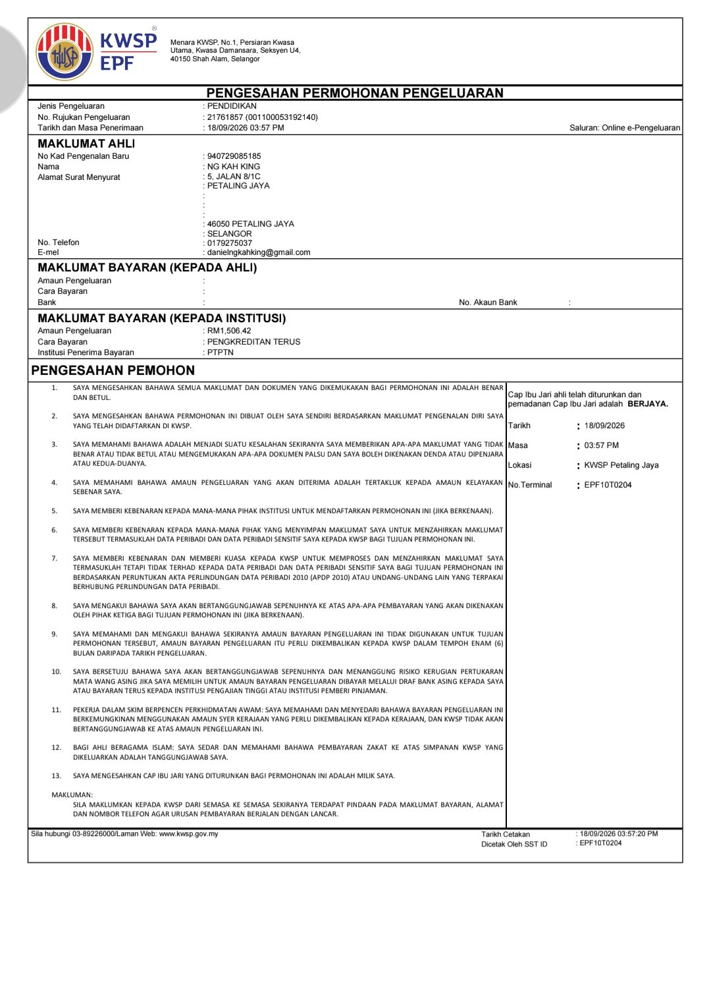

- 01:07 強迫性做事 ── 看視頻，覺察疲倦
- 01:53 睡覺，睡睡醒醒，[[被自己的夢話驚醒]]
- 08:00 主動解除鬧鐘，回籠覺
- 10:00 賴床，查實所聽所見 ── 藉助 [[Gemini]] 確認最臨近的 [[Kaunter Perkhidmatan KWSP Petaling Jaya]] 位於 [[Menara PJX]] 和 [[Amcorp Mall]] 附近
- 10:22 起床，喝水
- 10:30 [[瀏覽錶盤]]
- 11:10 排便，熱水澡，吃甜食，覺察猶豫而決、疲勞
- 12:24 時間帳
- 13:30 補眠
- 13:40 起床，午餐
- 14:04 儀容裝扮，換衣，覺察猶豫而決
- 14:48 排便，[[《 人類簡史 》有聲書]]
- 15:11 儀容裝扮
- 15:35 出門，
- 15:53 到了 [[Kaunter Perkhidmatan KWSP Petaling Jaya]]
- 15:57 在 [[kiosk]] 完成 [[KWSP 已准許通過 i-Akaun 2 繳付學貸最低額且信息通知我到臨近分局完成指紋蓋章]]
  collapsed:: true
	- 
- 16:03 時間帳，藉助 [[Gemini]] 確認下一步：通知 [[Puan Rohaiza]]
- 16:46 走到 [[Amcorp Mall]]
- 16:55 到了 [[Amcorp Mall]]，逛電玩店和 [[[[NSK]]@[[Amcorp Mall]]]]
- 18:27 從 [[Amcorp Mall]] 走路回家
- 18:50 到家
- 19:10 [[攝取營養素]]，浸泡衣物，晚餐
- 19:49 手洗衣物和 [[string strawed bag]]，熱水澡，盥洗，戴上牙套，[[6th attempt]] 使用 [[YOOSE 有色 NANO 女士多功能剃毛器]] [[剃下體的毛髮]]
- 21:47 時間帳
- 21:48 [[OGC]]
- 23:[[14]] 排尿
- 23:25 逛櫥窗，刷社媒，